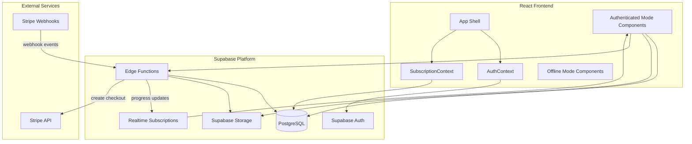
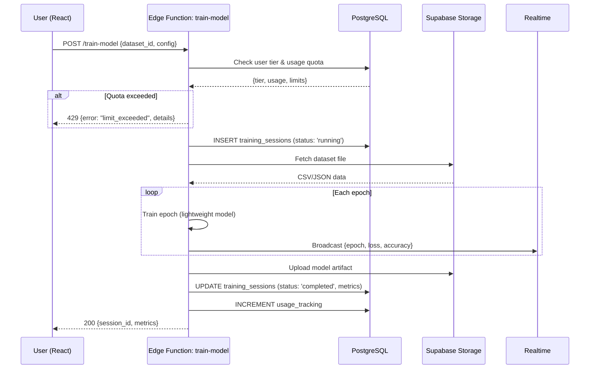

# Design Document: Backend Subscription Integration

## Overview

This design adds backend-powered ML training, persistent dataset storage, user authentication, and a tiered subscription system to ModelMentor — while preserving the existing offline-first learning experience. The architecture leverages the already-configured Supabase instance for auth, database, storage, and edge functions, with Stripe handling payment processing.

The system operates in two modes:
- **Offline Mode**: Unauthenticated users interact with synthetic data and client-side training simulation (existing behavior, unchanged)
- **Authenticated Mode**: Signed-in users get persistent storage, real ML training via Edge Functions, and tier-gated features

### Key Design Decisions

1. **Supabase Edge Functions for training** — Keeps compute co-located with data, avoids a separate server, and leverages Deno's lightweight runtime for ML inference with TensorFlow.js or ONNX Runtime.
2. **Stripe Checkout Sessions** — Offloads PCI compliance; the app never handles raw card data.
3. **Row-Level Security (RLS)** — All user data access is enforced at the database level, not just in application code.
4. **Platform-wide compute budget** — A daily counter in a `platform_config` table gates training requests when the budget is exhausted, preventing runaway costs.
5. **14-day trial without credit card** — Implemented via a `trial_ends_at` timestamp on the subscription record; no Stripe session created until trial converts.

## Architecture



### Request Flow: Training Job



## Components and Interfaces

### Edge Functions

| Function | Method | Purpose |
|----------|--------|---------|
| `train-model` | POST | Validates quota, runs training, persists results |
| `create-checkout` | POST | Creates Stripe Checkout session for Pro/Enterprise |
| `stripe-webhook` | POST | Handles Stripe events (payment success, cancellation, etc.) |
| `check-usage` | GET | Returns current usage summary and limits for a user |
| `migrate-local-data` | POST | Migrates offline projects/datasets to authenticated account |

### React Context Providers

| Context | Responsibility |
|---------|---------------|
| `AuthContext` (existing, extended) | User session, profile, sign-in/out/up |
| `SubscriptionContext` (new) | Current tier, usage summary, limit checks, trial status |
| `TrainingContext` (new) | Active training jobs, progress via Realtime, job history |

### Service Layer

| Service | Responsibility |
|---------|---------------|
| `usageTrackingService` (existing, extended) | Track consumption, check limits, compute budget |
| `subscriptionService` (new) | Manage tier transitions, Stripe integration, trial logic |
| `trainingJobService` (new) | Submit jobs, poll status, handle progress events |
| `datasetStorageService` (new) | Upload/download/delete datasets, quota enforcement |
| `migrationService` (new) | Offline-to-authenticated data migration |

### API Interfaces

```typescript
// POST /functions/v1/train-model
interface TrainModelRequest {
  dataset_id: string;
  model_type: 'classification' | 'regression' | 'image_classification' | 'text_classification';
  config: {
    epochs: number;
    batch_size: number;
    learning_rate: number;
    architecture: 'shallow_nn' | 'decision_tree' | 'random_forest' | 'logistic_regression';
  };
}

interface TrainModelResponse {
  session_id: string;
  status: 'running' | 'completed' | 'failed' | 'queued';
  metrics?: {
    accuracy: number;
    loss: number;
    precision: number;
    recall: number;
    f1_score: number;
  };
  error?: string;
}

// POST /functions/v1/create-checkout
interface CreateCheckoutRequest {
  tier: 'pro' | 'enterprise';
  billing_period: 'monthly' | 'yearly';
  success_url: string;
  cancel_url: string;
}

interface CreateCheckoutResponse {
  checkout_url: string;
  session_id: string;
}

// GET /functions/v1/check-usage
interface CheckUsageResponse {
  tier: SubscriptionTier;
  status: SubscriptionStatus;
  trial_days_remaining: number | null;
  usage: UsageSummary;
  limits: UsageLimits;
  compute_budget: {
    daily_limit_minutes: number;
    consumed_today_minutes: number;
    available: boolean;
  };
}

// POST /functions/v1/migrate-local-data
interface MigrateLocalDataRequest {
  projects: Array<{
    title: string;
    description: string;
    model_type: ModelType;
    status: ProjectStatus;
    dataset?: {
      file_content: string; // base64
      file_name: string;
      labels: string[];
      sample_count: number;
    };
  }>;
}

interface MigrateLocalDataResponse {
  migrated: number;
  failed: Array<{ title: string; reason: string }>;
}
```

### Realtime Channel: Training Progress

```typescript
// Channel: `training:{session_id}`
interface TrainingProgressEvent {
  epoch: number;
  total_epochs: number;
  loss: number;
  accuracy: number;
  elapsed_seconds: number;
}

interface TrainingCompleteEvent {
  session_id: string;
  status: 'completed' | 'failed' | 'timeout';
  metrics?: TrainModelResponse['metrics'];
  error?: string;
  model_artifact_url?: string;
}
```

## Data Models

### Database Schema (Supabase PostgreSQL)

```sql
-- Existing table (extended)
CREATE TABLE profiles (
  id UUID PRIMARY KEY REFERENCES auth.users(id) ON DELETE CASCADE,
  email TEXT,
  username TEXT UNIQUE,
  first_name TEXT,
  last_name TEXT,
  role user_role DEFAULT 'user',
  organization_id UUID REFERENCES organizations(id),
  avatar_url TEXT,
  created_at TIMESTAMPTZ DEFAULT now(),
  updated_at TIMESTAMPTZ DEFAULT now()
);

-- Subscription management
CREATE TABLE user_subscriptions (
  id UUID PRIMARY KEY DEFAULT gen_random_uuid(),
  user_id UUID NOT NULL REFERENCES auth.users(id) ON DELETE CASCADE,
  tier subscription_tier NOT NULL DEFAULT 'free',
  status subscription_status NOT NULL DEFAULT 'active',
  stripe_customer_id TEXT,
  stripe_subscription_id TEXT,
  trial_ends_at TIMESTAMPTZ,
  current_period_start TIMESTAMPTZ,
  current_period_end TIMESTAMPTZ,
  cancelled_at TIMESTAMPTZ,
  created_at TIMESTAMPTZ DEFAULT now(),
  updated_at TIMESTAMPTZ DEFAULT now(),
  UNIQUE(user_id)
);

-- Usage tracking (per-event log)
CREATE TABLE usage_events (
  id UUID PRIMARY KEY DEFAULT gen_random_uuid(),
  user_id UUID NOT NULL REFERENCES auth.users(id) ON DELETE CASCADE,
  resource_type resource_type NOT NULL,
  amount NUMERIC NOT NULL DEFAULT 1,
  compute_minutes NUMERIC,
  metadata JSONB,
  created_at TIMESTAMPTZ DEFAULT now()
);

-- Index for monthly aggregation queries
CREATE INDEX idx_usage_events_user_month
  ON usage_events (user_id, resource_type, created_at);

-- Training sessions (extended from existing)
CREATE TABLE training_sessions (
  id UUID PRIMARY KEY DEFAULT gen_random_uuid(),
  project_id UUID NOT NULL REFERENCES projects(id) ON DELETE CASCADE,
  user_id UUID NOT NULL REFERENCES auth.users(id),
  dataset_id UUID NOT NULL REFERENCES datasets(id),
  model_type model_type NOT NULL,
  config JSONB NOT NULL,
  epochs INTEGER NOT NULL,
  current_epoch INTEGER DEFAULT 0,
  accuracy NUMERIC,
  loss NUMERIC,
  precision_score NUMERIC,
  recall_score NUMERIC,
  f1_score NUMERIC,
  metrics JSONB,
  status training_status NOT NULL DEFAULT 'pending',
  model_artifact_url TEXT,
  compute_minutes NUMERIC,
  error_message TEXT,
  started_at TIMESTAMPTZ,
  completed_at TIMESTAMPTZ,
  created_at TIMESTAMPTZ DEFAULT now()
);

-- Datasets (extended for storage tracking)
CREATE TABLE datasets (
  id UUID PRIMARY KEY DEFAULT gen_random_uuid(),
  project_id UUID REFERENCES projects(id) ON DELETE SET NULL,
  user_id UUID NOT NULL REFERENCES auth.users(id),
  file_name TEXT NOT NULL,
  file_url TEXT NOT NULL,
  file_size_bytes BIGINT NOT NULL,
  file_format TEXT NOT NULL CHECK (file_format IN ('csv', 'json', 'zip')),
  row_count INTEGER,
  labels TEXT[],
  sample_count INTEGER,
  created_at TIMESTAMPTZ DEFAULT now(),
  updated_at TIMESTAMPTZ DEFAULT now()
);

-- Platform-wide configuration (compute budget, etc.)
CREATE TABLE platform_config (
  key TEXT PRIMARY KEY,
  value JSONB NOT NULL,
  updated_at TIMESTAMPTZ DEFAULT now()
);

-- Seed: daily compute budget
INSERT INTO platform_config (key, value) VALUES
  ('daily_compute_budget', '{"limit_minutes": 1440, "reset_hour_utc": 0}');

-- Daily compute consumption tracker (reset daily via cron)
CREATE TABLE daily_compute_usage (
  date DATE PRIMARY KEY DEFAULT CURRENT_DATE,
  total_minutes NUMERIC DEFAULT 0,
  job_count INTEGER DEFAULT 0,
  updated_at TIMESTAMPTZ DEFAULT now()
);
```

### Enum Types

```sql
CREATE TYPE subscription_tier AS ENUM ('free', 'pro', 'enterprise');
CREATE TYPE subscription_status AS ENUM ('active', 'trial', 'cancelled', 'expired', 'past_due');
CREATE TYPE resource_type AS ENUM ('project', 'training', 'storage', 'api_call', 'report');
CREATE TYPE training_status AS ENUM ('pending', 'queued', 'running', 'completed', 'failed', 'timeout');
CREATE TYPE model_type AS ENUM ('classification', 'regression', 'image_classification', 'text_classification');
```

### Row-Level Security Policies

```sql
-- Users can only see their own subscriptions
ALTER TABLE user_subscriptions ENABLE ROW LEVEL SECURITY;
CREATE POLICY "Users read own subscription"
  ON user_subscriptions FOR SELECT USING (auth.uid() = user_id);

-- Users can only see their own usage events
ALTER TABLE usage_events ENABLE ROW LEVEL SECURITY;
CREATE POLICY "Users read own usage"
  ON usage_events FOR SELECT USING (auth.uid() = user_id);

-- Users can only access their own datasets
ALTER TABLE datasets ENABLE ROW LEVEL SECURITY;
CREATE POLICY "Users manage own datasets"
  ON datasets FOR ALL USING (auth.uid() = user_id);

-- Users can only see their own training sessions
ALTER TABLE training_sessions ENABLE ROW LEVEL SECURITY;
CREATE POLICY "Users read own training sessions"
  ON training_sessions FOR SELECT USING (auth.uid() = user_id);
```

### Storage Buckets

| Bucket | Access | Purpose |
|--------|--------|---------|
| `user-datasets` | Private (RLS via user_id path prefix) | CSV, JSON, ZIP dataset files |
| `model-artifacts` | Private (RLS via user_id path prefix) | Trained model weights/configs |
| `model-images` | Public (existing) | Avatar and project images |

### Tier Limits Configuration

```typescript
export const TIER_LIMITS = {
  free: {
    max_projects: 3,
    max_training_sessions_per_month: 10,
    max_storage_mb: 100,
    max_file_size_mb: 50,
    max_training_duration_seconds: 120,
    max_dataset_rows: 10_000,
    max_epochs: 50,
    max_concurrent_jobs: 1,
    max_daily_training_requests: 5,
    features: {
      kaggle_integration: false,
      collaboration: false,
      advanced_visualizations: false,
      model_deployment: false,
      pdf_export: true,
    },
  },
  pro: {
    max_projects: 50,
    max_training_sessions_per_month: 500,
    max_storage_mb: 5_000,
    max_file_size_mb: 500,
    max_training_duration_seconds: 600,
    max_dataset_rows: 100_000,
    max_epochs: 200,
    max_concurrent_jobs: 2,
    max_daily_training_requests: null, // unlimited
    features: {
      kaggle_integration: true,
      collaboration: true,
      advanced_visualizations: true,
      model_deployment: true,
      pdf_export: true,
    },
  },
  enterprise: {
    max_projects: null,
    max_training_sessions_per_month: null,
    max_storage_mb: null,
    max_file_size_mb: null,
    max_training_duration_seconds: null,
    max_dataset_rows: null,
    max_epochs: null,
    max_concurrent_jobs: 5,
    max_daily_training_requests: null,
    features: {
      kaggle_integration: true,
      collaboration: true,
      advanced_visualizations: true,
      model_deployment: true,
      pdf_export: true,
    },
  },
} as const;
```


## Correctness Properties

*A property is a characteristic or behavior that should hold true across all valid executions of a system — essentially, a formal statement about what the system should do. Properties serve as the bridge between human-readable specifications and machine-verifiable correctness guarantees.*

### Property 1: Username-to-email round trip

*For any* valid username (containing only letters, digits, and underscores), converting it to the internal email format and extracting the local part should yield the original username.

**Validates: Requirements 2.2**

### Property 2: Username validation correctness

*For any* string, the username validator SHALL accept it if and only if it matches the pattern `^[a-zA-Z0-9_]+$` (non-empty, only letters, digits, and underscores).

**Validates: Requirements 3.3**

### Property 3: User-scoped path construction

*For any* user ID and resource identifier (file name or session ID), the storage path construction function SHALL produce a path that starts with the user ID as the first path segment.

**Validates: Requirements 4.1, 5.7**

### Property 4: File format validation

*For any* file name, the format validator SHALL accept the upload if and only if the file extension is one of `csv`, `json`, or `zip` (case-insensitive).

**Validates: Requirements 4.2**

### Property 5: Tier-based limit enforcement

*For any* subscription tier, resource type, current usage amount, and requested amount: the limit enforcement function SHALL allow the request if and only if `current_usage + requested_amount <= tier_limit` (where `tier_limit` is null/unlimited for enterprise).

**Validates: Requirements 4.3, 4.5, 5.6, 5.8, 5.9, 5.10**

### Property 6: Failed training jobs do not consume quota

*For any* training job that fails due to invalid data or configuration, the user's usage counter for training sessions SHALL remain unchanged after the failure.

**Validates: Requirements 5.5**

### Property 7: Subscription state transitions

*For any* user with an active paid subscription, when a cancellation or expiration event occurs, the user's tier SHALL become `free` and their existing data record count SHALL remain unchanged.

**Validates: Requirements 6.4, 6.5**

### Property 8: Trial duration arithmetic

*For any* trial start timestamp and current timestamp, the remaining trial days SHALL equal `max(0, ceil((trial_ends_at - now) / 86400000))` where `trial_ends_at` is exactly 14 days after the trial start.

**Validates: Requirements 6.6, 6.7**

### Property 9: Usage event completeness

*For any* resource consumption event that is recorded, the resulting usage record SHALL contain a non-null user_id, a valid resource_type, a positive amount, and a timestamp within 1 second of the recording time.

**Validates: Requirements 7.1**

### Property 10: Monthly usage scoping

*For any* set of usage events spanning multiple months, the usage summary for a given month SHALL equal the sum of amounts for events whose `created_at` falls within that calendar month only.

**Validates: Requirements 7.3, 7.7**

### Property 11: Warning threshold at 80%

*For any* resource type, tier limit, and current usage amount, the warning notification SHALL trigger if and only if `current_usage >= 0.8 * tier_limit` and `current_usage < tier_limit`.

**Validates: Requirements 7.5**

### Property 12: Platform compute budget enforcement

*For any* daily compute consumption total and configured daily budget limit, new training jobs SHALL be queued (not started) if and only if `daily_consumption >= daily_budget_limit`.

**Validates: Requirements 7.6**

### Property 13: Daily rate limiting for free tier

*For any* free-tier user, if the count of training sessions submitted on the current calendar day exceeds 5, further training requests SHALL be rejected until the next calendar day.

**Validates: Requirements 7.8**

### Property 14: Feature gating by tier

*For any* feature name and subscription tier, the feature access check SHALL return `true` if and only if the tier's feature configuration map has that feature set to `true`.

**Validates: Requirements 8.1**

### Property 15: Migration preserves all projects

*For any* set of local projects submitted for migration where all items are valid, the number of projects associated with the new user ID after migration SHALL equal the number of projects submitted.

**Validates: Requirements 9.2**

### Property 16: Migration failure isolation

*For any* migration batch where some items fail, the failed items SHALL be reported in the response with specific reasons, and the successfully migrated items SHALL still be associated with the user. Local data for failed items SHALL remain intact.

**Validates: Requirements 9.3**

## Error Handling

### Error Categories

| Category | HTTP Status | Client Behavior |
|----------|-------------|-----------------|
| Authentication errors | 401 | Redirect to login, clear session |
| Authorization errors | 403 | Show upgrade prompt or access denied |
| Quota exceeded | 429 | Show limit reached message with upgrade CTA |
| Validation errors | 400 | Show field-level error messages |
| Training timeout | 408 | Show partial results if available, explain timeout |
| Platform budget exhausted | 503 | Show queue position and estimated wait time |
| Stripe webhook failure | 500 (internal) | Retry with exponential backoff, alert ops |
| Storage upload failure | 500 | Retry once, then show error with retry button |
| Migration partial failure | 207 | Show per-item success/failure report |

### Error Response Format

```typescript
interface ApiError {
  code: string;           // Machine-readable: 'quota_exceeded', 'invalid_format', etc.
  message: string;        // Human-readable description
  details?: {
    limit?: number;       // The limit that was hit
    current?: number;     // Current usage
    remaining?: number;   // Remaining capacity
    upgrade_tier?: string; // Suggested tier for resolution
  };
}
```

### Retry Strategy

- **Transient failures** (network, 5xx): Retry up to 3 times with exponential backoff (1s, 2s, 4s)
- **Stripe webhooks**: Stripe retries automatically; our handler is idempotent (uses event ID deduplication)
- **Training jobs**: No automatic retry on failure; user must manually re-submit
- **Storage uploads**: Single automatic retry on network failure; user-initiated retry after that

### Graceful Degradation

- If Supabase is unreachable, the app falls back to Offline Mode with a banner notification
- If Stripe checkout fails, the user sees an error with a "Try Again" button (no partial state)
- If Realtime connection drops during training, the client polls the training_sessions table as fallback

## Testing Strategy

### Unit Tests (Vitest)

Focus on pure business logic functions:
- Username validation and conversion
- Path construction utilities
- Tier limit lookup and comparison
- Usage summary aggregation
- Warning threshold calculations
- Trial days remaining computation
- Feature access checks
- File format validation
- Migration data transformation

### Property-Based Tests (fast-check + Vitest)

**Library**: `fast-check` (already compatible with Vitest)
**Configuration**: Minimum 100 iterations per property

Each property test references its design document property:
- Tag format: **Feature: backend-subscription-integration, Property {N}: {title}**

Property tests cover:
- All 16 correctness properties defined above
- Focus on the pure logic layer (validators, calculators, enforcers)
- Use mocks for Supabase client to test logic in isolation

### Integration Tests

- Auth flow: signup → profile creation → session management → signout
- Dataset upload: file upload → storage → URL retrieval → deletion
- Training pipeline: submit job → progress events → completion → metrics persistence
- Stripe flow: create checkout → webhook → tier upgrade → cancellation → downgrade
- Migration: offline data → signup → migration → verification

### E2E Tests (if applicable)

- Full user journey: signup → upload dataset → train model → view results
- Subscription upgrade: free → pro trial → payment → pro features unlocked
- Offline-to-online transition: use offline → signup → migrate → continue authenticated

### Test Organization

```
src/__tests__/
├── unit/
│   ├── usernameValidation.test.ts
│   ├── pathConstruction.test.ts
│   ├── tierLimits.test.ts
│   ├── usageCalculations.test.ts
│   ├── trialDuration.test.ts
│   └── featureGating.test.ts
├── properties/
│   ├── usernameRoundTrip.property.test.ts
│   ├── tierLimitEnforcement.property.test.ts
│   ├── usageScoping.property.test.ts
│   ├── warningThreshold.property.test.ts
│   ├── computeBudget.property.test.ts
│   ├── featureGating.property.test.ts
│   └── migration.property.test.ts
└── integration/
    ├── auth.integration.test.ts
    ├── storage.integration.test.ts
    ├── training.integration.test.ts
    └── stripe.integration.test.ts
```
