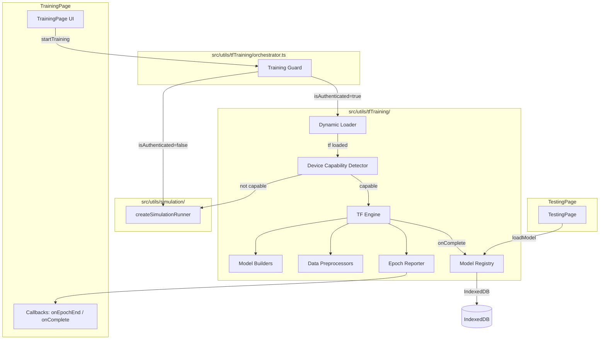

# Design Document: Browser Real Training (Level 2)

## Overview

Browser Real Training adds real TensorFlow.js model training for authenticated users while preserving the existing Level 1 simulation for unauthenticated users. The system dynamically loads TensorFlow.js (~1MB) only when needed, trains models entirely client-side using WebGL acceleration, reports real-time epoch metrics through the same callback interface the simulation uses, and persists trained models to IndexedDB for inference on the Test & Debug page.

The key architectural insight is that the Training Guard acts as a strategy selector: it reads `AuthContext.isAuthenticated` and routes training requests to either the existing `createSimulationRunner` (Level 1) or the new `TFEngine` (Level 2). Both engines conform to the same callback contract (`onEpochEnd`, `onComplete`), so the TrainingPage UI requires no changes to its chart/log rendering.

### Design Decisions

1. **Dynamic import over static bundling** — TensorFlow.js is ~1MB gzipped. Loading it statically would penalize all users. Dynamic `import()` keeps the main bundle lean and only fetches TF.js when an authenticated user starts training.

2. **Shared callback contract** — Both simulation and real training emit `{ loss, acc, val_loss, val_acc }` per epoch. This means the existing `LineChart`, `TrainingLogs`, and `TrainingMetricsDisplay` components work unchanged.

3. **IndexedDB for model persistence** — TensorFlow.js natively supports `model.save('indexeddb://key')` and `tf.loadLayersModel('indexeddb://key')`. This avoids custom serialization and survives page navigation.

4. **Cancellation via flag + tensor disposal** — A `cancelled` flag is checked between epochs. On cancellation, all tensors are explicitly disposed to prevent GPU memory leaks.

5. **Device capability detection before training** — Checks WebGL availability and estimated memory to warn users on low-end devices before committing to a potentially slow training run.

## Architecture



### Module Structure

```
src/utils/tfTraining/
├── index.ts                 # Public API barrel export
├── types.ts                 # Shared type definitions
├── orchestrator.ts          # Training Guard + strategy selection
├── dynamicLoader.ts         # Lazy TF.js import with caching
├── deviceCapability.ts      # WebGL/memory detection
├── tfEngine.ts              # Core training loop with cancellation
├── modelBuilders/
│   ├── index.ts             # Builder registry
│   ├── classification.ts    # Dense classification network
│   ├── regression.ts        # Dense regression network
│   ├── textClassification.ts # Embedding-based text model
│   └── imageClassification.ts # MobileNet transfer learning
├── preprocessing/
│   ├── index.ts             # Preprocessor registry
│   ├── normalization.ts     # Z-score normalization
│   ├── tokenization.ts      # Text tokenization + padding
│   ├── imageResize.ts       # 224×224 resize + normalize
│   └── labelEncoding.ts     # One-hot / binary encoding
├── epochReporter.ts         # Metric formatting + callback dispatch
└── modelRegistry.ts         # IndexedDB persistence + retrieval
```

## Components and Interfaces

### 1. Training Guard (orchestrator.ts)

The entry point that decides which engine to use.

```typescript
interface TrainingRequest {
  modelType: 'classification' | 'regression' | 'text_classification' | 'image_classification';
  data: DataPoint[];
  config: TrainingConfig;
  projectId: string;
}

interface TrainingRunner {
  start: () => Promise<void>;
  cancel: () => void;
}

interface TrainingCallbacks {
  onEpochEnd: (epoch: number, logs: EpochLogs) => void;
  onComplete: (result: TrainingResult) => void;
  onError: (error: Error) => void;
  onStatusChange: (status: TrainingStatus) => void;
}

type TrainingStatus = 
  | { type: 'loading_tf'; estimatedSizeMB: number }
  | { type: 'checking_device' }
  | { type: 'training'; isReal: boolean }
  | { type: 'fallback_to_simulation'; reason: string };

function createTrainingRunner(
  request: TrainingRequest,
  callbacks: TrainingCallbacks,
  isAuthenticated: boolean
): TrainingRunner;
```

### 2. Dynamic Loader (dynamicLoader.ts)

Lazily imports TensorFlow.js and caches the module reference.

```typescript
interface TFModule {
  tf: typeof import('@tensorflow/tfjs');
}

interface LoaderStatus {
  state: 'idle' | 'loading' | 'loaded' | 'error';
  error?: Error;
}

function loadTensorFlow(): Promise<TFModule>;
function getTFStatus(): LoaderStatus;
function isTFLoaded(): boolean;
```

**Behavior:**
- First call triggers `import('@tensorflow/tfjs')` 
- Subsequent calls return the cached module immediately
- On network failure, rejects with descriptive error

### 3. Device Capability Detector (deviceCapability.ts)

Checks hardware capabilities before training.

```typescript
interface DeviceCapabilities {
  hasWebGL: boolean;
  estimatedMemoryGB: number | null;
  recommendedBackend: 'webgl' | 'cpu';
  maxParameters: number;
  maxSamples: number;
  warnings: string[];
}

function detectCapabilities(tf: TFModule['tf']): Promise<DeviceCapabilities>;
```

**Detection logic:**
- WebGL: checks `tf.env().get('WEBGL_VERSION')` after backend init
- Memory: uses `navigator.deviceMemory` (Chrome) with fallback heuristic
- Limits: 50,000 params and 500 samples on low-memory devices

### 4. TF Engine (tfEngine.ts)

The core training loop with cancellation support.

```typescript
interface TFEngineConfig {
  request: TrainingRequest;
  tf: TFModule['tf'];
  capabilities: DeviceCapabilities;
  callbacks: TrainingCallbacks;
}

interface TFEngineHandle {
  start: () => Promise<TrainingResult>;
  cancel: () => void;
}

function createTFEngine(config: TFEngineConfig): TFEngineHandle;
```

**Training flow:**
1. Preprocess data (normalize, tokenize, resize based on model type)
2. Build model via appropriate model builder
3. Compile with user-specified optimizer and learning rate
4. Train with per-epoch callback that checks cancellation flag
5. On completion: return model + metrics
6. On cancellation: dispose all tensors, return partial result

### 5. Model Builders (modelBuilders/)

Each builder creates a compiled-ready `tf.LayersModel`.

```typescript
interface ModelBuilderOptions {
  inputShape: number[];
  numClasses?: number;
  vocabSize?: number;
  maxSequenceLength?: number;
  learningRate: number;
  optimizer: 'adam' | 'sgd' | 'rmsprop';
}

// classification.ts
function buildClassificationModel(tf: TFModule['tf'], opts: ModelBuilderOptions): tf.LayersModel;

// regression.ts  
function buildRegressionModel(tf: TFModule['tf'], opts: ModelBuilderOptions): tf.LayersModel;

// textClassification.ts
function buildTextClassificationModel(tf: TFModule['tf'], opts: ModelBuilderOptions): tf.LayersModel;

// imageClassification.ts
function buildImageClassificationModel(tf: TFModule['tf'], opts: ModelBuilderOptions): Promise<tf.LayersModel>;
```

**Architectures:**
- Classification: Input → Dense(64, ReLU) → Dense(32, ReLU) → Dense(numClasses, Softmax)
- Regression: Input → Dense(64, ReLU) → Dense(32, ReLU) → Dense(1, Linear)
- Text: Embedding(vocabSize, 32) → GlobalAveragePooling → Dense(16, ReLU) → Dense(numClasses, Softmax)
- Image: MobileNet(frozen) → GlobalAveragePooling → Dense(numClasses, Softmax), with fallback to Conv2D → MaxPool → Flatten → Dense

### 6. Data Preprocessors (preprocessing/)

```typescript
interface NormalizationResult {
  tensor: tf.Tensor2D;
  mean: number[];
  std: number[];
}

interface TokenizationResult {
  sequences: tf.Tensor2D;
  vocabulary: Map<string, number>;
  maxLength: number;
}

interface ImagePreprocessResult {
  tensor: tf.Tensor4D;  // [batch, 224, 224, 3]
}

interface LabelEncodingResult {
  tensor: tf.Tensor2D;
  labelMap: Map<string | number, number>;
  numClasses: number;
}

// normalization.ts
function normalizeFeatures(tf: TFModule['tf'], data: number[][]): NormalizationResult;
function normalizeTargets(tf: TFModule['tf'], targets: number[]): NormalizationResult;

// tokenization.ts
function tokenizeTexts(tf: TFModule['tf'], texts: string[], maxVocab?: number, maxLength?: number): TokenizationResult;

// imageResize.ts
function preprocessImages(tf: TFModule['tf'], images: ImageData[] | HTMLImageElement[]): ImagePreprocessResult;

// labelEncoding.ts
function encodeLabels(tf: TFModule['tf'], labels: (string | number)[]): LabelEncodingResult;
```

### 7. Epoch Reporter (epochReporter.ts)

Formats TF.js callback logs into the standard format expected by TrainingPage.

```typescript
interface EpochLogs {
  loss: number;
  acc: number;
  val_loss: number;
  val_acc: number;
}

interface EpochReporterConfig {
  totalEpochs: number;
  onEpochEnd: (epoch: number, logs: EpochLogs) => void;
  onComplete: (result: TrainingResult) => void;
}

function createEpochReporter(config: EpochReporterConfig): {
  handleEpoch: (epoch: number, tfLogs: tf.Logs) => void;
  handleComplete: (model: tf.LayersModel, metadata: PreprocessingMetadata) => void;
};
```

**Key behavior:**
- Replaces `NaN` / `Infinity` with `0` before dispatching
- Maps TF.js log keys (`acc`, `val_acc`) to the standard format
- Computes elapsed time and ETA per epoch
- For regression: derives pseudo-accuracy as `max(0, 1 - normalizedMSE)`

### 8. Model Registry (modelRegistry.ts)

Persists trained models and metadata to IndexedDB.

```typescript
interface StoredModelMetadata {
  projectId: string;
  modelType: 'classification' | 'regression' | 'text_classification' | 'image_classification';
  trainedAt: string;
  epochs: number;
  finalAccuracy: number;
  finalLoss: number;
  preprocessing: PreprocessingMetadata;
}

interface PreprocessingMetadata {
  normalization?: { mean: number[]; std: number[] };
  targetNormalization?: { mean: number; std: number };
  vocabulary?: Record<string, number>;
  maxSequenceLength?: number;
  labelMap?: Record<string, number>;
  numClasses?: number;
}

interface ModelRegistryEntry {
  model: tf.LayersModel;
  metadata: StoredModelMetadata;
}

// Save after successful training
function saveModel(entry: ModelRegistryEntry): Promise<void>;

// Load for inference on TestingPage
function loadModel(projectId: string): Promise<ModelRegistryEntry | null>;

// Check if a model exists
function hasModel(projectId: string): Promise<boolean>;

// Delete a stored model
function deleteModel(projectId: string): Promise<void>;
```

**Storage scheme:**
- Model weights: `indexeddb://modelmentor-{projectId}`
- Metadata: `localStorage` key `modelmentor-meta-{projectId}` (JSON)

## Data Models

### TrainingRequest

| Field | Type | Description |
|-------|------|-------------|
| modelType | `'classification' \| 'regression' \| 'text_classification' \| 'image_classification'` | Determines which model builder and preprocessor to use |
| data | `DataPoint[]` | Training data in the existing format from `tensorflowUtils.ts` |
| config | `TrainingConfig` | Epochs, batch size, learning rate, optimizer, validation split |
| projectId | `string` | Used as the IndexedDB storage key |

### TrainingResult

| Field | Type | Description |
|-------|------|-------------|
| metrics | `EpochLogs[]` | Per-epoch metrics array |
| finalMetrics | `{ loss: number; accuracy: number; val_loss: number; val_accuracy: number }` | Last epoch values |
| model | `tf.LayersModel \| null` | The trained model (null if cancelled) |
| metadata | `PreprocessingMetadata` | Normalization params, vocab, label map |
| cancelled | `boolean` | Whether training was stopped early |
| durationMs | `number` | Total training wall-clock time |

### DeviceCapabilities

| Field | Type | Description |
|-------|------|-------------|
| hasWebGL | `boolean` | Whether WebGL backend is available |
| estimatedMemoryGB | `number \| null` | Device memory estimate (null if unavailable) |
| recommendedBackend | `'webgl' \| 'cpu'` | Which TF.js backend to use |
| maxParameters | `number` | Parameter limit (50,000 on low-memory, unlimited otherwise) |
| maxSamples | `number` | Dataset size limit (500 for browser training) |
| warnings | `string[]` | User-facing warning messages |

### StoredModelMetadata

| Field | Type | Description |
|-------|------|-------------|
| projectId | `string` | Links model to project |
| modelType | `string` | Architecture type used |
| trainedAt | `string` | ISO timestamp of training completion |
| epochs | `number` | Number of epochs trained |
| finalAccuracy | `number` | Final accuracy metric |
| finalLoss | `number` | Final loss value |
| preprocessing | `PreprocessingMetadata` | All params needed to preprocess new inputs for inference |

## Correctness Properties

*A property is a characteristic or behavior that should hold true across all valid executions of a system — essentially, a formal statement about what the system should do. Properties serve as the bridge between human-readable specifications and machine-verifiable correctness guarantees.*

### Property 1: Authentication-based routing

*For any* training request, the Training Guard SHALL route to the simulation engine when `isAuthenticated` is false, and to the TF engine when `isAuthenticated` is true (assuming device is capable and TF.js loads successfully).

**Validates: Requirements 1.1, 1.2**

### Property 2: Dynamic loader caching

*For any* sequence of N calls (N ≥ 2) to `loadTensorFlow()` within a browser session, only one actual dynamic import SHALL be triggered, and all calls SHALL resolve to the same module reference.

**Validates: Requirements 2.5**

### Property 3: Normalization produces zero mean and unit variance

*For any* numeric dataset with at least 2 distinct values per feature, after normalization the column means SHALL be approximately 0 (within ±1e-5) and standard deviations approximately 1 (within ±1e-5). This applies to both input features and regression targets.

**Validates: Requirements 3.2, 4.2**

### Property 4: Normalization round-trip preserves data

*For any* numeric dataset, normalizing with stored parameters and then denormalizing using those same parameters SHALL recover the original values within floating-point tolerance (±1e-6).

**Validates: Requirements 4.5**

### Property 5: One-hot encoding correctness

*For any* set of categorical labels with K unique classes (K ≥ 2), one-hot encoding SHALL produce tensors of shape [N, K] where each row contains exactly one 1 and (K-1) zeros, and the sum of each row equals 1.

**Validates: Requirements 3.3**

### Property 6: Model architecture invariants

*For any* valid input shape and number of classes:
- Classification model SHALL have layers with units [64, 32, numClasses] and activations [relu, relu, softmax]
- Regression model SHALL have layers with units [64, 32, 1] and activations [relu, relu, linear]
- Text model SHALL have Embedding → GlobalAveragePooling → Dense(16, relu) → Dense(numClasses, softmax)

**Validates: Requirements 3.1, 4.1, 5.1**

### Property 7: Tokenization output shape and vocabulary constraints

*For any* set of text strings, tokenization SHALL produce sequences of exactly `maxLength` (100) elements, and the vocabulary size SHALL never exceed 1000 entries regardless of corpus size.

**Validates: Requirements 5.3, 5.4**

### Property 8: Tokenization vocabulary consistency

*For any* set of text strings, every non-zero index in the tokenized output SHALL map back to a word that appeared in the input corpus.

**Validates: Requirements 5.2**

### Property 9: Image preprocessing output invariants

*For any* input image of arbitrary dimensions, after preprocessing the output tensor SHALL have shape [224, 224, 3] and all pixel values SHALL be in the range [0, 1].

**Validates: Requirements 6.3**

### Property 10: Epoch reporter metric sanitization

*For any* numeric value (including NaN, Infinity, -Infinity, and normal finite numbers), the epoch reporter SHALL output a finite number, replacing non-finite values with 0.

**Validates: Requirements 7.5**

### Property 11: Epoch reporter format compatibility

*For any* TensorFlow.js epoch log object, the epoch reporter SHALL output an object with exactly the keys `{loss, acc, val_loss, val_acc}` matching the Level 1 simulation format, with all values being finite numbers.

**Validates: Requirements 7.1, 7.2**

### Property 12: Pseudo-accuracy derivation for regression

*For any* non-negative MSE value, the pseudo-accuracy SHALL equal `max(0, 1 - normalizedMSE)` and SHALL always be in the range [0, 1].

**Validates: Requirements 4.4**

### Property 13: Device capability memory-based constraints

*For any* estimated device memory value below 2GB, the Device Capability Detector SHALL set `maxParameters` to 50,000 and include a warning in the warnings array. For memory ≥ 2GB, no such constraint SHALL be applied.

**Validates: Requirements 9.3, 9.4**

### Property 14: Cancellation stops training within one epoch

*For any* training run, calling `cancel()` SHALL result in no further `onEpochEnd` callbacks being invoked after the currently executing epoch completes.

**Validates: Requirements 10.1**

### Property 15: Cancelled training does not persist model

*For any* training run that is cancelled before completion, the Model Registry SHALL not contain a model for that project's ID after cancellation.

**Validates: Requirements 10.4**

### Property 16: Tensor cleanup after cancellation

*For any* cancelled training run, the number of live TensorFlow.js tensors after cleanup SHALL not exceed the count before training started (within a tolerance of 5 for framework overhead).

**Validates: Requirements 10.2**

### Property 17: Model registry metadata round-trip

*For any* valid `PreprocessingMetadata` object, saving it to the Model Registry and then loading it back SHALL produce an object deeply equal to the original.

**Validates: Requirements 8.3**

### Property 18: Model registry key format

*For any* projectId string, the Model Registry SHALL generate a storage key matching the exact pattern `modelmentor-{projectId}`.

**Validates: Requirements 8.6**

## Error Handling

### Dynamic Loading Failures

| Error Condition | Handling Strategy |
|----------------|-------------------|
| Network timeout loading TF.js | Fall back to Level 1 simulation, show toast: "Real training unavailable — using simulation mode" |
| TF.js module parse error | Fall back to simulation, log error for debugging |
| MobileNet model load failure | Fall back to simple CNN architecture, notify user |

### Training Errors

| Error Condition | Handling Strategy |
|----------------|-------------------|
| WebGL context lost during training | Catch error, dispose tensors, notify user to retry |
| Out of memory (OOM) | Catch TF.js OOM error, suggest reducing dataset size or epochs |
| NaN loss detected | Replace with 0 in reporter, log warning, continue training |
| Dataset too small (< 2 samples) | Reject training request with descriptive error before starting |
| Invalid data format | Validate data shape before training, return error with field details |

### Persistence Errors

| Error Condition | Handling Strategy |
|----------------|-------------------|
| IndexedDB quota exceeded | Warn user, keep model in memory only for current session |
| IndexedDB not available (private browsing) | Fall back to in-memory only, warn user model won't persist |
| Corrupted stored model | Delete corrupted entry, return null, prompt user to retrain |

### Cleanup Guarantees

- All tensor disposal happens in a `finally` block wrapping the training loop
- `beforeunload` event listener triggers synchronous cancellation flag + async disposal
- The orchestrator registers a cleanup function that the TrainingPage calls on unmount

## Testing Strategy

### Unit Tests (Example-Based)

- **Training Guard routing**: Verify correct engine selection for auth/unauth states
- **Dynamic Loader**: Mock `import()` to test loading states, caching, and error fallback
- **Model compilation**: Verify optimizer and loss function match config
- **MobileNet fallback**: Mock load failure, verify CNN fallback
- **Device detection**: Mock `navigator.deviceMemory` and WebGL availability
- **beforeunload cleanup**: Simulate event, verify cancellation triggered
- **Registry retrieval**: Test most-recent-model selection, null for missing projects

### Property-Based Tests (via fast-check)

Each property test runs a minimum of 100 iterations with randomly generated inputs.

| Property | Generator Strategy |
|----------|-------------------|
| P1: Auth routing | Random `TrainingRequest` + random boolean `isAuthenticated` |
| P2: Loader caching | Random call count N ∈ [2, 20] |
| P3: Normalization stats | Random 2D numeric arrays (2-500 rows, 1-20 cols) |
| P4: Normalization round-trip | Random 2D numeric arrays |
| P5: One-hot encoding | Random string arrays with 2-20 unique values |
| P6: Architecture invariants | Random inputShape [1-100], numClasses [2-20] |
| P7: Tokenization shape | Random text strings of varying length (0-500 words) |
| P8: Tokenization vocab | Random word sets |
| P9: Image preprocessing | Random tensors of varying dimensions |
| P10: Metric sanitization | `fc.oneof(fc.double(), fc.constant(NaN), fc.constant(Infinity), fc.constant(-Infinity))` |
| P11: Reporter format | Random TF.js log-like objects |
| P12: Pseudo-accuracy | Random non-negative floats |
| P13: Device constraints | Random memory values [0.5, 16] GB |
| P14: Cancellation timing | Random epoch count [1-50], random cancel-at epoch |
| P15: No partial persistence | Random training configs, cancel at random epoch |
| P16: Tensor cleanup | Random training configs |
| P17: Metadata round-trip | Random `PreprocessingMetadata` objects |
| P18: Key format | Random projectId strings (alphanumeric + hyphens) |

### Integration Tests

- End-to-end training flow: authenticated user trains classification model, verifies model saved to IndexedDB
- TestingPage loads persisted model and makes a prediction
- Offline training after initial TF.js load (disable network mid-session)
- Training cancellation mid-run verifies no model persisted

### Test Configuration

- **Library**: `fast-check` (already compatible with vitest)
- **Iterations**: 100 minimum per property
- **Tag format**: `Feature: browser-real-training, Property {N}: {title}`
- **Timeout**: 30s per property test (training properties may need longer)

