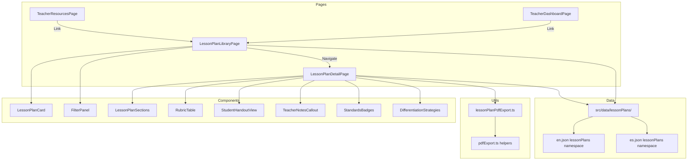

# Design Document: Classroom Lesson Plans

## Overview

This feature extends ModelMentor's teacher tooling with a full curriculum library system. It replaces the current flat lesson plan selector on TeacherResourcesPage with a dedicated, filterable library page and individual detail views. The system introduces structured lesson plan data with standards alignment (CSTA, ISTE, SEP), rubrics with performance levels, differentiation strategies, student handouts, and teacher notes. All content is pre-authored in both English and Spanish, leveraging the existing i18next infrastructure. PDF export uses the established jsPDF + jspdf-autotable pattern already in `src/utils/pdfExport.ts`.

### Key Design Decisions

1. **Static content, not a CMS**: Lesson plans are pre-authored TypeScript data files with i18n keys. No backend/database needed — content ships with the app bundle. This keeps the feature simple and offline-capable.

2. **Separate library page + detail page**: Rather than overloading TeacherResourcesPage, a new `/teacher/lesson-plans` route hosts the library, and `/teacher/lesson-plans/:planId` shows the detail view. TeacherResourcesPage and TeacherDashboardPage link into the library.

3. **Extended data model**: The existing `LessonPlan` interface is replaced with a richer `CurriculumLessonPlan` interface that adds standards, rubrics, differentiation, handouts, and teacher notes. The old interface remains for backward compatibility but the new pages use the new model.

4. **i18n for content**: Lesson plan content uses i18next namespace `lessonPlans` with structured keys. Each plan's translatable strings live in `src/i18n/locales/en.json` and `src/i18n/locales/es.json` under a `lessonPlans` namespace key.

5. **PDF reuses existing patterns**: The new `exportLessonPlanPDF` function follows the same architecture as `exportClassSummaryPDF` — same branding, fonts, spacing, and helper functions from `src/utils/pdfExport.ts`.

## Architecture



### Routing

| Route | Page | Access |
|-------|------|--------|
| `/teacher/lesson-plans` | LessonPlanLibraryPage | Teacher_Role only |
| `/teacher/lesson-plans/:planId` | LessonPlanDetailPage | Teacher_Role only |

Both routes are added to `src/routes.tsx` with `public: false`.

## Components and Interfaces

### Pages

#### LessonPlanLibraryPage (`src/pages/LessonPlanLibraryPage.tsx`)
- Uses `AppLayout` for consistent structure
- Role-gated (teacher, admin, super_admin) — same pattern as TeacherResourcesPage
- Renders `FilterPanel` and a grid of `LessonPlanCard` components
- Filters lesson plans client-side (all data is in-memory)
- Shows empty state when no plans match filters

#### LessonPlanDetailPage (`src/pages/LessonPlanDetailPage.tsx`)
- Uses `AppLayout`
- Reads `planId` from URL params, looks up plan from data
- Renders tabbed sections using Radix Tabs
- Includes PDF export and print buttons in header
- Shows breadcrumb navigation back to library

### Components

#### FilterPanel (`src/components/lesson-plans/FilterPanel.tsx`)
- Radix Select dropdowns for: grade band, subject area, duration, model type
- Optional standard code filter (CSTA/ISTE)
- "Clear filters" button
- Responsive: horizontal on desktop, stacked on mobile

#### LessonPlanCard (`src/components/lesson-plans/LessonPlanCard.tsx`)
- Card showing: title, grade band badge, subject badge, duration badge, model type badge
- Brief description (first ~100 chars of overview)
- Click navigates to detail page
- Uses existing Card, Badge components

#### RubricTable (`src/components/lesson-plans/RubricTable.tsx`)
- Renders rubric as a table (criteria rows × performance level columns)
- Uses existing Table component from `src/components/ui/table.tsx`
- Responsive with horizontal scroll on mobile

#### StudentHandoutView (`src/components/lesson-plans/StudentHandoutView.tsx`)
- Renders the student handout content
- Shows guided prompts, reflection questions, and response space indicators
- Print-friendly styling

#### TeacherNotesCallout (`src/components/lesson-plans/TeacherNotesCallout.tsx`)
- Visually distinct callout (colored border/background)
- Shows misconceptions, discussion prompts, and classroom tips
- Uses Alert component styling pattern

#### StandardsBadges (`src/components/lesson-plans/StandardsBadges.tsx`)
- Displays CSTA and ISTE standard codes as badges
- Expands on hover/click to show full standard description
- Conditionally shows SEP alignment when locale is Spanish

#### DifferentiationStrategies (`src/components/lesson-plans/DifferentiationStrategies.tsx`)
- Three-column layout: Struggling / On-Level / Advanced
- Each column lists specific strategies with ModelMentor feature references
- Uses Accordion for collapsible sections on mobile

### Utility Modules

#### lessonPlanPdfExport.ts (`src/utils/lessonPlanPdfExport.ts`)
- `exportLessonPlanPDF(plan: CurriculumLessonPlan, language: string): void`
- `exportStudentHandoutPDF(plan: CurriculumLessonPlan, language: string): void`
- Reuses `initializePDF`, `addHeader`, `addSectionHeading`, `addParagraph`, `addTable`, `addFooter`, `checkPageBreak` from existing `pdfExport.ts` (these will be exported from that module)
- Adds rubric table, standards section, differentiation section, and handout page
- Generates filename from plan title slug + date
- Wraps in try/catch with toast error fallback

## Data Models

### CurriculumLessonPlan Interface

```typescript
// src/data/lessonPlans/types.ts

export type GradeBand = '6-8' | '9-12';
export type ModelType = 'image-classification' | 'text-classification' | 'regression';
export type SubjectArea = 'computer-science' | 'mathematics' | 'science' | 'cross-curricular';
export type Duration = '45min' | '60min' | '90min';
export type PerformanceLevel = 'beginning' | 'developing' | 'proficient' | 'advanced';

export interface Standard {
  code: string;        // e.g., "3A-AP-13"
  name: string;        // i18n key for standard name
  description: string; // i18n key for how lesson addresses it
  type: 'CSTA' | 'ISTE';
}

export interface SEPAlignment {
  area: string;        // i18n key, e.g., "Pensamiento Computacional"
  description: string; // i18n key
}

export interface RubricCriterion {
  criterion: string;   // i18n key for criterion name
  levels: Record<PerformanceLevel, string>; // i18n keys for each level description
}

export interface LessonPhase {
  name: string;        // i18n key: "warm-up" | "direct-instruction" | "guided-practice" | "independent-practice" | "closure"
  duration: string;    // e.g., "10min"
  steps: string[];     // i18n keys for step-by-step instructions
  teacherNotes?: string[]; // i18n keys for inline teacher notes
  discussionPrompts?: string[]; // i18n keys
  modelMentorFeatures?: string[]; // references to app features used in this phase
}

export interface DifferentiationStrategy {
  level: 'struggling' | 'on-level' | 'advanced';
  strategies: string[];          // i18n keys
  modelMentorFeatures?: string[]; // which features support this level
}

export interface StudentHandout {
  title: string;                 // i18n key
  instructions: string;          // i18n key
  sections: {
    heading: string;             // i18n key
    prompts: string[];           // i18n keys for guided prompts
    reflectionQuestions?: string[]; // i18n keys
    hasResponseSpace: boolean;
  }[];
  workflowSteps: string[];       // i18n keys referencing ModelMentor steps
}

export interface TeacherNotes {
  misconceptions: {
    misconception: string;       // i18n key
    correction: string;          // i18n key
  }[];
  classroomTips: string[];       // i18n keys
  discussionPrompts: {
    phase: string;               // which lesson phase
    prompts: string[];           // i18n keys
  }[];
}

export interface CurriculumLessonPlan {
  id: string;
  slug: string;                  // URL-friendly identifier
  title: string;                 // i18n key
  overview: string;              // i18n key
  gradeBand: GradeBand;
  modelType: ModelType;
  subjectArea: SubjectArea;
  duration: Duration;
  
  // Learning objectives
  objectives: string[];          // i18n keys
  
  // Standards alignment
  standards: Standard[];
  sepAlignment?: SEPAlignment;   // shown when locale is 'es'
  
  // Materials
  materials: string[];           // i18n keys
  vocabulary: {
    term: string;                // i18n key
    definition: string;          // i18n key
  }[];
  
  // Lesson procedure (5 phases)
  procedure: LessonPhase[];
  
  // Assessment
  formativeAssessment: {
    indicators: string[];        // i18n keys referencing in-app indicators
  };
  rubric: RubricCriterion[];
  
  // Differentiation
  differentiation: DifferentiationStrategy[];
  
  // Student handout
  handout: StudentHandout;
  
  // Teacher notes
  teacherNotes: TeacherNotes;
}
```

### File Structure for Lesson Plan Content

```
src/data/lessonPlans/
├── types.ts                          # TypeScript interfaces above
├── index.ts                          # Exports all plans + lookup helpers
├── plans/
│   ├── image-classification-6-8.ts   # Plan data (i18n keys)
│   ├── image-classification-9-12.ts
│   ├── text-classification-9-12.ts
│   └── regression-9-12.ts
└── filters.ts                        # Filter logic utilities
```

Each plan file exports a `CurriculumLessonPlan` object with i18n keys as string values. The actual translated content lives in the i18n JSON files:

```
src/i18n/locales/
├── en.json   (adds "lessonPlans" namespace key)
└── es.json   (adds "lessonPlans" namespace key)
```

### i18n Key Structure

```json
{
  "lessonPlans": {
    "ui": {
      "library": "Lesson Plan Library",
      "filterBy": "Filter by",
      "gradeBand": "Grade Band",
      "noResults": "No lesson plans match your filters. Try broadening your criteria.",
      "exportPdf": "Export PDF",
      "exportHandout": "Export Student Handout",
      "print": "Print",
      "backToLibrary": "Back to Library"
    },
    "plans": {
      "image-classification-6-8": {
        "title": "Introduction to Image Classification",
        "overview": "Students explore how computers...",
        "objectives": ["...", "..."],
        "procedure": { ... }
      }
    },
    "standards": {
      "csta-3A-AP-13": { "name": "...", "description": "..." },
      "iste-5a": { "name": "...", "description": "..." }
    },
    "rubric": {
      "levels": {
        "beginning": "Beginning",
        "developing": "Developing",
        "proficient": "Proficient",
        "advanced": "Advanced"
      }
    }
  }
}
```

### Filter Logic

```typescript
// src/data/lessonPlans/filters.ts

export interface LessonPlanFilters {
  gradeBand?: GradeBand;
  modelType?: ModelType;
  subjectArea?: SubjectArea;
  duration?: Duration;
  standard?: string; // standard code to match
}

export function filterLessonPlans(
  plans: CurriculumLessonPlan[],
  filters: LessonPlanFilters
): CurriculumLessonPlan[] {
  return plans.filter(plan => {
    if (filters.gradeBand && plan.gradeBand !== filters.gradeBand) return false;
    if (filters.modelType && plan.modelType !== filters.modelType) return false;
    if (filters.subjectArea && plan.subjectArea !== filters.subjectArea) return false;
    if (filters.duration && plan.duration !== filters.duration) return false;
    if (filters.standard && !plan.standards.some(s => s.code === filters.standard)) return false;
    return true;
  });
}
```


## Correctness Properties

*A property is a characteristic or behavior that should hold true across all valid executions of a system — essentially, a formal statement about what the system should do. Properties serve as the bridge between human-readable specifications and machine-verifiable correctness guarantees.*

### Property 1: Filter correctness

*For any* set of lesson plans and *any* combination of filter criteria (grade band, model type, subject area, duration, standard code), the `filterLessonPlans` function SHALL return only plans that match ALL active filter criteria, and SHALL not exclude any plan that matches all criteria.

**Validates: Requirements 1.3, 3.4**

### Property 2: Lesson plan data completeness invariant

*For any* `CurriculumLessonPlan` in the system, the following invariants SHALL hold:
- `standards` contains at least one entry with `type === 'CSTA'` and at least one with `type === 'ISTE'`
- `formativeAssessment.indicators` is non-empty
- `rubric` is non-empty and each criterion has all four performance levels with non-empty descriptions
- `differentiation` includes a `'struggling'` level with at least 3 strategies and an `'advanced'` level with at least 3 strategies, each with at least one `modelMentorFeatures` entry
- `handout` has at least one section with prompts, at least one with reflectionQuestions, and `workflowSteps` is non-empty
- `teacherNotes.misconceptions` has length >= 3
- `teacherNotes.classroomTips` is non-empty
- Total discussion prompts across all procedure phases and teacherNotes >= 5

**Validates: Requirements 3.1, 3.2, 4.1, 4.2, 4.3, 5.1, 5.2, 5.4, 7.1, 7.2, 8.1, 8.2, 8.3**

### Property 3: Procedure structure invariant

*For any* `CurriculumLessonPlan`, the `procedure` array SHALL contain exactly 5 phases in the order: warm-up, direct-instruction, guided-practice, independent-practice, closure. Each phase SHALL have a non-empty `duration` string and at least one entry in `steps`.

**Validates: Requirements 2.3, 2.4**

### Property 4: Card rendering completeness

*For any* valid `CurriculumLessonPlan`, when rendered as a `LessonPlanCard`, the output SHALL contain the plan's translated title, grade band label, subject area label, duration label, and model type label.

**Validates: Requirements 1.1**

### Property 5: Detail view section completeness

*For any* valid `CurriculumLessonPlan`, when rendered in the detail view, the output SHALL contain dedicated sections for: title, grade band, subject area, duration, objectives, standards (with code, name, and description for each), materials, procedure, assessment, differentiation, teacher notes, handout, and rubric.

**Validates: Requirements 2.2, 3.3**

### Property 6: Role-based access control

*For any* user profile, access to the Lesson Plan Library SHALL be granted if and only if the user's role is one of: `'teacher'`, `'admin'`, or `'super_admin'`.

**Validates: Requirements 1.5**

### Property 7: PDF content completeness

*For any* valid `CurriculumLessonPlan`, the generated PDF document SHALL contain text content representing: the plan title, objectives, standards codes, procedure phases, rubric criteria, and student handout. The PDF SHALL include a header with the plan title, grade band, and "ModelMentor" branding on every page.

**Validates: Requirements 6.1, 6.3, 6.5**

### Property 8: PDF filename generation

*For any* lesson plan title string, the generated PDF filename SHALL be a URL-safe slug derived from the title, suffixed with the current date in ISO format, and ending with `.pdf`.

**Validates: Requirements 6.6**

### Property 9: i18n key resolution completeness

*For any* `CurriculumLessonPlan` and *for each* supported locale (`'en'`, `'es'`), all i18n keys referenced by the plan (title, overview, objectives, procedure steps, rubric levels, handout content, teacher notes) SHALL resolve to non-empty translated strings.

**Validates: Requirements 10.2**

## Error Handling

| Scenario | Handling |
|----------|----------|
| PDF generation throws | Catch error, display toast with error message and suggestion to use browser print (`window.print()`) as fallback |
| Plan ID in URL not found | Show 404-style message with link back to library |
| i18n key missing translation | Falls back to English (existing i18next `fallbackLng: 'en'` behavior) |
| Filter produces no results | Show empty state message suggesting broader criteria |
| Non-teacher role accesses page | Redirect to home with access denied toast (same pattern as TeacherResourcesPage) |
| Image/asset fails to load in PDF | Skip the asset, continue PDF generation with text content |

## Testing Strategy

### Unit Tests (Example-Based)

- **FilterPanel rendering**: Verify all filter dropdowns render with correct options
- **LessonPlanCard**: Verify card renders with sample plan data
- **RubricTable**: Verify table structure (rows = criteria, columns = levels)
- **Navigation links**: Verify TeacherResourcesPage and TeacherDashboardPage contain links to `/teacher/lesson-plans`
- **SEP alignment conditional**: Verify SEP section appears only when locale is `'es'`
- **Empty state**: Verify empty state message renders when filter returns no plans
- **PDF error fallback**: Mock jsPDF to throw, verify error toast appears
- **Route configuration**: Verify routes array contains lesson plan paths with `public: false`
- **Pre-authored content smoke tests**: Verify all 4 required plans exist with correct model types and grade bands

### Property-Based Tests (fast-check)

Each property test runs a minimum of 100 iterations using the `fast-check` library (already in devDependencies).

- **Property 1**: Generate random arrays of `CurriculumLessonPlan` objects and random `LessonPlanFilters`, verify `filterLessonPlans` output correctness
  - Tag: `Feature: classroom-lesson-plans, Property 1: Filter correctness`
- **Property 2**: Generate random valid `CurriculumLessonPlan` objects, verify all data completeness invariants hold
  - Tag: `Feature: classroom-lesson-plans, Property 2: Lesson plan data completeness invariant`
- **Property 3**: Generate random valid `CurriculumLessonPlan` objects, verify procedure structure
  - Tag: `Feature: classroom-lesson-plans, Property 3: Procedure structure invariant`
- **Property 6**: Generate random user profiles with various roles, verify access control logic
  - Tag: `Feature: classroom-lesson-plans, Property 6: Role-based access control`
- **Property 8**: Generate random title strings, verify filename generation produces valid slugs
  - Tag: `Feature: classroom-lesson-plans, Property 8: PDF filename generation`
- **Property 9**: For each plan and each locale, verify all i18n keys resolve to non-empty strings
  - Tag: `Feature: classroom-lesson-plans, Property 9: i18n key resolution completeness`

### Integration Tests

- **PDF generation end-to-end**: Generate a PDF from a real pre-authored plan, verify file is non-empty and downloadable
- **Route navigation flow**: Navigate from TeacherResourcesPage → Library → Detail → back to Library
- **Language switching**: Switch locale while on detail page, verify content updates reactively

### Test Configuration

- Framework: Vitest (already configured)
- PBT library: fast-check (already in devDependencies)
- Minimum iterations: 100 per property test
- Test location: `src/__tests__/lesson-plans/`
