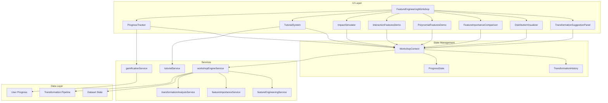
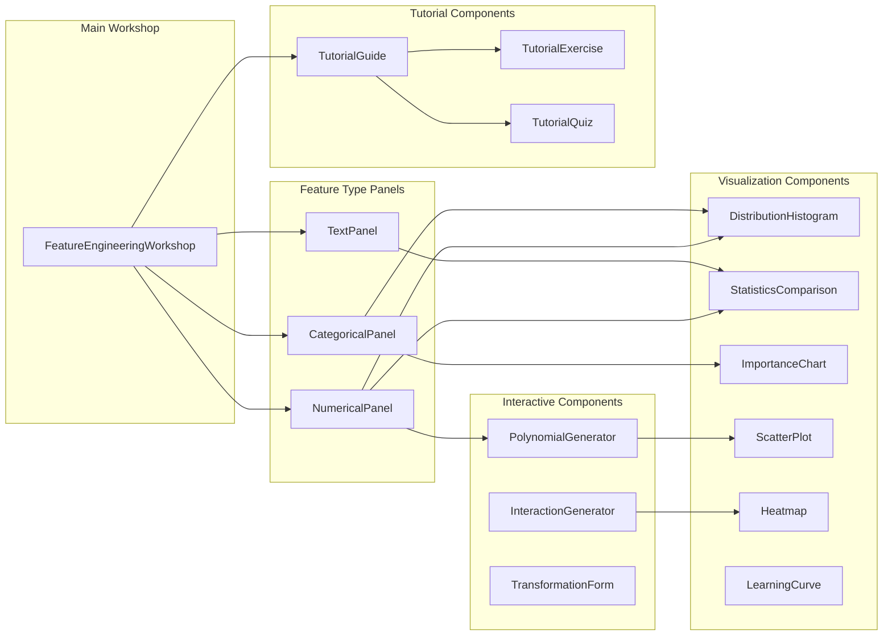

# Design Document: Feature Engineering Workshop

## Overview

The Feature Engineering Workshop is a comprehensive, interactive learning environment that teaches students the fundamental skill of feature engineering before training machine learning models. Building upon the existing `FeatureEngineeringPanel` and `FeatureEngineeringWorkshop` components, this enhanced workshop provides hands-on experience with data transformations, real-time visualizations of transformation effects, and guided tutorials.

### Goals

1. **Educational Impact**: Help students understand how transformations affect data and model performance
2. **Hands-on Learning**: Provide interactive tools for experimenting with transformations
3. **Visual Feedback**: Show before-and-after comparisons for every transformation
4. **Progress Tracking**: Track student progress and award achievements for milestones
5. **Integration**: Seamlessly integrate with the existing data pipeline and training workflow

### Key Design Decisions

1. **Extend Existing Architecture**: Build on `featureEngineeringService` rather than replacing it
2. **Client-Side Computation**: Perform transformations and statistics in the browser for instant feedback
3. **Modular Components**: Create reusable visualization and tutorial components
4. **State Management**: Use React context for workshop state to enable undo/redo and persistence
5. **Progressive Disclosure**: Show basic transformations first, advanced features on demand

## Architecture

### High-Level Architecture



### Component Architecture



## Components and Interfaces

### Core Components

#### 1. FeatureEngineeringWorkshop (Enhanced)

The main container component that orchestrates the workshop experience.

```typescript
interface FeatureEngineeringWorkshopProps {
  data: string[][];
  columnInfo: ColumnInfo[];
  targetColumn?: string;
  onDataTransformed?: (data: string[][], pipeline: TransformationPipeline) => void;
  onWorkshopComplete?: (summary: WorkshopSummary) => void;
}

interface WorkshopState {
  currentTab: 'transformations' | 'polynomial' | 'interactions' | 'tutorials';
  selectedFeatureType: FeatureType;
  selectedFeature: string | null;
  selectedTransformation: TransformationType | null;
  appliedTransformations: AppliedTransformation[];
  previewData: TransformationPreview | null;
  progress: WorkshopProgress;
}
```

#### 2. TransformationSuggestionPanel

Displays context-aware transformation suggestions based on feature type and data characteristics.

```typescript
interface TransformationSuggestionPanelProps {
  featureType: FeatureType;
  featureData: number[] | string[];
  featureName: string;
  onSelect: (transformation: TransformationType) => void;
  onApply: (transformation: TransformationType) => void;
}

interface TransformationSuggestion {
  type: TransformationType;
  name: string;
  description: string;
  expectedImpact: 'low' | 'medium' | 'high';
  applicability: 'applicable' | 'not_applicable' | 'warning';
  applicabilityReason?: string;
  complexity: 'simple' | 'moderate' | 'complex';
}
```

#### 3. DistributionVisualizer

Renders before-and-after distribution comparisons with statistics.

```typescript
interface DistributionVisualizerProps {
  originalData: number[];
  transformedData: number[];
  transformationType: TransformationType;
  showAnimation?: boolean;
  onStatisticHover?: (statistic: string) => void;
}

interface DistributionStats {
  mean: number;
  median: number;
  std: number;
  min: number;
  max: number;
  skewness: number;
  kurtosis: number;
}

interface DistributionComparison {
  original: DistributionStats;
  transformed: DistributionStats;
  changes: {
    meanChange: number;
    stdChange: number;
    skewnessChange: number;
    rangeChange: number;
  };
}
```

#### 4. FeatureImportanceComparison

Shows how transformations affect feature importance.

```typescript
interface FeatureImportanceComparisonProps {
  features: FeatureImportanceChange[];
  targetColumn: string;
  onFeatureSelect?: (feature: string) => void;
}

interface FeatureImportanceChange {
  featureName: string;
  originalImportance: number;
  transformedImportance: number;
  percentageChange: number;
  transformation: TransformationType;
  explanation: string;
}
```

#### 5. PolynomialFeaturesDemo

Interactive demonstration of polynomial feature generation.

```typescript
interface PolynomialFeaturesDemoProps {
  features: string[];
  data: string[][];
  targetColumn: string;
  onPolynomialCreate: (feature: string, degree: number) => void;
}

interface PolynomialFeatureResult {
  originalFeature: string;
  degree: number;
  formula: string;
  values: number[];
  correlation: number;
  r2Improvement: number;
  overfittingRisk: 'low' | 'medium' | 'high';
}
```

#### 6. InteractionFeaturesDemo

Interactive demonstration of feature interactions.

```typescript
interface InteractionFeaturesDemoProps {
  features: string[];
  data: string[][];
  targetColumn: string;
  onInteractionCreate: (feature1: string, feature2: string, type: InteractionType) => void;
}

type InteractionType = 'multiply' | 'divide' | 'add' | 'subtract';

interface InteractionFeatureResult {
  feature1: string;
  feature2: string;
  interactionType: InteractionType;
  formula: string;
  values: number[];
  importance: number;
  explanation: string;
  suggestedInteractions: SuggestedInteraction[];
}

interface SuggestedInteraction {
  feature1: string;
  feature2: string;
  type: InteractionType;
  expectedCorrelation: number;
  rank: number;
}
```

#### 7. ImpactSimulator

Simulates model performance impact from transformations.

```typescript
interface ImpactSimulatorProps {
  originalData: string[][];
  transformedData: string[][];
  targetColumn: string;
  modelType: 'linear_regression' | 'decision_tree';
}

interface ImpactSimulationResult {
  originalMetrics: ModelMetrics;
  transformedMetrics: ModelMetrics;
  improvement: {
    accuracy?: number;
    r2?: number;
    mse?: number;
  };
  learningCurve: LearningCurveData;
  crossValidationScores: number[];
  recommendation: string;
}

interface ModelMetrics {
  accuracy?: number;
  r2?: number;
  mse?: number;
  mae?: number;
}

interface LearningCurveData {
  trainingSizes: number[];
  trainingScores: number[];
  validationScores: number[];
}
```

#### 8. TutorialSystem

Guided tutorial system with interactive exercises.

```typescript
interface TutorialSystemProps {
  userId: string;
  onTutorialComplete: (tutorialId: string) => void;
  onBadgeEarned: (badge: TutorialBadge) => void;
}

interface Tutorial {
  id: string;
  title: string;
  description: string;
  topic: TutorialTopic;
  difficulty: 'beginner' | 'intermediate' | 'advanced';
  steps: TutorialStep[];
  exercises: TutorialExercise[];
  estimatedTime: number; // minutes
}

type TutorialTopic = 
  | 'log_transform'
  | 'one_hot_encoding'
  | 'standardization'
  | 'polynomial_features'
  | 'interaction_features'
  | 'text_vectorization';

interface TutorialStep {
  id: string;
  title: string;
  content: string;
  highlightElement?: string; // CSS selector
  action?: TutorialAction;
  validation?: TutorialValidation;
}

interface TutorialExercise {
  id: string;
  question: string;
  type: 'apply_transformation' | 'select_option' | 'interpret_result';
  correctAnswer: string | string[];
  feedback: {
    correct: string;
    incorrect: string;
  };
}

interface TutorialBadge {
  id: string;
  name: string;
  description: string;
  icon: string;
  tutorialId: string;
}
```

#### 9. ProgressTracker

Tracks and displays workshop progress.

```typescript
interface ProgressTrackerProps {
  userId: string;
  progress: WorkshopProgress;
  onMilestoneReached: (milestone: Milestone) => void;
}

interface WorkshopProgress {
  exploredTransformations: Set<TransformationType>;
  appliedTransformations: AppliedTransformation[];
  completedTutorials: string[];
  featureTypeProgress: {
    numerical: number; // 0-100
    categorical: number;
    text: number;
  };
  totalImprovement: number;
  milestonesReached: string[];
}

interface AppliedTransformation {
  id: string;
  type: TransformationType;
  feature: string;
  timestamp: Date;
  importanceChange: number;
  performanceImpact: number;
}

interface Milestone {
  id: string;
  name: string;
  description: string;
  condition: MilestoneCondition;
  reward: {
    points: number;
    badge?: string;
  };
}

type MilestoneCondition = 
  | { type: 'transformations_applied'; count: number }
  | { type: 'tutorials_completed'; count: number }
  | { type: 'improvement_achieved'; percentage: number };
```

### Service Interfaces

#### workshopEngineService

New service that orchestrates the workshop functionality.

```typescript
interface WorkshopEngineService {
  // Feature Analysis
  analyzeDataset(data: string[][], columnInfo: ColumnInfo[]): DatasetAnalysis;
  categorizeFeature(values: (string | number)[]): FeatureType;
  
  // Transformation Suggestions
  getSuggestionsForFeature(
    featureType: FeatureType,
    featureData: number[] | string[],
    featureName: string
  ): TransformationSuggestion[];
  
  checkTransformationApplicability(
    transformation: TransformationType,
    featureData: number[] | string[]
  ): ApplicabilityResult;
  
  // Transformation Application
  applyTransformation(
    data: string[][],
    feature: string,
    transformation: TransformationType
  ): TransformationResult;
  
  undoTransformation(
    data: string[][],
    transformationId: string
  ): string[][];
  
  // Pipeline Management
  savePipeline(transformations: AppliedTransformation[]): TransformationPipeline;
  loadPipeline(pipeline: TransformationPipeline): AppliedTransformation[];
  exportPipeline(pipeline: TransformationPipeline): string; // JSON
  
  // Statistics & Analysis
  calculateDistributionStats(data: number[]): DistributionStats;
  calculateSkewness(data: number[]): number;
  compareDistributions(original: number[], transformed: number[]): DistributionComparison;
  
  // Importance Calculation
  calculateImportanceChange(
    originalData: string[][],
    transformedData: string[][],
    feature: string,
    targetColumn: string
  ): FeatureImportanceChange;
  
  // Educational Content
  getTransformationExplanation(transformation: TransformationType): TransformationExplanation;
  getUseCases(transformation: TransformationType): UseCase[];
  getAntiPatterns(transformation: TransformationType): AntiPattern[];
  getTip(): DidYouKnowTip;
  getGlossaryTerm(term: string): GlossaryEntry | null;
}

interface DatasetAnalysis {
  columns: ColumnAnalysis[];
  suggestedTransformations: Map<string, TransformationSuggestion[]>;
  overallRecommendations: string[];
}

interface ColumnAnalysis {
  name: string;
  type: FeatureType;
  statistics: DistributionStats | null;
  uniqueValues: number;
  missingValues: number;
  suggestedTransformations: TransformationType[];
}

interface TransformationExplanation {
  whatItDoes: string;
  whyItHelps: string;
  visualAnalogy?: string;
  realWorldExample?: string;
  mathematicalFormula?: string;
}

interface UseCase {
  scenario: string;
  example: string;
  benefit: string;
}

interface AntiPattern {
  scenario: string;
  problem: string;
  alternative: string;
}

interface DidYouKnowTip {
  id: string;
  content: string;
  relatedTransformation?: TransformationType;
}

interface GlossaryEntry {
  term: string;
  definition: string;
  relatedTerms: string[];
}
```

## Data Models

### Transformation Pipeline

```typescript
interface TransformationPipeline {
  id: string;
  name: string;
  createdAt: Date;
  updatedAt: Date;
  steps: PipelineStep[];
  metadata: {
    originalColumns: string[];
    newColumns: string[];
    totalImprovement: number;
  };
}

interface PipelineStep {
  id: string;
  order: number;
  transformation: TransformationType;
  sourceColumn: string;
  targetColumn: string;
  parameters?: Record<string, unknown>;
}
```

### Workshop Session

```typescript
interface WorkshopSession {
  id: string;
  userId: string;
  startedAt: Date;
  completedAt?: Date;
  datasetId?: string;
  progress: WorkshopProgress;
  transformationHistory: TransformationHistoryEntry[];
  summary?: WorkshopSummary;
}

interface TransformationHistoryEntry {
  id: string;
  timestamp: Date;
  action: 'apply' | 'undo' | 'preview';
  transformation: TransformationType;
  feature: string;
  result?: {
    importanceChange: number;
    performanceImpact: number;
  };
}

interface WorkshopSummary {
  totalTransformationsApplied: number;
  totalImprovementAchieved: number;
  mostImpactfulTransformation: {
    type: TransformationType;
    feature: string;
    impact: number;
  };
  tutorialsCompleted: string[];
  badgesEarned: string[];
  timeSpent: number; // minutes
  recommendations: string[];
}
```

### Tutorial Progress

```typescript
interface TutorialProgress {
  tutorialId: string;
  userId: string;
  status: 'not_started' | 'in_progress' | 'completed';
  currentStep: number;
  completedExercises: string[];
  score: number;
  startedAt?: Date;
  completedAt?: Date;
}
```

## Correctness Properties

*A property is a characteristic or behavior that should hold true across all valid executions of a system—essentially, a formal statement about what the system should do. Properties serve as the bridge between human-readable specifications and machine-verifiable correctness guarantees.*

### Property 1: Feature Type Detection Correctness

*For any* column of data with known characteristics (all numeric values, all string categories, or text strings), the `categorizeFeature` function SHALL correctly identify the feature type.

**Validates: Requirements 1.1**

### Property 2: Transformation Metadata Completeness

*For any* transformation type in the system, the transformation SHALL have a valid impact score (low, medium, or high), a plain-language explanation, and at least one use case defined.

**Validates: Requirements 1.5, 10.1, 10.3**

### Property 3: Statistics Calculation Correctness

*For any* array of numeric values, the calculated statistics (mean, median, standard deviation, min, max, skewness) SHALL be mathematically correct within floating-point precision.

**Validates: Requirements 2.2**

### Property 4: Skewness Reduction for Normalizing Transforms

*For any* right-skewed distribution with positive values, applying a log or square root transformation SHALL reduce the absolute skewness value.

**Validates: Requirements 2.3**

### Property 5: Importance Calculation Idempotence

*For any* dataset and feature, computing feature importance twice with the same methodology SHALL produce identical results.

**Validates: Requirements 3.1**

### Property 6: Percentage Change Calculation Correctness

*For any* pair of before and after values, the percentage change SHALL be calculated as `((after - before) / |before|) * 100` when before is non-zero.

**Validates: Requirements 3.2, 6.2**

### Property 7: Feature Ranking Correctness

*For any* list of features with importance changes, ranking by importance change SHALL produce a list sorted in descending order of absolute change value.

**Validates: Requirements 3.3**

### Property 8: Cumulative Change Calculation

*For any* sequence of transformations with individual importance changes, the cumulative change SHALL equal the sum of individual changes, and the most impactful transformation SHALL be correctly identified.

**Validates: Requirements 3.5, 9.4**

### Property 9: Feature Generation Mathematical Correctness

*For any* numeric feature value x and degree n, polynomial term generation SHALL produce x^n. *For any* two numeric values a and b, interaction operations SHALL produce: multiply → a×b, divide → a÷b (when b≠0), add → a+b, subtract → a-b.

**Validates: Requirements 4.1, 5.1, 5.2**

### Property 10: Correlation Calculation Correctness

*For any* two numeric arrays of equal length, the Pearson correlation coefficient SHALL be between -1 and 1 inclusive.

**Validates: Requirements 4.6, 5.4**

### Property 11: Interaction Suggestion Ranking

*For any* set of feature pairs with computed correlations, the top 5 suggested interactions SHALL be those with the highest absolute correlation values.

**Validates: Requirements 5.4**

### Property 12: Cross-Validation Score Count

*For any* dataset and k-fold value where k > 1, cross-validation SHALL produce exactly k scores.

**Validates: Requirements 6.4**

### Property 13: Undo Restores Original State (Round-Trip)

*For any* transformation applied to a dataset, undoing that transformation SHALL restore the dataset to its exact original state.

**Validates: Requirements 8.4**

### Property 14: Pipeline Serialization Round-Trip

*For any* transformation pipeline, serializing to JSON and deserializing SHALL produce an equivalent pipeline that applies the same transformations in the same order.

**Validates: Requirements 8.5**

### Property 15: Error Handling with Alternatives

*For any* transformation that would fail (log of negative values, division by zero), the system SHALL return an error with at least one alternative suggestion.

**Validates: Requirements 1.6, 8.6**

### Property 16: Progress Tracking Accuracy

*For any* sequence of transformation explorations and applications, the progress state SHALL accurately reflect which transformations have been explored and applied.

**Validates: Requirements 9.1, 9.2**

### Property 17: Milestone Detection Correctness

*For any* student who applies exactly the threshold number of transformations (e.g., 3), a milestone notification SHALL be triggered exactly once.

**Validates: Requirements 9.3**

### Property 18: Badge Awarding on Tutorial Completion

*For any* tutorial that is completed, a completion badge SHALL be awarded and recorded in the student's profile.

**Validates: Requirements 7.5**

### Property 19: Glossary Term Coverage

*For any* technical term displayed in the workshop UI, a tooltip definition SHALL be available in the glossary.

**Validates: Requirements 10.6**

## Error Handling

### Transformation Errors

| Error Type | Cause | User Message | Recovery Action |
|------------|-------|--------------|-----------------|
| `InvalidInputError` | Negative values for log transform | "Log transform requires positive values. Your data contains {count} negative values." | Suggest sqrt or standardization |
| `DivisionByZeroError` | Zero values in denominator | "Cannot divide by zero. {count} zero values found in {feature}." | Suggest adding small constant or using multiplication |
| `InsufficientDataError` | Too few unique values | "Feature has only {count} unique values. Consider using a different transformation." | Suggest appropriate alternatives |
| `MemoryLimitError` | One-hot encoding high cardinality | "Feature has {count} unique values. One-hot encoding would create too many columns." | Suggest frequency or target encoding |

### Computation Errors

| Error Type | Cause | User Message | Recovery Action |
|------------|-------|--------------|-----------------|
| `CorrelationError` | Constant feature values | "Cannot calculate correlation for constant feature." | Skip correlation display |
| `ImportanceError` | Missing target column | "Target column not found. Please select a target variable." | Prompt for target selection |
| `SimulationError` | Model training failure | "Model training failed. This may be due to data quality issues." | Show diagnostic information |

### State Errors

| Error Type | Cause | User Message | Recovery Action |
|------------|-------|--------------|-----------------|
| `UndoError` | No transformations to undo | "No transformations to undo." | Disable undo button |
| `PipelineLoadError` | Invalid pipeline format | "Could not load transformation pipeline. The file may be corrupted." | Offer to start fresh |
| `ProgressSaveError` | Database connection failure | "Could not save progress. Your work is preserved locally." | Retry with exponential backoff |

## Testing Strategy

### Unit Testing

Unit tests will cover:
- Statistical calculations (mean, median, std, skewness)
- Transformation logic for each transformation type
- Feature type detection
- Importance calculation
- Pipeline serialization/deserialization

### Property-Based Testing

Property-based tests will validate the correctness properties defined above using a library like `fast-check`:

```typescript
// Example: Property 3 - Statistics Calculation
import * as fc from 'fast-check';

describe('Statistics Calculation', () => {
  it('should calculate mean correctly for any numeric array', () => {
    fc.assert(
      fc.property(
        fc.array(fc.float({ min: -1e6, max: 1e6, noNaN: true }), { minLength: 1 }),
        (data) => {
          const calculated = workshopEngineService.calculateDistributionStats(data).mean;
          const expected = data.reduce((a, b) => a + b, 0) / data.length;
          return Math.abs(calculated - expected) < 1e-10;
        }
      )
    );
  });
});
```

**Property Test Configuration:**
- Minimum 100 iterations per property test
- Each test tagged with: **Feature: feature-engineering-workshop, Property {number}: {property_text}**

### Integration Testing

Integration tests will verify:
- Workshop flow from data loading to transformation application
- Tutorial progression and badge awarding
- Progress persistence across sessions
- Pipeline export and reimport

### Visual/Manual Testing

- Animation smoothness for distribution transitions
- Tooltip positioning and content
- Responsive layout on different screen sizes
- Accessibility compliance (keyboard navigation, screen reader support)

## Implementation Notes

### Performance Considerations

1. **Large Datasets**: For datasets > 10,000 rows, use sampling for visualizations and full data for transformations
2. **Real-time Updates**: Debounce transformation previews to avoid excessive computation
3. **Memory Management**: Clear transformation history beyond 50 entries to prevent memory bloat
4. **Lazy Loading**: Load tutorial content on demand rather than upfront

### Accessibility

1. All interactive elements must be keyboard accessible
2. Color-coded indicators must have text alternatives
3. Animations must respect `prefers-reduced-motion`
4. Charts must have aria-labels and data tables as alternatives

### Browser Compatibility

- Target: Chrome 90+, Firefox 88+, Safari 14+, Edge 90+
- Use feature detection for optional enhancements
- Provide fallbacks for CSS animations

### Dependencies

- **Recharts**: Already in use for visualizations
- **fast-check**: For property-based testing (dev dependency)
- **No new runtime dependencies required**

## Migration Path

1. **Phase 1**: Enhance existing `FeatureEngineeringWorkshop` with new visualization components
2. **Phase 2**: Add `workshopEngineService` and integrate with existing services
3. **Phase 3**: Implement tutorial system and progress tracking
4. **Phase 4**: Add polynomial and interaction feature demonstrations
5. **Phase 5**: Implement impact simulator and summary reports
