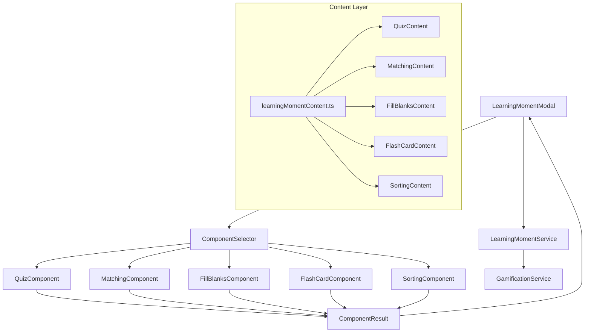
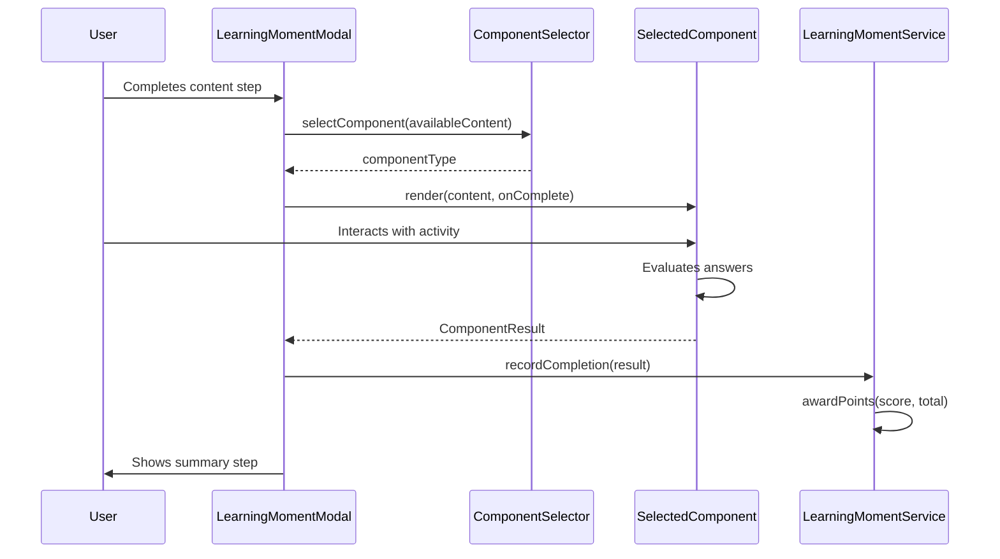

# Design Document: Interactive Learning Variety

## Overview

This design replaces the fixed quiz step (Step 3) in the Learning Moment Modal with a dynamic component selection system. When a learner reaches the interactive activity step, a Component Selector randomly picks one of five learning component types: Quiz, Matching, Fill in the Blanks, Flash Cards, or Concept Sorting. Each component has its own interaction pattern but shares a common interface for scoring, completion, and gamification integration.

The architecture follows a strategy pattern where each learning component implements a shared `LearningComponent` interface. The existing `LearningMomentModal` orchestrates the flow, delegating the interactive step to whichever component the selector chooses. Content for each component type is defined alongside existing learning moment content in the content module.

### Key Design Decisions

1. **Strategy Pattern over Switch Statements**: Each component is a self-contained React component implementing a common props interface, rather than a monolithic component with conditional rendering.
2. **@dnd-kit/core for Drag-and-Drop**: Lightweight, accessible, and supports keyboard alternatives out of the box. Used by Matching and Sorting components.
3. **Content Co-location**: New component content types are added to the existing `learningMomentContent.ts` module, extending the `LearningMomentContent` interface.
4. **Uniform Scoring Interface**: All components report results through the same `ComponentResult` type, making gamification integration straightforward.

## Architecture



### Flow Sequence



## Components and Interfaces

### Shared Interface

```typescript
// src/components/learning/types.ts

/** Types of interactive learning components */
export type LearningComponentType = 
  | 'quiz' 
  | 'matching' 
  | 'fill_blanks' 
  | 'flash_cards' 
  | 'sorting';

/** Result reported by any learning component upon completion */
export interface ComponentResult {
  componentType: LearningComponentType;
  score: number;       // Number of correct answers
  total: number;       // Total possible correct answers
  timeSpentMs: number; // Time spent on the activity
}

/** Common props passed to all learning components */
export interface LearningComponentProps {
  /** Content data specific to this component type */
  content: ComponentContentMap[LearningComponentType];
  /** Called when the learner completes the activity */
  onComplete: (result: ComponentResult) => void;
}
```

### Component Selector

```typescript
// src/components/learning/componentSelector.ts

import type { LearningComponentType } from './types';
import type { InteractiveContent } from '@/utils/learningMomentContent';

export interface ComponentSelectorOptions {
  availableContent: InteractiveContent;
}

/**
 * Selects a random learning component type from those that have content available.
 * Uses uniform random distribution. Falls back to single type if only one has content.
 */
export function selectComponent(options: ComponentSelectorOptions): LearningComponentType {
  const available = getAvailableTypes(options.availableContent);
  
  if (available.length === 0) {
    return 'quiz'; // Ultimate fallback
  }
  
  const index = Math.floor(Math.random() * available.length);
  return available[index];
}

/**
 * Returns component types that have valid content defined.
 */
export function getAvailableTypes(content: InteractiveContent): LearningComponentType[] {
  const types: LearningComponentType[] = [];
  
  if (content.quiz && content.quiz.questions.length > 0) types.push('quiz');
  if (content.matching && content.matching.pairs.length >= 3) types.push('matching');
  if (content.fillBlanks && content.fillBlanks.sentences.length >= 2) types.push('fill_blanks');
  if (content.flashCards && content.flashCards.statements.length >= 3) types.push('flash_cards');
  if (content.sorting && content.sorting.items.length >= 4) types.push('sorting');
  
  return types;
}
```

### Component Registry and Rendering

```typescript
// src/components/learning/ComponentRegistry.tsx

import { lazy } from 'react';
import type { LearningComponentType, LearningComponentProps } from './types';

const QuizComponent = lazy(() => import('./QuizComponent'));
const MatchingComponent = lazy(() => import('./MatchingComponent'));
const FillBlanksComponent = lazy(() => import('./FillBlanksComponent'));
const FlashCardComponent = lazy(() => import('./FlashCardComponent'));
const SortingComponent = lazy(() => import('./SortingComponent'));

const COMPONENT_MAP: Record<LearningComponentType, React.ComponentType<LearningComponentProps>> = {
  quiz: QuizComponent,
  matching: MatchingComponent,
  fill_blanks: FillBlanksComponent,
  flash_cards: FlashCardComponent,
  sorting: SortingComponent,
};

export function getComponentForType(type: LearningComponentType) {
  return COMPONENT_MAP[type];
}
```

### Individual Components

#### QuizComponent (Refactored from existing)

Extracts the existing quiz logic from `LearningMomentModal` into a standalone component. Presents multiple-choice questions sequentially with immediate feedback.

**State**: `currentQuestionIndex`, `selectedAnswer`, `showFeedback`, `isCorrect`, `score`

#### MatchingComponent

Two-column layout using `@dnd-kit/core`. Left column has draggable concept items, right column has droppable definition slots. Keyboard alternative: Tab to select a concept, then Tab through definitions and press Enter to connect.

**State**: `connections` (Map<conceptId, definitionId>), `evaluated`, `results`

#### FillBlanksComponent

Renders sentences with inline blank slots. Word bank displayed below. Drag words from bank to blanks, or use keyboard: Tab to blank, then arrow keys through word bank, Enter to place.

**State**: `placements` (Map<blankId, word>), `evaluated`, `results`

#### FlashCardComponent

Single statement displayed with True/False buttons. After selection, shows explanation and advances to next card. No drag-and-drop needed.

**State**: `currentIndex`, `selectedAnswer`, `showResult`, `score`

#### SortingComponent

Category buckets displayed at top, draggable concept items below. Uses `@dnd-kit/core` with `SortableContext` for each bucket. Keyboard: Tab to item, arrow keys to select bucket, Enter to place.

**State**: `placements` (Map<itemId, categoryId>), `evaluated`, `results`

## Data Models

### Extended Content Types

```typescript
// Added to src/utils/learningMomentContent.ts

/** Content for the Matching component */
export interface MatchingContent {
  pairs: MatchingPair[];
}

export interface MatchingPair {
  id: string;
  concept: string;
  definition: string;
}

/** Content for the Fill in the Blanks component */
export interface FillBlanksContent {
  sentences: FillBlanksSentence[];
  distractors: string[]; // Extra words in the word bank
}

export interface FillBlanksSentence {
  id: string;
  /** Template with blanks marked as {{blank_id}} */
  template: string;
  /** Map of blank_id to correct word */
  blanks: Record<string, string>;
}

/** Content for the Flash Cards component */
export interface FlashCardContent {
  statements: FlashCardStatement[];
}

export interface FlashCardStatement {
  id: string;
  statement: string;
  isTrue: boolean;
  explanation: string;
}

/** Content for the Sorting component */
export interface SortingContent {
  categories: SortingCategory[];
  items: SortingItem[];
}

export interface SortingCategory {
  id: string;
  label: string;
}

export interface SortingItem {
  id: string;
  concept: string;
  correctCategoryId: string;
}

/** Aggregated interactive content for a learning moment */
export interface InteractiveContent {
  quiz?: LearningMomentQuiz;
  matching?: MatchingContent;
  fillBlanks?: FillBlanksContent;
  flashCards?: FlashCardContent;
  sorting?: SortingContent;
}

/** Extended LearningMomentContent with interactive component data */
export interface LearningMomentContentExtended extends LearningMomentContent {
  interactive: InteractiveContent;
}
```

### Component Result Integration

The `LearningMomentResult` type in `learningMomentService.ts` is extended:

```typescript
export interface LearningMomentResult {
  momentType: LearningMomentType;
  completed: boolean;
  componentType: LearningComponentType; // NEW: which component was used
  score: number;        // Replaces quizScore
  total: number;        // Replaces quizTotal
  timeSpentSeconds: number;
}
```

### Evaluation Functions (Pure Logic)

```typescript
// src/components/learning/evaluators.ts

/** Evaluate matching pairs */
export function evaluateMatching(
  correctPairs: MatchingPair[],
  userConnections: Map<string, string> // conceptId -> definitionId
): { correct: string[]; incorrect: string[] } {
  const correct: string[] = [];
  const incorrect: string[] = [];
  
  for (const pair of correctPairs) {
    if (userConnections.get(pair.id) === pair.id) {
      correct.push(pair.id);
    } else {
      incorrect.push(pair.id);
    }
  }
  
  return { correct, incorrect };
}

/** Evaluate fill-in-the-blanks */
export function evaluateFillBlanks(
  sentences: FillBlanksSentence[],
  userPlacements: Map<string, string> // blankId -> word
): { correct: string[]; incorrect: string[] } {
  const correct: string[] = [];
  const incorrect: string[] = [];
  
  for (const sentence of sentences) {
    for (const [blankId, correctWord] of Object.entries(sentence.blanks)) {
      const userWord = userPlacements.get(blankId);
      if (userWord?.toLowerCase() === correctWord.toLowerCase()) {
        correct.push(blankId);
      } else {
        incorrect.push(blankId);
      }
    }
  }
  
  return { correct, incorrect };
}

/** Evaluate sorting */
export function evaluateSorting(
  items: SortingItem[],
  userPlacements: Map<string, string> // itemId -> categoryId
): { correct: string[]; incorrect: string[] } {
  const correct: string[] = [];
  const incorrect: string[] = [];
  
  for (const item of items) {
    if (userPlacements.get(item.id) === item.correctCategoryId) {
      correct.push(item.id);
    } else {
      incorrect.push(item.id);
    }
  }
  
  return { correct, incorrect };
}

/** Evaluate a single answer (quiz or flash card) */
export function evaluateAnswer(
  userAnswer: number | boolean,
  correctAnswer: number | boolean
): boolean {
  return userAnswer === correctAnswer;
}
```

## Correctness Properties

*A property is a characteristic or behavior that should hold true across all valid executions of a system — essentially, a formal statement about what the system should do. Properties serve as the bridge between human-readable specifications and machine-verifiable correctness guarantees.*

### Property 1: Component Selection Validity

*For any* content availability map where at least one component type has valid content, the Component Selector SHALL return only a component type that has content available in that map.

**Validates: Requirements 1.1, 1.4**

### Property 2: Uniform Distribution of Selection

*For any* pool of N available component types (N ≥ 2), over a sufficiently large number of selections, each component type SHALL appear with frequency approximately 1/N (within statistical tolerance).

**Validates: Requirements 1.3**

### Property 3: Answer Evaluation Correctness

*For any* question (quiz or flash card) with a defined correct answer, and *for any* user-provided answer, the evaluation function SHALL return `true` if and only if the user's answer equals the correct answer.

**Validates: Requirements 2.2, 5.2**

### Property 4: Score Tracking Accuracy

*For any* sequence of N answers where K are correct, the component's final score SHALL equal K and the total SHALL equal N.

**Validates: Requirements 2.4, 5.5**

### Property 5: Match Evaluation Correctness

*For any* set of concept-definition pairs and *for any* user-provided connection mapping, the evaluation function SHALL classify a pair as correct if and only if the user connected the concept to its corresponding definition.

**Validates: Requirements 3.3**

### Property 6: Randomization Preserves Elements

*For any* list of items (concepts, definitions, or sorting items), the randomized output SHALL be a permutation of the input — containing exactly the same elements with the same multiplicity.

**Validates: Requirements 3.6, 6.7**

### Property 7: Word Bank Completeness

*For any* fill-in-the-blanks content definition, the word bank (correct answers + distractors) SHALL contain every correct answer word for every blank in every sentence.

**Validates: Requirements 4.2**

### Property 8: Fill-Blanks Evaluation Correctness

*For any* set of sentences with defined correct words per blank, and *for any* user-provided word placements, the evaluation function SHALL classify a blank as correct if and only if the placed word matches the expected word (case-insensitive).

**Validates: Requirements 4.4**

### Property 9: Sorting Evaluation Correctness

*For any* set of items with defined correct categories, and *for any* user-provided category placements, the evaluation function SHALL classify an item as correctly placed if and only if the user placed it in its correct category.

**Validates: Requirements 6.4**

### Property 10: Gamification Consistency

*For any* learning moment type and *for any* two component types completed with the same score ratio, the Gamification Service SHALL award identical base points and identical bonus points (bonus awarded if and only if score equals total).

**Validates: Requirements 7.1, 7.2**

## Error Handling

| Scenario | Handling |
|----------|----------|
| No content available for any component type | Fall back to Quiz component with existing quiz content (backward compatible) |
| Content available for only one component type | Use that single type without randomization |
| @dnd-kit fails to initialize | Automatically switch to keyboard-only mode (buttons instead of drag) |
| Component throws during render | Error boundary catches and falls back to Quiz component |
| User closes modal mid-activity | No points awarded; progress not recorded; state reset on next open |
| localStorage full when recording result | Graceful degradation — log warning, skip persistence, still show summary |

### Error Boundary

Each learning component is wrapped in a `LearningComponentErrorBoundary` that catches render errors and falls back to the Quiz component with an informational message.

```typescript
class LearningComponentErrorBoundary extends React.Component {
  state = { hasError: false };
  
  static getDerivedStateFromError() {
    return { hasError: true };
  }
  
  render() {
    if (this.state.hasError) {
      return <QuizComponent content={this.props.fallbackContent} onComplete={this.props.onComplete} />;
    }
    return this.props.children;
  }
}
```

## Testing Strategy

### Property-Based Tests

Property-based testing is appropriate for this feature because the core logic involves pure evaluation functions, selection algorithms, and data transformations with clear input/output behavior and large input spaces.

**Library**: `fast-check` (TypeScript property-based testing library)
**Configuration**: Minimum 100 iterations per property test

Each correctness property maps to a single property-based test:

| Property | Test Target | Generator Strategy |
|----------|-------------|-------------------|
| 1: Selection Validity | `selectComponent()` | Random subsets of component types with content |
| 2: Uniform Distribution | `selectComponent()` | Fixed pool, 1000+ selections, chi-squared test |
| 3: Answer Evaluation | `evaluateAnswer()` | Random correct answers and user answers |
| 4: Score Tracking | Component score reducers | Random boolean sequences |
| 5: Match Evaluation | `evaluateMatching()` | Random pairs + random connection maps |
| 6: Randomization | Shuffle functions | Random arrays of items |
| 7: Word Bank Completeness | Content validation | Random fill-blanks content |
| 8: Fill-Blanks Evaluation | `evaluateFillBlanks()` | Random sentences + random placements |
| 9: Sorting Evaluation | `evaluateSorting()` | Random items + random category placements |
| 10: Gamification Consistency | `awardPoints()` | Random component types + score ratios |

**Tag format**: `Feature: interactive-learning-variety, Property {N}: {title}`

### Unit Tests (Example-Based)

- Quiz component renders questions and options correctly
- Matching component displays two columns
- Fill-blanks component shows blanks in sentences
- Flash card component shows statement with True/False buttons
- Sorting component displays category buckets
- Incorrect answers show explanations/corrections
- Summary step displays points and achievements
- Keyboard navigation works for all components
- ARIA live regions announce results

### Integration Tests

- Full modal flow: Content → Component Selection → Activity → Summary
- Gamification service records component type with result
- Points awarded correctly after component completion
- Error boundary fallback works when component fails

### Accessibility Tests

- All components navigable via keyboard only
- Screen reader announcements via ARIA live regions
- Visible focus indicators on all interactive elements
- Drag-and-drop alternatives work equivalently to mouse interaction
