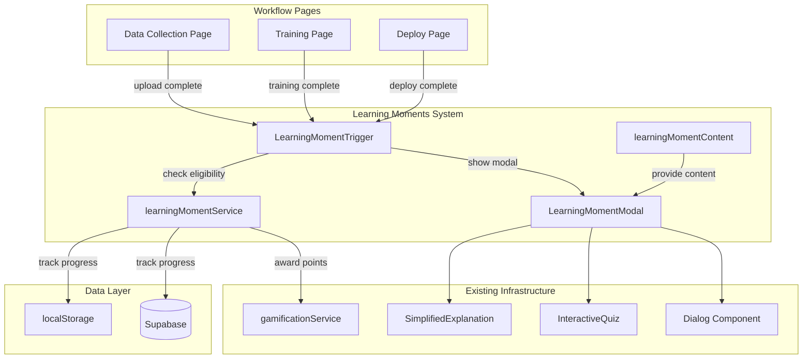

# Design Document: Learning Moments

## Overview

The Learning Moments feature provides contextual educational experiences at three key points in the ML workflow: after data upload (Learn: Data), after model training (Learn: Model), and after deployment (Learn: Next Steps). The system delivers just-in-time learning through modal dialogs that adapt content based on the user's model type, data characteristics, and training results.

This design leverages existing infrastructure:
- **SimplifiedExplanation** component for term explanations
- **InteractiveQuiz** component for quiz functionality
- **gamificationService** for points and achievements
- **Dialog** component from shadcn/ui for modal presentation
- **learningContent** patterns from `src/utils/learning.ts`

The feature integrates seamlessly with the existing workflow without blocking user progress, while encouraging engagement through gamification rewards.

## Architecture



## Components and Interfaces

### LearningMomentModal Component

The primary UI component that displays Learning Moment content in a dialog overlay.

```typescript
// src/components/learning/LearningMomentModal.tsx

interface LearningMomentModalProps {
  /** Type of learning moment to display */
  momentType: LearningMomentType;
  /** Project context for content adaptation */
  project: Project;
  /** Dataset statistics for Learn: Data content */
  datasetStats?: DatasetStats;
  /** Training metrics for Learn: Model content */
  trainingMetrics?: TrainingMetrics;
  /** Model performance for Learn: Next Steps content */
  modelPerformance?: ModelPerformance;
  /** Whether the modal is open */
  isOpen: boolean;
  /** Callback when modal is closed */
  onClose: () => void;
  /** Callback when learning moment is completed */
  onComplete: (result: LearningMomentResult) => void;
  /** Whether this is a guided tour project */
  isGuidedTour?: boolean;
}

type LearningMomentType = 'data' | 'model' | 'next_steps';

interface LearningMomentResult {
  momentType: LearningMomentType;
  completed: boolean;
  quizScore?: number;
  quizTotal?: number;
  timeSpentSeconds: number;
}
```

**Component Structure:**
- Uses shadcn/ui Dialog for modal presentation
- Three-step internal flow: Content → Quiz → Summary
- Progress indicator showing current step
- Responsive design with mobile support (min 320px viewport)
- Keyboard navigation support (Escape to close, Tab navigation)

### LearningMomentTrigger Component

A wrapper component that handles trigger logic and eligibility checking.

```typescript
// src/components/learning/LearningMomentTrigger.tsx

interface LearningMomentTriggerProps {
  /** Type of learning moment to trigger */
  momentType: LearningMomentType;
  /** Project context */
  project: Project;
  /** Whether the trigger condition is met */
  triggerCondition: boolean;
  /** Additional context data */
  contextData?: LearningMomentContextData;
  /** Children to render (the workflow content) */
  children: React.ReactNode;
}

interface LearningMomentContextData {
  datasetStats?: DatasetStats;
  trainingMetrics?: TrainingMetrics;
  modelPerformance?: ModelPerformance;
}
```

**Behavior:**
- Checks eligibility via learningMomentService
- For guided tour: auto-opens modal when trigger condition is met
- For non-guided tour: shows notification prompt that user can click to open
- Respects "Don't show again" preferences

### learningMomentService

Service layer for progress tracking, persistence, and gamification integration.

```typescript
// src/services/learningMomentService.ts

interface LearningMomentProgress {
  projectId: string;
  userId: string | null;
  sessionId: string;
  moments: {
    data: LearningMomentStatus;
    model: LearningMomentStatus;
    next_steps: LearningMomentStatus;
  };
  preferences: LearningMomentPreferences;
}

interface LearningMomentStatus {
  completed: boolean;
  completedAt?: string;
  quizScore?: number;
  quizTotal?: number;
  timeSpentSeconds?: number;
}

interface LearningMomentPreferences {
  dontShowData: boolean;
  dontShowModel: boolean;
  dontShowNextSteps: boolean;
}

class LearningMomentService {
  /** Check if a learning moment should be shown */
  async shouldShowMoment(
    projectId: string,
    momentType: LearningMomentType,
    isGuidedTour: boolean
  ): Promise<boolean>;
  
  /** Record completion of a learning moment */
  async recordCompletion(
    projectId: string,
    result: LearningMomentResult
  ): Promise<void>;
  
  /** Get progress for a project */
  async getProgress(projectId: string): Promise<LearningMomentProgress>;
  
  /** Set "Don't show again" preference */
  async setDontShowPreference(
    momentType: LearningMomentType,
    dontShow: boolean
  ): Promise<void>;
  
  /** Award points and check achievements */
  async awardPoints(
    userId: string,
    momentType: LearningMomentType,
    quizScore: number,
    quizTotal: number
  ): Promise<GamificationResult>;
}
```

**Persistence Strategy:**
- Authenticated users: Supabase `learning_moment_progress` table
- Anonymous users: localStorage with key `modelmentor_learning_moments_{sessionId}`

### learningMomentContent Module

Content definitions following the existing learningContent pattern.

```typescript
// src/utils/learningMomentContent.ts

interface LearningMomentContent {
  title: string;
  description: string;
  icon: string;
  sections: ContentSection[];
  quiz: LearningMomentQuiz;
}

interface ContentSection {
  id: string;
  title: string;
  content: string;
  /** Placeholders for dynamic data: {{sampleCount}}, {{labelCount}}, etc. */
  dynamicContent?: boolean;
  /** Term explanations to show */
  explanations?: SimplifiedExplanationData[];
  /** Optional visualization component key */
  visualization?: string;
}

interface LearningMomentQuiz {
  questions: QuizQuestion[];
  passingScore: number;
}

type LearningMomentContentMap = {
  [K in ModelType]: {
    data: LearningMomentContent;
    model: LearningMomentContent;
    next_steps: LearningMomentContent;
  };
};
```

## Data Models

### Database Schema (Supabase)

```sql
-- Learning moment progress tracking
CREATE TABLE learning_moment_progress (
  id UUID PRIMARY KEY DEFAULT gen_random_uuid(),
  project_id UUID NOT NULL REFERENCES projects(id) ON DELETE CASCADE,
  user_id UUID REFERENCES auth.users(id) ON DELETE CASCADE,
  session_id TEXT,
  moment_type TEXT NOT NULL CHECK (moment_type IN ('data', 'model', 'next_steps')),
  completed BOOLEAN DEFAULT FALSE,
  completed_at TIMESTAMPTZ,
  quiz_score INTEGER,
  quiz_total INTEGER,
  time_spent_seconds INTEGER,
  created_at TIMESTAMPTZ DEFAULT NOW(),
  updated_at TIMESTAMPTZ DEFAULT NOW(),
  UNIQUE(project_id, moment_type)
);

-- User preferences for learning moments
CREATE TABLE learning_moment_preferences (
  id UUID PRIMARY KEY DEFAULT gen_random_uuid(),
  user_id UUID REFERENCES auth.users(id) ON DELETE CASCADE,
  session_id TEXT,
  dont_show_data BOOLEAN DEFAULT FALSE,
  dont_show_model BOOLEAN DEFAULT FALSE,
  dont_show_next_steps BOOLEAN DEFAULT FALSE,
  created_at TIMESTAMPTZ DEFAULT NOW(),
  updated_at TIMESTAMPTZ DEFAULT NOW(),
  UNIQUE(user_id),
  UNIQUE(session_id)
);

-- Indexes for performance
CREATE INDEX idx_lmp_project_id ON learning_moment_progress(project_id);
CREATE INDEX idx_lmp_user_id ON learning_moment_progress(user_id);
CREATE INDEX idx_lmp_session_id ON learning_moment_progress(session_id);
```

### localStorage Schema

```typescript
interface LocalStorageLearningMoments {
  version: 1;
  sessionId: string;
  projects: {
    [projectId: string]: {
      data: LearningMomentStatus;
      model: LearningMomentStatus;
      next_steps: LearningMomentStatus;
    };
  };
  preferences: LearningMomentPreferences;
}
```

### Context Data Interfaces

```typescript
interface DatasetStats {
  sampleCount: number;
  labelCount: number;
  labelDistribution: { [label: string]: number };
  hasClassImbalance: boolean;
  imbalancedClasses: string[];
  detectedIssues: string[];
}

interface TrainingMetrics {
  accuracy: number;
  loss: number;
  precision?: number;
  recall?: number;
  f1Score?: number;
  epochs: number;
  trainingAccuracy: number;
  validationAccuracy: number;
  isOverfitting: boolean;
  isUnderfitting: boolean;
}

interface ModelPerformance {
  finalAccuracy: number;
  performanceCategory: 'high' | 'medium' | 'low';
  modelType: ModelType;
  trainingDuration: number;
}
```


## Correctness Properties

*A property is a characteristic or behavior that should hold true across all valid executions of a system—essentially, a formal statement about what the system should do. Properties serve as the bridge between human-readable specifications and machine-verifiable correctness guarantees.*

### Property 1: Content Selection by Model Type and Moment Type

*For any* valid model type (image_classification, text_classification, regression, classification) and *for any* learning moment type (data, model, next_steps), the content selection system SHALL return content that is specific to that model type and moment type combination.

**Validates: Requirements 2.5, 2.6, 2.7, 2.8, 3.5, 3.6, 3.7, 3.8, 7.1, 10.2, 10.3**

### Property 2: Dataset Statistics Incorporation

*For any* dataset statistics object containing sample count, label distribution, and detected issues, the rendered Learn: Data content SHALL include all provided statistics values in the output.

**Validates: Requirements 2.9, 7.2**

### Property 3: Training Metrics Incorporation

*For any* training metrics object containing accuracy, loss, and epoch values, the rendered Learn: Model content SHALL include all provided metric values in the output.

**Validates: Requirements 3.9, 7.3**

### Property 4: Model Performance Incorporation in Recommendations

*For any* model performance object with accuracy and performance category, the Learn: Next Steps recommendations SHALL reflect the performance level (high accuracy suggests optimization, low accuracy suggests debugging).

**Validates: Requirements 4.5, 4.6, 7.4**

### Property 5: Progress Data Persistence Round-Trip

*For any* learning moment completion data (project ID, moment type, completion status, quiz score, timestamp), storing the data then retrieving it SHALL return equivalent completion data.

**Validates: Requirements 5.1, 5.2, 5.4, 5.5, 5.7, 9.5**

### Property 6: Don't Show Preference Persistence Round-Trip

*For any* moment type and preference value, setting the "don't show again" preference then retrieving it SHALL return the same preference value.

**Validates: Requirements 1.4**

### Property 7: Content Definition Round-Trip

*For any* valid learning moment content definition, serializing the content structure then deserializing it SHALL produce an equivalent content object.

**Validates: Requirements 10.6**

### Property 8: Perfect Quiz Score Awards Bonus Points

*For any* quiz completion where the score equals the total number of questions (perfect score), the system SHALL award exactly 25 bonus points in addition to the base points.

**Validates: Requirements 6.5**

### Property 9: Complete Learner Achievement Unlock

*For any* project where all three learning moments (data, model, next_steps) are marked as completed, the system SHALL unlock the "Complete Learner" achievement for that user.

**Validates: Requirements 6.6**

### Property 10: Knowledge Seeker Achievement Unlock

*For any* user who has completed 5 or more learning moments of any type across all projects, the system SHALL unlock the "Knowledge Seeker" achievement.

**Validates: Requirements 6.7**

### Property 11: Class Imbalance Highlighting

*For any* dataset where any class represents less than 20% of the total samples, the Learn: Data content SHALL include content highlighting class imbalance issues.

**Validates: Requirements 7.5**

### Property 12: Underfitting Explanation

*For any* training session where the loss is not decreasing across epochs, the Learn: Model content SHALL include an explanation of potential underfitting.

**Validates: Requirements 7.6**

### Property 13: Overfitting Explanation

*For any* training session where validation accuracy is more than 10 percentage points lower than training accuracy, the Learn: Model content SHALL include an explanation of overfitting.

**Validates: Requirements 7.7**

### Property 14: Don't Show Preference Prevents Trigger

*For any* learning moment type where the user has set "don't show again" to true, and the project is not in guided tour mode, the system SHALL NOT display the learning moment modal when the trigger condition is met.

**Validates: Requirements 8.4, 11.5**

### Property 15: No Duplicate Triggers for Completed Moments

*For any* learning moment that has already been completed for a given project, the system SHALL NOT display the learning moment modal when the trigger condition is met again.

**Validates: Requirements 11.4**

### Property 16: Content Structure Completeness

*For any* model type and moment type combination, the content definition SHALL include at least one quiz question and support dynamic placeholder replacement for contextual data.

**Validates: Requirements 10.4, 10.5**

### Property 17: Visualizer Reflects Completion Status

*For any* learning moment completion status (not started, in progress, completed), the MLWorkflowVisualizer SHALL display the corresponding visual state for that moment's indicator.

**Validates: Requirements 12.2**

## Error Handling

### Modal Errors

| Error Scenario | Handling Strategy | User Experience |
|----------------|-------------------|-----------------|
| Content loading fails | Display fallback generic content | User sees basic learning content without personalization |
| Quiz submission fails | Retry with exponential backoff, then allow skip | Toast notification, option to skip quiz |
| Progress save fails | Queue for retry, continue workflow | Silent retry, no workflow blocking |
| Gamification service unavailable | Log error, skip point award | User completes moment without points (can be reconciled later) |

### Trigger Errors

| Error Scenario | Handling Strategy | User Experience |
|----------------|-------------------|-----------------|
| Eligibility check fails | Default to showing moment | User sees learning moment |
| Context data unavailable | Use default/generic content | Content without personalization |
| Modal fails to open | Log error, continue workflow | Workflow continues unblocked |

### Data Persistence Errors

| Error Scenario | Handling Strategy | User Experience |
|----------------|-------------------|-----------------|
| Supabase unavailable | Fall back to localStorage | Progress saved locally |
| localStorage full | Clear old data, retry | Transparent to user |
| Data corruption | Reset progress for project | User may need to redo moments |

### Error Logging

All errors are logged with:
- Error type and message
- User/session context
- Moment type and project ID
- Timestamp
- Stack trace (in development)

## Testing Strategy

### Unit Tests

Unit tests verify specific behaviors and edge cases:

1. **LearningMomentModal Component**
   - Renders correctly for each moment type
   - Close button dismisses modal
   - Skip button dismisses modal
   - Don't show again checkbox works
   - Progress indicator updates correctly
   - Keyboard navigation (Escape closes)
   - Responsive layout at 320px viewport

2. **LearningMomentTrigger Component**
   - Triggers modal when condition is met
   - Respects guided tour mode
   - Respects don't show preferences
   - Handles missing context data gracefully

3. **learningMomentService**
   - Records completion correctly
   - Retrieves progress correctly
   - Awards correct points for each moment type
   - Awards bonus points for perfect quiz
   - Unlocks achievements at correct thresholds

4. **learningMomentContent**
   - Returns correct content for each model type
   - Returns correct content for each moment type
   - Replaces placeholders correctly
   - Includes quiz questions for all combinations

### Property-Based Tests

Property-based tests validate universal properties across generated inputs. Each test runs minimum 100 iterations.

**Test Configuration:**
- Framework: fast-check (TypeScript property-based testing library)
- Minimum iterations: 100 per property
- Shrinking enabled for counterexample minimization

**Property Tests to Implement:**

1. **Content Selection Property** (Property 1)
   - Generate random model types and moment types
   - Verify content matches the requested combination

2. **Dataset Stats Incorporation Property** (Property 2)
   - Generate random dataset statistics
   - Verify all stats appear in rendered content

3. **Training Metrics Incorporation Property** (Property 3)
   - Generate random training metrics
   - Verify all metrics appear in rendered content

4. **Progress Persistence Round-Trip Property** (Property 5)
   - Generate random completion data
   - Store then retrieve, verify equivalence

5. **Preference Persistence Round-Trip Property** (Property 6)
   - Generate random preferences
   - Store then retrieve, verify equivalence

6. **Content Round-Trip Property** (Property 7)
   - Generate random content structures
   - Serialize then deserialize, verify equivalence

7. **Achievement Unlock Properties** (Properties 9, 10)
   - Generate random completion sequences
   - Verify achievements unlock at correct thresholds

8. **Conditional Content Properties** (Properties 11, 12, 13)
   - Generate random dataset/training data with edge conditions
   - Verify appropriate content is included

9. **Trigger Prevention Properties** (Properties 14, 15)
   - Generate random preference/completion states
   - Verify triggers are prevented correctly

### Integration Tests

1. **Workflow Integration**
   - Data upload triggers Learn: Data modal
   - Training completion triggers Learn: Model modal
   - Deployment completion triggers Learn: Next Steps modal

2. **Gamification Integration**
   - Points are awarded via gamificationService
   - Achievements are unlocked correctly
   - Toast notifications appear

3. **Persistence Integration**
   - Authenticated user progress saves to Supabase
   - Anonymous user progress saves to localStorage
   - Progress persists across page reloads

4. **MLWorkflowVisualizer Integration**
   - Learning moment indicators appear
   - Completion status is reflected
   - Clicking indicator opens modal

### Accessibility Tests

1. **Keyboard Navigation**
   - Tab through all interactive elements
   - Escape closes modal
   - Focus trapped within modal

2. **Screen Reader**
   - Modal has appropriate ARIA labels
   - Progress indicator is announced
   - Quiz questions are accessible

3. **Visual**
   - Sufficient color contrast
   - Focus indicators visible
   - Responsive at 320px minimum
