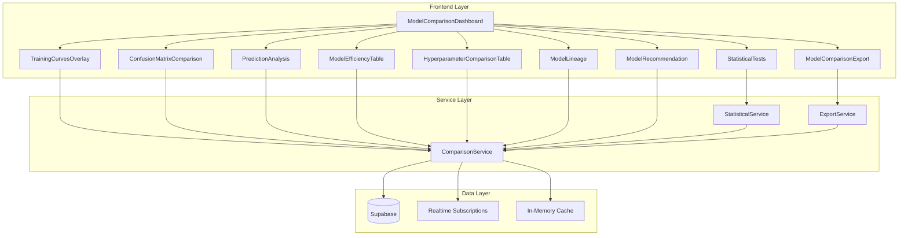
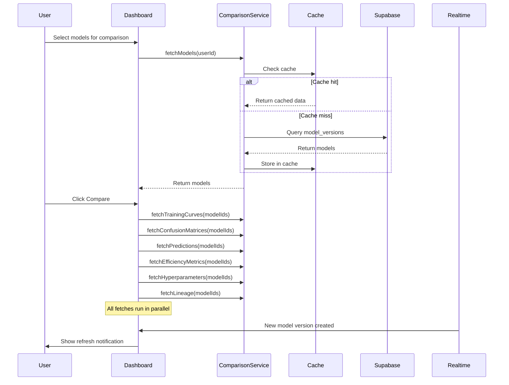
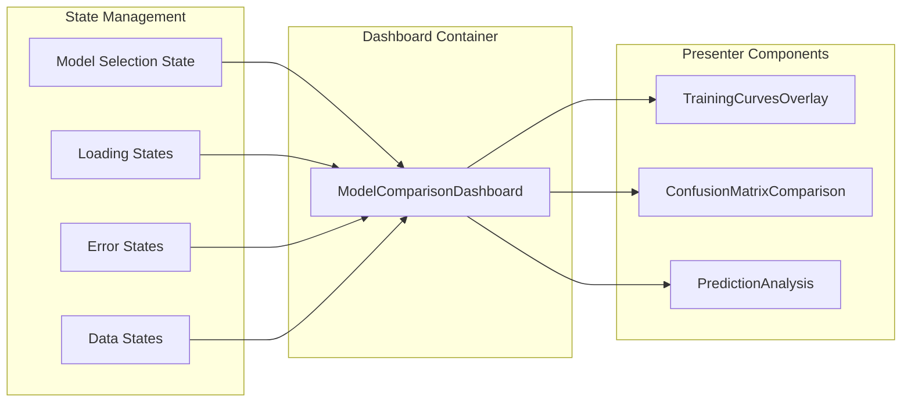

# Design Document: Model Comparison Dashboard Enhancement

## Overview

This design document describes the technical architecture for enhancing the Model Comparison Dashboard to integrate with real backend data from Supabase. The enhancement transforms nine existing comparison components from using placeholder/mock data to fetching and displaying real model data, while adding comprehensive error handling, loading states, real-time synchronization, and export capabilities.

### Goals

1. **Data Integration**: Replace all mock data with real Supabase queries through a centralized Comparison_Service
2. **Schema Extension**: Add database tables and columns to support training curves, efficiency metrics, and model lineage
3. **Component Enhancement**: Update all nine comparison components to consume real data with proper loading and error states
4. **New Capabilities**: Add model recommendation engine, export functionality, and real-time data synchronization
5. **User Experience**: Provide skeleton loaders, error boundaries, and clear feedback during all operations

### Non-Goals

- Modifying the core training or testing logic
- Changing the visual design language of existing components
- Supporting model comparison across different organizations
- Implementing model deployment from the comparison dashboard

## Architecture

### High-Level Architecture



### Data Flow Architecture



### Component Architecture

The dashboard follows a container-presenter pattern where:
- **Container (Dashboard)**: Manages state, orchestrates data fetching, handles errors
- **Presenters (Components)**: Receive data via props, render visualizations, emit user actions



## Components and Interfaces

### ComparisonService Interface

```typescript
// src/services/comparisonService.ts

export interface ComparisonServiceError {
  code: 'NETWORK_ERROR' | 'NOT_FOUND' | 'UNAUTHORIZED' | 'VALIDATION_ERROR' | 'UNKNOWN';
  message: string;
  details?: Record<string, unknown>;
}

export interface ComparisonServiceResult<T> {
  data: T | null;
  error: ComparisonServiceError | null;
}

export interface ModelForComparison {
  id: string;
  projectId: string;
  projectTitle: string;
  versionNumber: number;
  versionName: string | null;
  accuracy: number | null;
  loss: number | null;
  createdAt: string;
  createdBy: string | null;
}

export interface TrainingCurveData {
  modelId: string;
  modelName: string;
  epochs: number[];
  trainLoss: number[];
  valLoss: number[];
  trainAcc: number[];
  valAcc: number[];
}

export interface ConfusionMatrixData {
  modelId: string;
  modelName: string;
  labels: string[];
  matrix: number[][];
}

export interface PredictionData {
  sampleId: string;
  trueLabel: string;
  predictions: Record<string, string>; // modelId -> predicted label
  confidence?: Record<string, number>; // modelId -> confidence score
}

export interface EfficiencyMetrics {
  modelId: string;
  modelName: string;
  trainingTimeSeconds: number | null;
  inferenceTimeMs: number | null;
  modelSizeBytes: number | null;
  flops: number | null;
}

export interface HyperparameterData {
  modelId: string;
  modelName: string;
  learningRate: number | null;
  batchSize: number | null;
  epochs: number | null;
  optimizer: string | null;
  customParams: Record<string, unknown>;
}

export interface LineageData {
  modelId: string;
  modelName: string;
  parentModelId: string | null;
  parentModelName: string | null;
  experimentId: string | null;
  createdAt: string;
  createdBy: string | null;
  notes: string | null;
}

export interface ComparisonService {
  // Model fetching
  fetchModels(userId: string): Promise<ComparisonServiceResult<ModelForComparison[]>>;
  
  // Training data
  fetchTrainingCurves(modelIds: string[]): Promise<ComparisonServiceResult<TrainingCurveData[]>>;
  
  // Test results
  fetchConfusionMatrices(modelIds: string[]): Promise<ComparisonServiceResult<ConfusionMatrixData[]>>;
  fetchPredictions(modelIds: string[], page?: number, pageSize?: number): Promise<ComparisonServiceResult<{
    predictions: PredictionData[];
    total: number;
    page: number;
    pageSize: number;
  }>>;
  
  // Efficiency metrics
  fetchEfficiencyMetrics(modelIds: string[]): Promise<ComparisonServiceResult<EfficiencyMetrics[]>>;
  
  // Hyperparameters
  fetchHyperparameters(modelIds: string[]): Promise<ComparisonServiceResult<HyperparameterData[]>>;
  
  // Lineage
  fetchLineage(modelIds: string[]): Promise<ComparisonServiceResult<LineageData[]>>;
  
  // Cache management
  clearCache(): void;
  invalidateCache(modelId: string): void;
  
  // Realtime subscriptions
  subscribeToModelChanges(userId: string, callback: (change: ModelChangeEvent) => void): () => void;
}

export interface ModelChangeEvent {
  type: 'INSERT' | 'UPDATE' | 'DELETE';
  modelId: string;
  projectId: string;
}
```

### ExportService Interface

```typescript
// src/services/exportService.ts

export interface ExportOptions {
  modelIds: string[];
  includeCharts: boolean;
  includeMetrics: boolean;
  includePredictions: boolean;
  includeHyperparameters: boolean;
  includeLineage: boolean;
  userName: string;
  comparisonDate: string;
}

export interface ExportResult {
  success: boolean;
  error?: string;
  downloadUrl?: string;
  fileName?: string;
}

export interface ExportService {
  exportToPDF(options: ExportOptions): Promise<ExportResult>;
  exportToCSV(options: ExportOptions): Promise<ExportResult>;
  exportCharts(chartRefs: React.RefObject<HTMLElement>[]): Promise<ExportResult>;
}
```

### StatisticalService Interface

```typescript
// src/services/statisticalService.ts

export interface StatisticalTestResult {
  testName: 'paired_t_test' | 'mcnemar_test';
  modelAId: string;
  modelAName: string;
  modelBId: string;
  modelBName: string;
  pValue: number;
  significant: boolean;
  confidenceInterval?: [number, number];
  effectSize?: number;
}

export interface StatisticalService {
  computePairedTTest(
    modelAAccuracies: number[],
    modelBAccuracies: number[]
  ): StatisticalTestResult;
  
  computeMcNemarTest(
    modelAPredictions: string[],
    modelBPredictions: string[],
    trueLabels: string[]
  ): StatisticalTestResult;
  
  computeAllPairwiseTests(
    modelIds: string[],
    predictions: PredictionData[]
  ): Promise<StatisticalTestResult[]>;
}
```

### Component Props Interfaces

```typescript
// Component prop interfaces for enhanced components

export interface TrainingCurvesOverlayProps {
  modelIds: string[];
  data?: TrainingCurveData[];
  loading?: boolean;
  error?: ComparisonServiceError | null;
  onRetry?: () => void;
}

export interface ConfusionMatrixComparisonProps {
  modelIds: string[];
  data?: ConfusionMatrixData[];
  loading?: boolean;
  error?: ComparisonServiceError | null;
  onRetry?: () => void;
}

export interface PredictionAnalysisProps {
  modelIds: string[];
  data?: {
    predictions: PredictionData[];
    total: number;
    page: number;
    pageSize: number;
  };
  loading?: boolean;
  error?: ComparisonServiceError | null;
  onRetry?: () => void;
  onPageChange?: (page: number) => void;
}

export interface ModelEfficiencyTableProps {
  modelIds: string[];
  data?: EfficiencyMetrics[];
  loading?: boolean;
  error?: ComparisonServiceError | null;
  onRetry?: () => void;
}

export interface HyperparameterComparisonTableProps {
  modelIds: string[];
  data?: HyperparameterData[];
  loading?: boolean;
  error?: ComparisonServiceError | null;
  onRetry?: () => void;
}

export interface StatisticalTestsProps {
  modelIds: string[];
  results?: StatisticalTestResult[];
  loading?: boolean;
  error?: ComparisonServiceError | null;
  onRetry?: () => void;
}

export interface ModelLineageProps {
  modelIds: string[];
  data?: LineageData[];
  loading?: boolean;
  error?: ComparisonServiceError | null;
  onRetry?: () => void;
}

export interface ModelRecommendationProps {
  modelIds: string[];
  efficiencyData?: EfficiencyMetrics[];
  accuracyData?: { modelId: string; accuracy: number }[];
  loading?: boolean;
}

export interface ModelComparisonExportProps {
  modelIds: string[];
  disabled?: boolean;
  onExportStart?: () => void;
  onExportComplete?: (result: ExportResult) => void;
  onExportError?: (error: string) => void;
}
```

### Dashboard State Interface

```typescript
// Dashboard state management

export interface DashboardState {
  // Model selection
  availableModels: ModelForComparison[];
  selectedModelIds: string[];
  isComparing: boolean;
  
  // Loading states per component
  loadingStates: {
    models: boolean;
    trainingCurves: boolean;
    confusionMatrices: boolean;
    predictions: boolean;
    efficiency: boolean;
    hyperparameters: boolean;
    statisticalTests: boolean;
    lineage: boolean;
  };
  
  // Error states per component
  errorStates: {
    models: ComparisonServiceError | null;
    trainingCurves: ComparisonServiceError | null;
    confusionMatrices: ComparisonServiceError | null;
    predictions: ComparisonServiceError | null;
    efficiency: ComparisonServiceError | null;
    hyperparameters: ComparisonServiceError | null;
    statisticalTests: ComparisonServiceError | null;
    lineage: ComparisonServiceError | null;
  };
  
  // Data states
  dataStates: {
    trainingCurves: TrainingCurveData[];
    confusionMatrices: ConfusionMatrixData[];
    predictions: { predictions: PredictionData[]; total: number; page: number; pageSize: number };
    efficiency: EfficiencyMetrics[];
    hyperparameters: HyperparameterData[];
    statisticalTests: StatisticalTestResult[];
    lineage: LineageData[];
  };
  
  // Realtime
  hasNewModelData: boolean;
  realtimeSubscription: (() => void) | null;
}
```

## Data Models

### Database Schema Extensions

#### Training Curves Table

```sql
CREATE TABLE training_curves (
  id UUID PRIMARY KEY DEFAULT gen_random_uuid(),
  training_session_id UUID NOT NULL REFERENCES training_sessions(id) ON DELETE CASCADE,
  epoch INTEGER NOT NULL,
  train_loss DECIMAL(10, 6),
  val_loss DECIMAL(10, 6),
  train_accuracy DECIMAL(10, 6),
  val_accuracy DECIMAL(10, 6),
  created_at TIMESTAMPTZ DEFAULT NOW(),
  
  UNIQUE(training_session_id, epoch)
);

CREATE INDEX idx_training_curves_session ON training_curves(training_session_id);
CREATE INDEX idx_training_curves_epoch ON training_curves(training_session_id, epoch);
```

#### Model Version Extensions

```sql
-- Add efficiency metrics columns to model_versions
ALTER TABLE model_versions
ADD COLUMN training_time_seconds INTEGER,
ADD COLUMN inference_time_ms DECIMAL(10, 3),
ADD COLUMN model_size_bytes BIGINT,
ADD COLUMN flops BIGINT,
ADD COLUMN experiment_id VARCHAR(100),
ADD COLUMN optimizer VARCHAR(50);

CREATE INDEX idx_model_versions_experiment ON model_versions(experiment_id);
```

#### Model Lineage Table

```sql
CREATE TABLE model_lineage (
  id UUID PRIMARY KEY DEFAULT gen_random_uuid(),
  model_version_id UUID NOT NULL REFERENCES model_versions(id) ON DELETE CASCADE,
  parent_model_version_id UUID REFERENCES model_versions(id) ON DELETE SET NULL,
  relationship_type VARCHAR(50) DEFAULT 'derived_from',
  notes TEXT,
  created_at TIMESTAMPTZ DEFAULT NOW(),
  
  UNIQUE(model_version_id)
);

CREATE INDEX idx_model_lineage_model ON model_lineage(model_version_id);
CREATE INDEX idx_model_lineage_parent ON model_lineage(parent_model_version_id);
```

#### Test Results Extensions

```sql
-- Ensure test_results has proper structure for predictions
-- The existing predictions JSONB column should store:
-- { "samples": [{ "id": "sample_1", "true_label": "Cat", "predicted_label": "Dog", "confidence": 0.85 }, ...] }

-- Add index for faster prediction queries
CREATE INDEX idx_test_results_session ON test_results(training_session_id);
```

### TypeScript Type Extensions

```typescript
// src/types/comparison.ts

export interface TrainingCurve {
  id: string;
  trainingSessionId: string;
  epoch: number;
  trainLoss: number | null;
  valLoss: number | null;
  trainAccuracy: number | null;
  valAccuracy: number | null;
  createdAt: string;
}

export interface ModelLineage {
  id: string;
  modelVersionId: string;
  parentModelVersionId: string | null;
  relationshipType: string;
  notes: string | null;
  createdAt: string;
}

// Extended ModelVersion with new fields
export interface ExtendedModelVersion extends ModelVersion {
  trainingTimeSeconds: number | null;
  inferenceTimeMs: number | null;
  modelSizeBytes: number | null;
  flops: number | null;
  experimentId: string | null;
  optimizer: string | null;
}

// Prediction sample structure within test_results.predictions
export interface PredictionSample {
  id: string;
  trueLabel: string;
  predictedLabel: string;
  confidence?: number;
}

export interface TestResultPredictions {
  samples: PredictionSample[];
}
```

### Cache Data Structure

```typescript
// In-memory cache structure for ComparisonService

interface CacheEntry<T> {
  data: T;
  timestamp: number;
  expiresAt: number;
}

interface ComparisonCache {
  models: Map<string, CacheEntry<ModelForComparison[]>>; // keyed by userId
  trainingCurves: Map<string, CacheEntry<TrainingCurveData>>; // keyed by modelId
  confusionMatrices: Map<string, CacheEntry<ConfusionMatrixData>>; // keyed by modelId
  predictions: Map<string, CacheEntry<PredictionData[]>>; // keyed by modelId
  efficiency: Map<string, CacheEntry<EfficiencyMetrics>>; // keyed by modelId
  hyperparameters: Map<string, CacheEntry<HyperparameterData>>; // keyed by modelId
  lineage: Map<string, CacheEntry<LineageData>>; // keyed by modelId
}

const CACHE_TTL_MS = 5 * 60 * 1000; // 5 minutes default TTL
```


## Correctness Properties

*A property is a characteristic or behavior that should hold true across all valid executions of a system—essentially, a formal statement about what the system should do. Properties serve as the bridge between human-readable specifications and machine-verifiable correctness guarantees.*

### Property 1: Fetch Operations Return Correct Data for Requested Model IDs

*For any* fetch operation (fetchModels, fetchTrainingCurves, fetchConfusionMatrices, fetchPredictions, fetchEfficiencyMetrics, fetchHyperparameters, fetchLineage) with a set of model IDs, the returned data SHALL contain exactly the data for the requested model IDs—no more, no less—and each returned record SHALL have a modelId that exists in the request set.

**Validates: Requirements 1.1, 1.2, 1.3, 1.4, 1.5, 1.6**

### Property 2: Error Responses Have Consistent Structure

*For any* error condition encountered by the Comparison_Service (network error, not found, unauthorized, validation error), the returned error object SHALL contain a non-empty `code` field from the defined error codes and a non-empty `message` field describing the error.

**Validates: Requirements 1.7**

### Property 3: Cache Returns Identical Data on Subsequent Calls

*For any* fetch operation, calling the same function with the same parameters twice within the cache TTL SHALL return identical data, and the second call SHALL NOT trigger an additional API request to Supabase.

**Validates: Requirements 1.8**

### Property 4: Model Selection Dropdown Displays Required Fields

*For any* model in the available models list, the rendered dropdown option SHALL contain the model name, version number, and creation date in a human-readable format.

**Validates: Requirements 3.2**

### Property 5: Model Selection State Reflects User Actions

*For any* model selection action by the user, the component state SHALL contain exactly the set of model IDs that the user has selected—adding a model adds its ID to state, removing a model removes its ID from state.

**Validates: Requirements 3.4**

### Property 6: Model Selection Count Validation

*For any* number of selected models, if the count is less than 2, the Compare button SHALL be disabled; if the count is between 2 and 10 inclusive, the Compare button SHALL be enabled; if the count exceeds 10, additional selections SHALL be prevented.

**Validates: Requirements 3.5, 3.6**

### Property 7: Training Curves Render All Metrics for All Models

*For any* set of training curve data, the rendered chart SHALL contain four curve datasets per model (train loss, validation loss, train accuracy, validation accuracy), and the total number of datasets SHALL equal 4 times the number of models with data.

**Validates: Requirements 4.2, 4.3**

### Property 8: Model Curves Have Distinct Colors

*For any* set of models displayed in the training curves chart, each model SHALL be assigned a distinct base color, and no two models SHALL share the same color for their curves.

**Validates: Requirements 4.4**

### Property 9: Confusion Matrices Render for All Models

*For any* set of confusion matrix data with N models, the rendered output SHALL contain exactly N confusion matrix visualizations, one for each model.

**Validates: Requirements 5.2**

### Property 10: Confusion Matrix Labels Are Consistent

*For any* set of confusion matrices with potentially different label orderings, the displayed matrices SHALL use a unified, consistent label ordering across all matrices to enable accurate visual comparison.

**Validates: Requirements 5.4**

### Property 11: Confusion Matrix Color Intensity Correlates with Value

*For any* confusion matrix cell, the color intensity SHALL be proportional to the cell value—higher values result in more intense colors, and cells with equal values SHALL have equal color intensity.

**Validates: Requirements 5.6**

### Property 12: Prediction Table Contains Required Columns

*For any* prediction analysis with N models, the rendered table SHALL contain columns for sample ID, true label, one prediction column per model (N columns), and an ensemble vote column, totaling N + 3 columns.

**Validates: Requirements 6.2**

### Property 13: Prediction Disagreement and Color Coding

*For any* prediction row, if the models' predictions are not all identical, the row SHALL be highlighted; each prediction cell SHALL be colored green if it matches the true label, red if it does not match the true label, and blue if it matches the ensemble vote but not the true label.

**Validates: Requirements 6.3, 6.5**

### Property 14: Ensemble Vote Equals Majority Prediction

*For any* prediction row with model predictions, the ensemble vote SHALL equal the prediction that appears most frequently among the models; in case of a tie, the ensemble vote SHALL be deterministically selected (e.g., alphabetically first).

**Validates: Requirements 6.4**

### Property 15: Pagination Activates for Large Datasets

*For any* prediction dataset with more than 50 samples, pagination controls SHALL be displayed, and each page SHALL contain at most 50 samples.

**Validates: Requirements 6.6**

### Property 16: Training Time Formatting

*For any* training time value in seconds, the displayed value SHALL be formatted as "H:MM:SS" where H is hours (no leading zero), MM is minutes (with leading zero), and SS is seconds (with leading zero).

**Validates: Requirements 7.2**

### Property 17: Model Size Unit Selection

*For any* model size in bytes, the displayed value SHALL use the most appropriate unit: bytes for values < 1024, KB for values < 1,048,576, MB for values < 1,073,741,824, and GB for larger values, with the numeric value adjusted accordingly.

**Validates: Requirements 7.4**

### Property 18: Best Efficiency Value Highlighting

*For any* efficiency metric column (training time, inference time, model size), the cell with the lowest (best) value SHALL be visually highlighted, and if multiple cells share the lowest value, all SHALL be highlighted.

**Validates: Requirements 7.6**

### Property 19: Hyperparameter Table Displays Required Fields

*For any* hyperparameter comparison, the table SHALL display rows for learning rate, batch size, epochs, and optimizer, with one column per model.

**Validates: Requirements 8.2**

### Property 20: Hyperparameter Difference Highlighting

*For any* hyperparameter row where at least two models have different values, all cells in that row SHALL be highlighted to indicate the difference.

**Validates: Requirements 8.3**

### Property 21: Custom Hyperparameters Display

*For any* custom hyperparameters stored in the JSONB metadata field, each unique custom parameter key across all models SHALL appear as an additional row in the hyperparameter table.

**Validates: Requirements 8.4**

### Property 22: Statistical Tests Computed for All Model Pairs

*For any* comparison with N models where N ≥ 2, paired t-tests and McNemar tests SHALL be computed for all unique model pairs, resulting in N*(N-1)/2 test results per test type.

**Validates: Requirements 9.1, 9.2**

### Property 23: Statistical Significance Threshold

*For any* statistical test result, if the p-value is less than 0.05, the result SHALL be marked as statistically significant; if the p-value is greater than or equal to 0.05, the result SHALL be marked as not significant.

**Validates: Requirements 9.4**

### Property 24: Lineage Display Shows Required Information

*For any* model lineage data, the display SHALL show the parent model name (or "—" if no parent), experiment ID, creation timestamp, and creator information for each model.

**Validates: Requirements 10.2, 10.3**

### Property 25: Timestamp Timezone Conversion

*For any* UTC timestamp in the lineage data, the displayed timestamp SHALL be converted to and shown in the user's local timezone.

**Validates: Requirements 10.6**

### Property 26: Best Overall Model Recommendation

*For any* set of models, the "best overall" recommendation SHALL be the model with the highest accuracy; if accuracies are tied, the model with the lowest inference time; if still tied, the model with the smallest size.

**Validates: Requirements 11.2**

### Property 27: Edge/Mobile Deployment Recommendation

*For any* set of models, the "best for edge/mobile" recommendation SHALL be the model with the smallest size; if sizes are tied, the model with the lowest inference time.

**Validates: Requirements 11.3**

### Property 28: Accuracy-Critical Recommendation

*For any* set of models, the "best for accuracy-critical applications" recommendation SHALL be the model with the highest accuracy value.

**Validates: Requirements 11.4**

### Property 29: Export Metadata Inclusion

*For any* export operation (PDF, CSV, or charts), the exported document SHALL include the names of all compared models, the date of comparison, and the user information.

**Validates: Requirements 12.4**

### Property 30: CSV Export Structure

*For any* CSV export, the generated files SHALL contain all metrics data, hyperparameter data, and prediction data in a parseable CSV format with headers matching the table column names.

**Validates: Requirements 12.2**

### Property 31: Loading State Skeleton Display

*For any* comparison component in a loading state, a skeleton loader SHALL be displayed in place of the component content.

**Validates: Requirements 13.1**

### Property 32: Error State Display with Retry

*For any* comparison component that encounters a data loading error, an error message SHALL be displayed along with a retry button that, when clicked, re-attempts the data fetch.

**Validates: Requirements 13.2**

### Property 33: Error Boundary Isolation

*For any* component that throws a runtime error, the error SHALL be caught by an error boundary, and the rest of the dashboard SHALL remain functional and interactive.

**Validates: Requirements 13.4**

### Property 34: Model Selection Persistence Across Refresh

*For any* set of selected models, after a data refresh, if those models still exist in the available models list, they SHALL remain selected; models that no longer exist SHALL be removed from the selection.

**Validates: Requirements 14.4**

## Error Handling

### Error Categories and Handling Strategies

| Error Category | Error Code | User Message | Recovery Action |
|---------------|------------|--------------|-----------------|
| Network failure | `NETWORK_ERROR` | "Unable to connect to the server. Please check your internet connection." | Retry button, auto-retry after 5s |
| Resource not found | `NOT_FOUND` | "The requested model data could not be found." | Refresh model list |
| Authentication failure | `UNAUTHORIZED` | "Your session has expired. Please log in again." | Redirect to login |
| Validation error | `VALIDATION_ERROR` | "Invalid request parameters." | Show specific validation message |
| Unknown error | `UNKNOWN` | "An unexpected error occurred." | Retry button, contact support link |

### Error Boundary Implementation

```typescript
// Error boundary wrapper for each comparison component
interface ErrorBoundaryState {
  hasError: boolean;
  error: Error | null;
  errorInfo: React.ErrorInfo | null;
}

class ComparisonErrorBoundary extends React.Component<
  { children: React.ReactNode; componentName: string; onRetry?: () => void },
  ErrorBoundaryState
> {
  // Catches errors in child components
  // Displays fallback UI with error message and retry option
  // Logs error to monitoring service
  // Does not crash the entire dashboard
}
```

### Retry Logic

```typescript
interface RetryConfig {
  maxRetries: number;
  baseDelayMs: number;
  maxDelayMs: number;
  backoffMultiplier: number;
}

const DEFAULT_RETRY_CONFIG: RetryConfig = {
  maxRetries: 3,
  baseDelayMs: 1000,
  maxDelayMs: 10000,
  backoffMultiplier: 2,
};

// Exponential backoff retry wrapper
async function withRetry<T>(
  operation: () => Promise<T>,
  config: RetryConfig = DEFAULT_RETRY_CONFIG
): Promise<T>;
```

### Loading State Management

Each component tracks its own loading state independently:

```typescript
// Loading states are managed per-component to allow partial rendering
const loadingStates = {
  trainingCurves: false,
  confusionMatrices: false,
  predictions: false,
  efficiency: false,
  hyperparameters: false,
  statisticalTests: false,
  lineage: false,
};

// Components render skeleton loaders when their specific loading state is true
// Other components can render normally even if one is still loading
```

### Graceful Degradation

When individual components fail:
1. The failed component displays its error state with retry option
2. Other components continue to function normally
3. Export functionality excludes failed components and notes the exclusion
4. Recommendations adjust based on available data

## Testing Strategy

### Unit Testing Approach

Unit tests focus on:
- **Service layer functions**: Test each Comparison_Service method with mocked Supabase responses
- **Data transformation utilities**: Test formatting functions (time, size, etc.)
- **Statistical computations**: Test t-test and McNemar calculations with known inputs
- **Recommendation logic**: Test ranking algorithms with various model configurations
- **Component rendering**: Test that components render correct structure given props

### Property-Based Testing Configuration

Property-based tests will use **fast-check** library for TypeScript with the following configuration:

```typescript
import fc from 'fast-check';

// Minimum 100 iterations per property test
const PBT_CONFIG = {
  numRuns: 100,
  verbose: true,
  seed: Date.now(), // For reproducibility in CI
};

// Example property test structure
describe('ComparisonService', () => {
  it('Property 1: Fetch operations return correct data for requested model IDs', () => {
    fc.assert(
      fc.asyncProperty(
        fc.array(fc.uuid(), { minLength: 1, maxLength: 10 }),
        async (modelIds) => {
          // Feature: model-comparison-enhancement, Property 1: Fetch operations return correct data
          const result = await comparisonService.fetchTrainingCurves(modelIds);
          if (result.data) {
            const returnedIds = result.data.map(d => d.modelId);
            return (
              returnedIds.every(id => modelIds.includes(id)) &&
              returnedIds.length <= modelIds.length
            );
          }
          return true; // Error case handled separately
        }
      ),
      PBT_CONFIG
    );
  });
});
```

### Test Categories

| Category | Test Type | Coverage Target |
|----------|-----------|-----------------|
| Service layer | Property + Unit | All fetch functions, cache behavior, error handling |
| Data formatting | Property | Time formatting, size unit selection, number precision |
| Statistical tests | Property | T-test computation, McNemar computation, significance threshold |
| Recommendation engine | Property | All three recommendation types with various inputs |
| Component rendering | Unit + Integration | Loading states, error states, data display |
| Export functionality | Integration | PDF generation, CSV structure, chart export |
| Realtime subscriptions | Integration | Event detection, notification display |

### Integration Testing

Integration tests verify:
- End-to-end data flow from Supabase to component rendering
- Realtime subscription behavior with actual Supabase connection
- Export file generation and content validation
- Error boundary behavior with actual component failures

### Test Data Generators

```typescript
// Generators for property-based testing

const modelVersionGenerator = fc.record({
  id: fc.uuid(),
  projectId: fc.uuid(),
  versionNumber: fc.integer({ min: 1, max: 100 }),
  versionName: fc.option(fc.string({ minLength: 1, maxLength: 50 })),
  accuracy: fc.option(fc.float({ min: 0, max: 1 })),
  loss: fc.option(fc.float({ min: 0, max: 10 })),
  createdAt: fc.date().map(d => d.toISOString()),
});

const trainingCurveGenerator = fc.record({
  modelId: fc.uuid(),
  modelName: fc.string({ minLength: 1, maxLength: 50 }),
  epochs: fc.array(fc.integer({ min: 1, max: 100 }), { minLength: 1, maxLength: 100 }),
  trainLoss: fc.array(fc.float({ min: 0, max: 10 })),
  valLoss: fc.array(fc.float({ min: 0, max: 10 })),
  trainAcc: fc.array(fc.float({ min: 0, max: 1 })),
  valAcc: fc.array(fc.float({ min: 0, max: 1 })),
});

const efficiencyMetricsGenerator = fc.record({
  modelId: fc.uuid(),
  modelName: fc.string({ minLength: 1, maxLength: 50 }),
  trainingTimeSeconds: fc.option(fc.integer({ min: 0, max: 86400 })),
  inferenceTimeMs: fc.option(fc.float({ min: 0, max: 1000 })),
  modelSizeBytes: fc.option(fc.integer({ min: 0, max: 10_000_000_000 })),
  flops: fc.option(fc.integer({ min: 0, max: 1_000_000_000_000 })),
});

const predictionGenerator = fc.record({
  sampleId: fc.string({ minLength: 1, maxLength: 20 }),
  trueLabel: fc.string({ minLength: 1, maxLength: 20 }),
  predictions: fc.dictionary(fc.uuid(), fc.string({ minLength: 1, maxLength: 20 })),
});
```

### Mocking Strategy

- **Supabase client**: Mock at the service layer boundary
- **Realtime subscriptions**: Mock subscription callbacks for unit tests
- **Export libraries**: Mock jsPDF and html2canvas for unit tests
- **Chart.js**: Mock canvas context for chart rendering tests

### CI/CD Integration

```yaml
# Property-based tests run with extended timeout
test:pbt:
  runs-on: ubuntu-latest
  steps:
    - run: npm run test:pbt -- --timeout 60000
```
