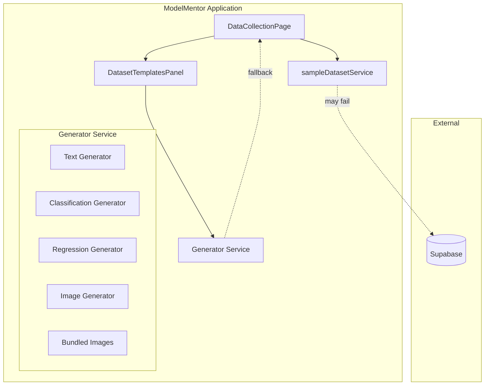
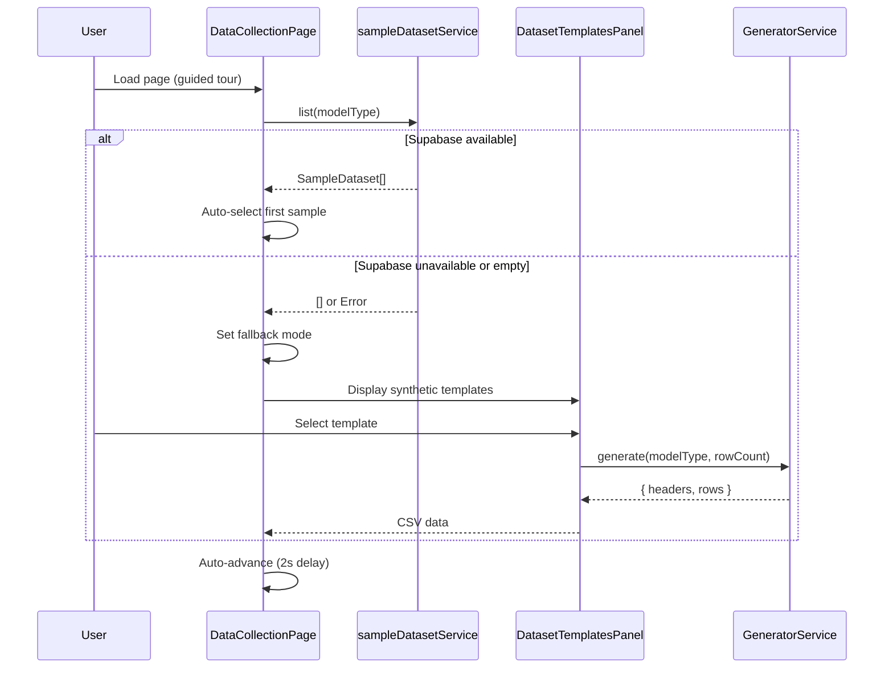

# Technical Design Document: Sample Dataset Generators

## Overview

This feature implements a comprehensive synthetic dataset generation system for the ModelMentor application, ensuring guided tours can complete end-to-end without depending on external Supabase data. The system provides client-side generators for all four supported model types: `text_classification`, `classification`, `regression`, and `image_classification`.

### Problem Statement

Currently, the `DatasetTemplatesPanel` has generators for most model types, but `image_classification` templates have `rows: 0` because images cannot be easily generated inline. The guided tour auto-advance depends on `sampleDatasetService.list()` returning data, which may be empty or unavailable when Supabase is unreachable. This creates a broken user experience where learners cannot complete tutorials.

### Solution Approach

1. **Create a dedicated Generator Service** (`syntheticDatasetGeneratorService.ts`) that provides a unified API for all model types
2. **Bundle small images** for image classification using base64 data URIs embedded in the application
3. **Enhance the fallback system** in `DataCollectionPage.tsx` to automatically use synthetic datasets when Supabase data is unavailable
4. **Update `DatasetTemplatesPanel`** to support image classification templates with bundled images

### Key Design Decisions

| Decision | Rationale |
|----------|-----------|
| Client-side generation only | Ensures offline capability and eliminates network dependencies |
| Base64 data URIs for images | Avoids external URL dependencies; images are bundled with the app |
| Deterministic seeding option | Enables reproducible tests and consistent demo experiences |
| Unified generator interface | Simplifies adding new model types and maintains consistency |
| Minimum 100 rows for tabular data | Provides sufficient data for meaningful ML training demonstrations |
| Minimum 20 images (10 per class) | Balances bundle size with training viability |

## Architecture

### System Context Diagram



### Data Flow



## Components and Interfaces

### 1. SyntheticDatasetGeneratorService

**Location:** `src/services/syntheticDatasetGeneratorService.ts`

```typescript
// ─────────────────────────────────────────────────────────────────────────────
// Types
// ─────────────────────────────────────────────────────────────────────────────

export interface GeneratedDataset {
  headers: string[];
  rows: string[][];
}

export interface GeneratorOptions {
  rowCount?: number;
  seed?: number;  // Optional seed for deterministic generation
}

export interface ImageDatasetRow {
  imageDataUri: string;
  label: string;
  filename: string;
}

export interface ImageGeneratedDataset {
  images: ImageDatasetRow[];
  labels: string[];
}

// ─────────────────────────────────────────────────────────────────────────────
// Service Interface
// ─────────────────────────────────────────────────────────────────────────────

export interface SyntheticDatasetGeneratorService {
  /**
   * Generate a dataset for the specified model type.
   * @throws Error if modelType is not supported
   */
  generateForModelType(
    modelType: ModelType,
    options?: GeneratorOptions
  ): GeneratedDataset | ImageGeneratedDataset;

  /**
   * Get the appropriate generator function for a model type.
   * @throws Error if modelType is not supported
   */
  getGeneratorForModelType(
    modelType: ModelType
  ): (options?: GeneratorOptions) => GeneratedDataset | ImageGeneratedDataset;

  /**
   * Check if a model type is supported.
   */
  isModelTypeSupported(modelType: ModelType): boolean;

  // Individual generators
  generateTextClassification(options?: GeneratorOptions): GeneratedDataset;
  generateClassification(options?: GeneratorOptions): GeneratedDataset;
  generateRegression(options?: GeneratorOptions): GeneratedDataset;
  generateImageClassification(options?: GeneratorOptions): ImageGeneratedDataset;
}
```

### 2. Updated DatasetTemplatesPanel

**Location:** `src/components/data/DatasetTemplatesPanel.tsx`

Changes required:
- Add new `DatasetTemplate` entries for image classification with bundled images
- Update `handleLoad` to support image datasets
- Add visual indicator for "bundled/synthetic" vs "external" data sources
- Add "network-required" badge for templates that need connectivity

```typescript
// New template structure for image classification
interface ImageDatasetTemplate extends DatasetTemplate {
  modelType: 'image_classification';
  generateData: () => ImageDatasetRow[];
  bundledImages: true;
}

// Updated props to handle image datasets
interface DatasetTemplatesPanelProps {
  modelType: ModelType;
  onLoadDataset: (csvText: string, filename: string, template: DatasetTemplate) => void;
  onLoadImageDataset?: (images: ImageDatasetRow[], template: DatasetTemplate) => void;
}
```

### 3. Updated DataCollectionPage

**Location:** `src/pages/DataCollectionPage.tsx`

Changes required:
- Enhanced fallback detection logic
- Informational message when using synthetic data
- Support for image dataset loading from templates
- Auto-selection of appropriate synthetic dataset based on model type

```typescript
// New state for fallback mode
const [usingSyntheticFallback, setUsingSyntheticFallback] = useState(false);

// Enhanced fallback logic
useEffect(() => {
  if (project?.is_guided_tour) {
    if (sampleLoadError || sampleLoadEmpty) {
      setUsingSyntheticFallback(true);
      // Auto-select first synthetic template
      autoSelectSyntheticTemplate(project.model_type);
    }
  }
}, [project, sampleLoadError, sampleLoadEmpty]);
```

### 4. Bundled Images Module

**Location:** `src/data/bundledImages.ts`

Contains base64-encoded images for image classification:

```typescript
export interface BundledImage {
  dataUri: string;
  label: string;
  filename: string;
  sizeBytes: number;
}

export const BUNDLED_IMAGES: Record<string, BundledImage[]> = {
  'cats-vs-dogs': [
    // 10 cat images, 10 dog images
    // Each image < 50KB, base64 encoded
  ],
  'shapes': [
    // 10 circles, 10 squares, 10 triangles
    // Simple geometric shapes, very small file size
  ]
};
```

## Data Models

### GeneratedDataset

The standard output format for tabular data generators:

```typescript
interface GeneratedDataset {
  headers: string[];  // Column names, e.g., ['sepal_length', 'species']
  rows: string[][];   // Data rows, all values as strings for CSV compatibility
}
```

### ImageGeneratedDataset

The output format for image classification generators:

```typescript
interface ImageGeneratedDataset {
  images: ImageDatasetRow[];
  labels: string[];  // Unique class labels, e.g., ['cat', 'dog']
}

interface ImageDatasetRow {
  imageDataUri: string;  // Base64 data URI, e.g., 'data:image/png;base64,...'
  label: string;         // Class label for this image
  filename: string;      // Suggested filename, e.g., 'cat_001.png'
}
```

### Generator Configuration

Configuration for each generator type:

```typescript
interface TextClassificationConfig {
  minRowCount: 100;
  defaultRowCount: 100;
  classes: string[];           // e.g., ['positive', 'negative']
  phraseVariants: number;      // Number of unique phrases per class
}

interface ClassificationConfig {
  minRowCount: 100;
  defaultRowCount: 150;
  featureRanges: Record<string, [number, number]>;  // Per-class feature ranges
  classes: string[];
}

interface RegressionConfig {
  minRowCount: 100;
  defaultRowCount: 200;
  featureWeights: number[];    // Coefficients for linear relationship
  noiseStdDev: number;         // Standard deviation of noise
}

interface ImageClassificationConfig {
  minImageCount: 20;
  defaultImageCount: 20;
  maxImageSizeBytes: 50 * 1024;  // 50KB
  minClassCount: 2;
  minImagesPerClass: 10;
}
```

### Seeded Random Number Generator

For deterministic generation:

```typescript
class SeededRandom {
  private seed: number;
  
  constructor(seed: number) {
    this.seed = seed;
  }
  
  next(): number {
    // Linear congruential generator
    this.seed = (this.seed * 1103515245 + 12345) & 0x7fffffff;
    return this.seed / 0x7fffffff;
  }
  
  between(min: number, max: number): number {
    return min + this.next() * (max - min);
  }
  
  choice<T>(arr: T[]): T {
    return arr[Math.floor(this.next() * arr.length)];
  }
}
```


## Correctness Properties

*A property is a characteristic or behavior that should hold true across all valid executions of a system—essentially, a formal statement about what the system should do. Properties serve as the bridge between human-readable specifications and machine-verifiable correctness guarantees.*

### Property 1: Tabular Generators Produce Minimum Row Count

*For any* tabular generator (text_classification, classification, regression) invoked with default options, the returned dataset SHALL contain at least 100 rows.

**Validates: Requirements 1.2, 2.2, 3.2**

### Property 2: Text Classification Structure Correctness

*For any* generated text classification dataset, the dataset SHALL have exactly 2 columns where the first column contains non-empty text strings and the second column contains category labels.

**Validates: Requirements 1.1**

### Property 3: Text Classification Balanced Class Distribution

*For any* generated text classification dataset, the count of samples in each class SHALL differ by no more than 10% of the total row count.

**Validates: Requirements 1.3**

### Property 4: Text Classification Phrase Variety

*For any* generated text classification dataset with N rows, the number of unique text values SHALL be at least N/5 (20% uniqueness ratio) to ensure variety.

**Validates: Requirements 1.5**

### Property 5: Numeric Classification Structure Correctness

*For any* generated numeric classification dataset, all feature columns SHALL contain valid numeric values (parseable as floats), and the output column SHALL contain categorical string labels.

**Validates: Requirements 2.1**

### Property 6: Numeric Classification Class Separability

*For any* generated numeric classification dataset with multiple classes, the mean feature values (centroids) for different classes SHALL be distinct (not identical), while the feature value ranges SHALL overlap between classes.

**Validates: Requirements 2.4**

### Property 7: Regression Structure Correctness

*For any* generated regression dataset, all columns (both features and target) SHALL contain valid numeric values parseable as floats.

**Validates: Requirements 3.1**

### Property 8: Regression Feature-Target Correlation

*For any* generated regression dataset, the Pearson correlation coefficient between at least one feature and the target variable SHALL be greater than 0.3 (indicating a meaningful relationship).

**Validates: Requirements 3.3**

### Property 9: Regression Noise Presence

*For any* generated regression dataset, the residuals from a linear fit SHALL have a non-zero standard deviation, indicating the presence of noise.

**Validates: Requirements 3.4**

### Property 10: Image Classification Structure Correctness

*For any* generated image classification dataset, each image entry SHALL contain a valid base64 data URI (starting with 'data:image/'), a non-empty label string, and a non-empty filename string.

**Validates: Requirements 4.1**

### Property 11: Image Classification Minimum Count

*For any* generated image classification dataset invoked with default options, the dataset SHALL contain at least 20 images.

**Validates: Requirements 4.2**

### Property 12: Image Classification Data URI Format

*For any* generated image classification dataset, all image references SHALL be base64 data URIs (not external URLs), ensuring offline availability.

**Validates: Requirements 4.3, 8.3**

### Property 13: Image Classification Size Constraint

*For any* image in a generated image classification dataset, the decoded image size SHALL be less than 50KB (51,200 bytes).

**Validates: Requirements 4.5**

### Property 14: Image Classification Class Distribution

*For any* generated image classification dataset, there SHALL be at least 2 distinct class labels, and each class SHALL have at least 10 images.

**Validates: Requirements 4.6**

### Property 15: Fallback Auto-Selection Model Type Match

*For any* project model type in guided tour fallback mode, the auto-selected synthetic template SHALL have a modelType property matching the project's model type.

**Validates: Requirements 5.4**

### Property 16: Unified Interface Consistency

*For any* tabular generator (text_classification, classification, regression), the return value SHALL conform to the structure `{ headers: string[], rows: string[][] }` where headers is a non-empty array and rows is an array of arrays with length matching headers.

**Validates: Requirements 6.1, 6.2**

### Property 17: getGeneratorForModelType Returns Correct Generator

*For any* supported ModelType, calling `getGeneratorForModelType(modelType)` SHALL return a function that, when invoked, produces a dataset appropriate for that model type.

**Validates: Requirements 6.3**

### Property 18: Deterministic Seeding

*For any* generator and any seed value, invoking the generator twice with the same seed SHALL produce identical output datasets.

**Validates: Requirements 6.5**

### Property 19: Templates Exist for All Model Types

*For any* supported ModelType, the Dataset_Templates_Panel SHALL contain at least one template with `rows > 0` (or `images.length > 0` for image_classification).

**Validates: Requirements 7.1**

### Property 20: Button Enabled for Valid Templates

*For any* template in Dataset_Templates_Panel where `rows > 0` (or bundled images exist for image_classification), the "Use This Dataset" button SHALL be enabled.

**Validates: Requirements 7.4**

### Property 21: Synchronous Generation

*For any* generator function, the return value SHALL be the dataset directly (not a Promise), ensuring synchronous operation.

**Validates: Requirements 8.2**

## Error Handling

### Generator Service Errors

| Error Condition | Error Type | Message | Recovery |
|-----------------|------------|---------|----------|
| Unsupported model type | `UnsupportedModelTypeError` | `Model type "${modelType}" is not supported. Supported types: text_classification, classification, regression, image_classification` | Caller should validate model type before calling |
| Invalid row count (< 1) | `InvalidOptionsError` | `Row count must be at least 1, received: ${rowCount}` | Use default row count |
| Invalid seed (non-integer) | `InvalidOptionsError` | `Seed must be an integer, received: ${seed}` | Use random seed |

### Fallback System Errors

| Error Condition | Handling | User Feedback |
|-----------------|----------|---------------|
| `sampleDatasetService.list()` throws | Catch error, set `sampleLoadError` state | Display error alert with retry button |
| `sampleDatasetService.list()` returns empty | Set `sampleLoadEmpty` state | Display info alert suggesting synthetic templates |
| Template generation fails | Catch error, show toast | "Failed to load template data. Please try another template." |
| Image data URI invalid | Skip invalid image, log warning | Continue with valid images; warn if count drops below minimum |

### Graceful Degradation

1. **Network unavailable**: All synthetic generators work offline; only Supabase sample datasets are affected
2. **Bundled images corrupted**: Fall back to geometric shapes dataset (simplest, smallest)
3. **Browser memory constraints**: Reduce default row count; provide option for smaller datasets

### Error Logging

```typescript
// Error logging pattern
try {
  const dataset = generatorService.generateForModelType(modelType, options);
} catch (error) {
  console.error(`[GeneratorService] Failed to generate ${modelType} dataset:`, error);
  
  if (error instanceof UnsupportedModelTypeError) {
    // Log and show user-friendly message
    toast.error(`This project type is not yet supported for synthetic data.`);
  } else {
    // Generic error handling
    toast.error('Failed to generate sample data. Please try again.');
  }
}
```

## Testing Strategy

### Overview

This feature uses a dual testing approach:
- **Property-based tests**: Verify universal properties across many generated inputs (minimum 100 iterations per property)
- **Unit tests**: Verify specific examples, edge cases, and error conditions

### Property-Based Testing Configuration

**Library**: fast-check (already used in the project or to be added)

**Configuration**:
```typescript
// Property test configuration
const PBT_CONFIG = {
  numRuns: 100,        // Minimum iterations per property
  seed: 42,            // Default seed for reproducibility in CI
  verbose: true,       // Log failing examples
};
```

### Test File Structure

```
src/__tests__/
├── services/
│   └── syntheticDatasetGeneratorService.test.ts
│       ├── Property tests (P1-P21)
│       └── Unit tests (error cases, edge cases)
├── components/
│   └── data/
│       └── DatasetTemplatesPanel.test.tsx
│           ├── Property tests (P19, P20)
│           └── Integration tests (template loading)
└── pages/
    └── DataCollectionPage.test.tsx
        ├── Property tests (P15)
        └── Integration tests (fallback behavior)
```

### Property Test Implementation Examples

```typescript
// Property 1: Tabular Generators Produce Minimum Row Count
// Feature: sample-dataset-generators, Property 1: Tabular generators produce minimum row count
describe('Property 1: Tabular Generators Produce Minimum Row Count', () => {
  it('text_classification generator produces >= 100 rows', () => {
    fc.assert(
      fc.property(fc.constant(undefined), () => {
        const result = generatorService.generateTextClassification();
        expect(result.rows.length).toBeGreaterThanOrEqual(100);
      }),
      PBT_CONFIG
    );
  });

  it('classification generator produces >= 100 rows', () => {
    fc.assert(
      fc.property(fc.constant(undefined), () => {
        const result = generatorService.generateClassification();
        expect(result.rows.length).toBeGreaterThanOrEqual(100);
      }),
      PBT_CONFIG
    );
  });

  it('regression generator produces >= 100 rows', () => {
    fc.assert(
      fc.property(fc.constant(undefined), () => {
        const result = generatorService.generateRegression();
        expect(result.rows.length).toBeGreaterThanOrEqual(100);
      }),
      PBT_CONFIG
    );
  });
});

// Property 18: Deterministic Seeding
// Feature: sample-dataset-generators, Property 18: Deterministic seeding
describe('Property 18: Deterministic Seeding', () => {
  it('same seed produces identical output', () => {
    fc.assert(
      fc.property(fc.integer({ min: 1, max: 1000000 }), (seed) => {
        const result1 = generatorService.generateTextClassification({ seed });
        const result2 = generatorService.generateTextClassification({ seed });
        
        expect(result1.headers).toEqual(result2.headers);
        expect(result1.rows).toEqual(result2.rows);
      }),
      PBT_CONFIG
    );
  });
});
```

### Unit Test Coverage

| Component | Test Cases |
|-----------|------------|
| `syntheticDatasetGeneratorService` | Unsupported model type error, invalid options, edge cases (rowCount=1, rowCount=1000) |
| `DatasetTemplatesPanel` | Template rendering, button states, toast messages, image template handling |
| `DataCollectionPage` | Fallback trigger conditions, auto-advance timing, error recovery |
| `bundledImages` | Image data integrity, size validation, label correctness |

### Integration Tests

1. **Full guided tour flow**: Complete tour using synthetic data for each model type
2. **Offline mode**: Verify all synthetic features work without network
3. **Template → Training pipeline**: Verify generated data is accepted by training components

### Test Data Generators (for property tests)

```typescript
// Arbitrary for GeneratorOptions
const generatorOptionsArb = fc.record({
  rowCount: fc.option(fc.integer({ min: 1, max: 500 })),
  seed: fc.option(fc.integer({ min: 1, max: 1000000 })),
});

// Arbitrary for ModelType
const modelTypeArb = fc.constantFrom(
  'text_classification',
  'classification', 
  'regression',
  'image_classification'
);

// Arbitrary for tabular ModelType only
const tabularModelTypeArb = fc.constantFrom(
  'text_classification',
  'classification',
  'regression'
);
```

### CI/CD Integration

- Property tests run on every PR
- Seed is fixed in CI for reproducibility
- Failing examples are logged for debugging
- Coverage threshold: 80% for new service code
