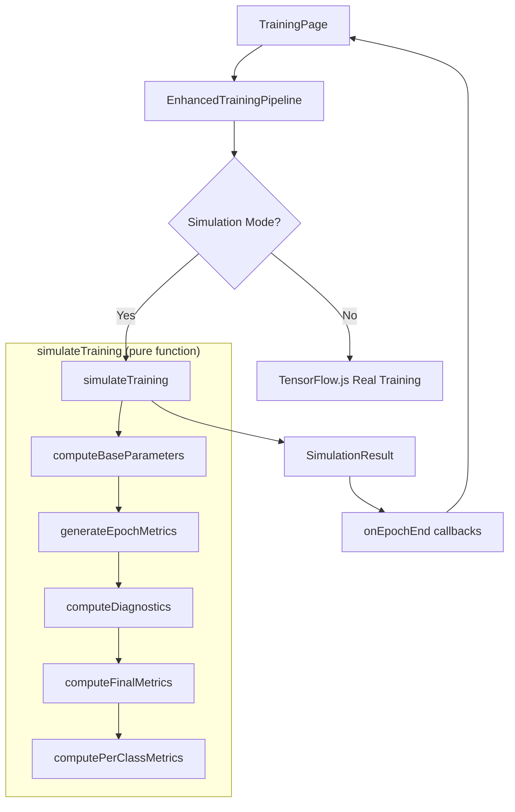

# Design Document: Smart Training Simulation

## Overview

The Smart Training Simulation engine is a pure, deterministic TypeScript function that generates realistic epoch-by-epoch training metrics based on student-configured hyperparameters, dataset properties, and model architecture choices. It replaces the current naive metric generation (simple exponential decay + random noise in `EnhancedTrainingPipeline`) with a physics-informed simulation that teaches students to recognize the consequences of their parameter choices.

The engine runs 100% client-side, produces all epochs in under 1 second (up to 200 epochs), and integrates with the existing `TrainingPage` and `EnhancedTrainingPipeline` callback system. It uses a seeded PRNG for reproducibility and composes parameter effects multiplicatively to model realistic interactions.

### Design Decisions

1. **Pure function architecture**: The simulation engine is a single pure function `simulateTraining(config) → result` with no side effects, making it trivially testable and cacheable.
2. **Multiplicative composition**: Parameter effects are composed multiplicatively (not additively) so that combining bad choices produces realistically compounding degradation.
3. **Seeded Mulberry32 PRNG**: A fast 32-bit PRNG (Mulberry32) provides deterministic noise without external dependencies.
4. **Separation from pipeline**: The simulation engine is a standalone utility; the `EnhancedTrainingPipeline` calls it and feeds results through its existing callback system, preserving the current UI contract.

## Architecture



### Data Flow

1. Student configures training parameters in `TrainingConfigPanel`
2. `TrainingPage` passes config to `EnhancedTrainingPipeline`
3. Pipeline detects simulation mode and calls `simulateTraining(config)`
4. Engine computes all epochs synchronously (< 1s)
5. Pipeline replays results through `onEpochEnd` callbacks with artificial delays for UX
6. UI renders metrics charts and diagnostics as if training were live

## Components and Interfaces

### Core Types

```typescript
// src/utils/simulation/types.ts

export type OptimizerType = 'adam' | 'sgd' | 'rmsprop';
export type ModelComplexity = 'low' | 'medium' | 'high';

export interface SimulationConfig {
  // Hyperparameters
  learningRate: number;        // e.g., 0.001
  batchSize: number;           // e.g., 32
  epochs: number;              // 1–200
  optimizer: OptimizerType;

  // Architecture
  architecture: ModelComplexity;

  // Dataset properties
  datasetSize: number;         // number of samples
  classImbalanceRatio: number; // e.g., 1.0 = balanced, 10.0 = 10:1 imbalance
  dataQualityScore: number;    // 0.0–1.0

  // Reproducibility
  seed?: number;               // optional; generated if omitted
}

export interface EpochMetrics {
  epoch: number;
  loss: number;
  accuracy: number;
  val_loss: number;
  val_accuracy: number;
}

export interface FinalMetrics {
  accuracy: number;
  loss: number;
  precision: number;
  recall: number;
  f1_score: number;
}

export interface PerClassMetrics {
  className: string;
  precision: number;
  recall: number;
  f1: number;
}

export interface Diagnostics {
  isOverfitting: boolean;
  isUnderfitting: boolean;
  isDiverging: boolean;
  isOscillating: boolean;
}

export interface SimulationResult {
  metrics: EpochMetrics[];
  finalMetrics: FinalMetrics;
  perClassMetrics: PerClassMetrics[];
  diagnostics: Diagnostics;
  seed: number;
}
```

### Simulation Engine Module

```typescript
// src/utils/simulation/engine.ts

export function simulateTraining(config: SimulationConfig): SimulationResult;
```

### Internal Sub-Functions

```typescript
// src/utils/simulation/parameters.ts

export interface BaseParameters {
  optimalLR: number;
  divergenceThreshold: number;
  oscillationRange: [number, number];
  convergenceEpoch: number;
  overfittingOnset: number;
  maxAccuracy: number;
  noiseFloor: number;
  noiseAmplitude: number;
  convergenceRate: number;
}

export function computeBaseParameters(config: SimulationConfig): BaseParameters;
```

```typescript
// src/utils/simulation/rng.ts

export function createRng(seed: number): () => number;
export function generateSeed(): number;
```

```typescript
// src/utils/simulation/curves.ts

export function generateLossCurve(
  params: BaseParameters,
  config: SimulationConfig,
  rng: () => number
): number[];

export function generateAccuracyCurve(
  lossCurve: number[],
  params: BaseParameters,
  config: SimulationConfig,
  rng: () => number
): number[];

export function generateValidationCurves(
  trainLoss: number[],
  trainAccuracy: number[],
  params: BaseParameters,
  config: SimulationConfig,
  rng: () => number
): { valLoss: number[]; valAccuracy: number[] };
```

```typescript
// src/utils/simulation/diagnostics.ts

export function computeDiagnostics(metrics: EpochMetrics[]): Diagnostics;
export function computeFinalMetrics(metrics: EpochMetrics[], params: BaseParameters): FinalMetrics;
export function computePerClassMetrics(
  finalMetrics: FinalMetrics,
  config: SimulationConfig
): PerClassMetrics[];
```

### Integration Adapter

```typescript
// src/utils/simulation/adapter.ts

/**
 * Wraps simulateTraining for use with EnhancedTrainingPipeline callbacks.
 * Replays epoch results with configurable delay for UX.
 */
export function createSimulationRunner(
  config: SimulationConfig,
  callbacks: {
    onEpochEnd: (epoch: number, logs: Record<string, number>) => void;
    onComplete: (result: SimulationResult) => void;
  },
  options?: { replayDelayMs?: number }
): { start: () => Promise<void>; cancel: () => void };
```

## Data Models

### Parameter Effect Computation

The engine computes base parameters by composing individual effects:

**Optimal Learning Rate** is determined by model complexity and optimizer:
- `adam`: base 0.001, scaled by complexity (low: 3x, medium: 1x, high: 0.3x)
- `sgd`: base 0.01, scaled by complexity
- `rmsprop`: base 0.001, scaled by complexity

**Maximum Achievable Accuracy** is computed multiplicatively:
```
maxAccuracy = architectureCeiling
            × datasetSizeFactor
            × dataQualityFactor
            × classBalanceFactor
```

Where:
- `architectureCeiling`: low=0.82, medium=0.91, high=0.97
- `datasetSizeFactor`: `min(1.0, 0.7 + 0.3 × log10(datasetSize) / log10(10000))`
  - Capped at 0.7 when datasetSize < 100
- `dataQualityFactor`: `0.8 + 0.2 × dataQualityScore` (when score > 0.9, factor = 1.0)
- `classBalanceFactor`: `1.0 - 0.1 × log2(classImbalanceRatio)` (clamped to [0.6, 1.0])

**Noise Floor** (minimum achievable loss):
```
noiseFloor = (1 - dataQualityScore) × 0.3 + log2(classImbalanceRatio) × 0.05
```

**Noise Amplitude** (epoch-to-epoch variance):
```
noiseAmplitude = baseNoise / sqrt(batchSize) × (1 + (1 - dataQualityScore))
```
Where `baseNoise = 0.15` for batch size 1.

**Convergence Rate**:
```
convergenceRate = baseLREffect × complexityFactor × dataSufficiencyFactor
```
- `baseLREffect`: ratio of actual LR to optimal LR (clamped)
- `complexityFactor`: low=1.5, medium=1.0, high=0.6
- `dataSufficiencyFactor`: `min(1.0, datasetSize / (modelParams × 10))`

**Overfitting Onset** (epoch where val_accuracy starts declining):
```
overfittingOnset = baseOnset × dataSufficiencyRatio × (1 / complexityMultiplier)
```
Where `dataSufficiencyRatio = datasetSize / (modelParams × 10)`.

### Loss Curve Generation

For each epoch `t`:

**Diverging** (LR > divergenceThreshold):
```
loss[t] = initialLoss × (1 + 0.1 × t)^1.5
```

**Oscillating** (LR in oscillation range):
```
loss[t] = targetLoss + amplitude × sin(2π × t / period) × (1 - 0.1 × t/epochs)
```

**Converging** (LR in optimal range):
```
loss[t] = noiseFloor + (initialLoss - noiseFloor) × exp(-convergenceRate × t)
         + noise[t]
```

**Slow convergence** (LR < 10% of optimal):
```
loss[t] = noiseFloor + (initialLoss - noiseFloor) × exp(-convergenceRate × 0.2 × t)
         + noise[t]
```

### Validation Curve Generation

```
val_loss[t] = loss[t] + generalizationGap[t]
```

Where `generalizationGap[t]` increases after `overfittingOnset`:
```
if t < overfittingOnset:
  generalizationGap[t] = baseGap
else:
  generalizationGap[t] = baseGap + overfitRate × (t - overfittingOnset)^1.2
```

### Seeded PRNG (Mulberry32)

```typescript
function mulberry32(seed: number): () => number {
  return function() {
    seed |= 0; seed = seed + 0x6D2B79F5 | 0;
    let t = Math.imul(seed ^ seed >>> 15, 1 | seed);
    t = t + Math.imul(t ^ t >>> 7, 61 | t) ^ t;
    return ((t ^ t >>> 14) >>> 0) / 4294967296;
  };
}
```


## Correctness Properties

*A property is a characteristic or behavior that should hold true across all valid executions of a system — essentially, a formal statement about what the system should do. Properties serve as the bridge between human-readable specifications and machine-verifiable correctness guarantees.*

### Property 1: Deterministic reproducibility

*For any* valid `SimulationConfig` with a fixed seed, calling `simulateTraining` twice with identical inputs SHALL produce identical `SimulationResult` objects (deep equality on all metric arrays).

**Validates: Requirements 8.2**

### Property 2: Diverging loss is monotonically increasing

*For any* valid `SimulationConfig` where `learningRate` exceeds the computed divergence threshold, the resulting loss curve SHALL be monotonically non-decreasing after the first 3 epochs (i.e., `loss[t+1] >= loss[t]` for all `t >= 3`).

**Validates: Requirements 1.1**

### Property 3: Oscillating loss does not converge

*For any* valid `SimulationConfig` where `learningRate` falls within the oscillation range, the resulting loss curve SHALL have at least 3 direction changes (sign flips in the first derivative) and the final loss SHALL NOT be within 10% of the noise floor.

**Validates: Requirements 1.2**

### Property 4: Slow learning rate produces slow convergence

*For any* valid `SimulationConfig`, if the learning rate is set below 10% of the computed optimal value, the convergence rate (measured as epochs to reach 50% loss reduction) SHALL be at least 5× slower than with the optimal learning rate on the same config.

**Validates: Requirements 1.3**

### Property 5: Optimal learning rate converges within 60% of epochs

*For any* valid `SimulationConfig` where `learningRate` is within the optimal range and `epochs >= 20`, the loss curve SHALL reach within 10% of the noise floor by epoch `0.6 × totalEpochs`.

**Validates: Requirements 1.4**

### Property 6: Small dataset caps validation accuracy at 70%

*For any* valid `SimulationConfig` where `datasetSize < 100`, the maximum `val_accuracy` across all epochs SHALL NOT exceed 0.70.

**Validates: Requirements 2.1**

### Property 7: Dataset size effect is logarithmic

*For any* valid base `SimulationConfig`, if we compare results at dataset sizes `N` and `10N` (with all other parameters identical), the increase in maximum validation accuracy SHALL be sublinear — specifically, the ratio of accuracy gains `(acc(10N) - acc(N)) / (acc(100N) - acc(10N))` SHALL be greater than 1.0 (diminishing returns).

**Validates: Requirements 2.2**

### Property 8: Insufficient data produces overfitting

*For any* valid `SimulationConfig` where `datasetSize < 10 × modelParameters` (derived from architecture) and `epochs` is sufficient for convergence, the maximum gap `max(train_accuracy - val_accuracy)` SHALL be at least 0.15.

**Validates: Requirements 2.3**

### Property 9: Class imbalance degrades minority metrics proportionally

*For any* valid `SimulationConfig` where `classImbalanceRatio > 5`, the simulation SHALL produce `finalMetrics.accuracy > 0.80` AND the minority class recall in `perClassMetrics` SHALL be below `0.40`. Furthermore, when `classImbalanceRatio > 10`, minority class precision SHALL be below `0.50` and minority class recall below `0.25`.

**Validates: Requirements 3.1, 3.2**

### Property 10: Balanced datasets produce uniform per-class metrics

*For any* valid `SimulationConfig` where `classImbalanceRatio < 2`, all per-class F1 scores in `perClassMetrics` SHALL be within 0.10 of `finalMetrics.accuracy`.

**Validates: Requirements 3.3**

### Property 11: Insufficient epochs produce underfitting

*For any* valid `SimulationConfig` where `epochs` is below the computed convergence threshold, the final training loss SHALL be above 50% of the initial loss value (`metrics[last].loss > 0.5 × metrics[0].loss`).

**Validates: Requirements 4.1**

### Property 12: Excess epochs produce overfitting curve

*For any* valid `SimulationConfig` where `epochs` exceeds the computed overfitting onset by at least 20%, the `val_accuracy` curve SHALL have a maximum before the final epoch, followed by a decline of at least 2 percentage points.

**Validates: Requirements 4.2**

### Property 13: Architecture complexity tradeoff

*For any* two valid `SimulationConfig` objects differing only in `architecture` (one 'low', one 'high'), with sufficient epochs and data, the high-complexity model SHALL have a higher maximum accuracy but SHALL take at least 2× as many epochs to reach 90% of its maximum compared to the low-complexity model.

**Validates: Requirements 5.1, 5.2**

### Property 14: Noise amplitude scales inversely with sqrt(batchSize)

*For any* valid `SimulationConfig` and any two batch sizes `B1` and `B2`, the ratio of epoch-to-epoch noise amplitudes SHALL approximate `sqrt(B1) / sqrt(B2)` (within 20% tolerance to account for random variation).

**Validates: Requirements 6.4, 6.1**

### Property 15: Large batch size slows convergence

*For any* valid `SimulationConfig`, running with `batchSize > 256` SHALL require at least 40% more epochs to reach the same loss level as `batchSize = 32` (all other parameters equal).

**Validates: Requirements 6.2**

### Property 16: Low data quality reduces maximum accuracy

*For any* valid `SimulationConfig`, if `dataQualityScore < 0.5`, the maximum achievable validation accuracy SHALL be at least 20 percentage points lower than the same config with `dataQualityScore = 1.0`.

**Validates: Requirements 7.1**

### Property 17: High data quality is indistinguishable from perfect

*For any* valid `SimulationConfig` with `dataQualityScore > 0.9`, the resulting metrics SHALL be within 1 percentage point of the same config with `dataQualityScore = 1.0` (for all epoch metrics).

**Validates: Requirements 7.3**

### Property 18: Multiplicative composition of parameter effects

*For any* valid `SimulationConfig`, the computed `maxAccuracy` SHALL equal the product of individual factors: `architectureCeiling × datasetSizeFactor × dataQualityFactor × classBalanceFactor` (within floating-point tolerance). This ensures combined bad choices compound rather than merely add.

**Validates: Requirements 9.4**

### Property 19: Combined effects amplify beyond individual effects

*For any* valid `SimulationConfig` where two degrading factors are present simultaneously (e.g., high LR + small batch, or low quality + high complexity), the resulting degradation (measured as noise floor or oscillation amplitude) SHALL exceed the maximum degradation produced by either factor alone.

**Validates: Requirements 9.1, 9.3**

### Property 20: More data reduces overfitting for complex models

*For any* valid `SimulationConfig` with `architecture = 'high'`, increasing `datasetSize` while keeping all other parameters constant SHALL reduce the maximum `(train_accuracy - val_accuracy)` gap.

**Validates: Requirements 9.2**

## Error Handling

### Input Validation

The `simulateTraining` function validates all inputs before computation:

| Parameter | Valid Range | Error Behavior |
|-----------|------------|----------------|
| `learningRate` | > 0, ≤ 10 | Clamp to bounds, log warning |
| `batchSize` | ≥ 1, ≤ 4096 | Clamp to bounds |
| `epochs` | ≥ 1, ≤ 200 | Clamp to bounds |
| `datasetSize` | ≥ 10 | Clamp to minimum 10 |
| `classImbalanceRatio` | ≥ 1.0 | Clamp to minimum 1.0 |
| `dataQualityScore` | 0.0–1.0 | Clamp to [0, 1] |
| `seed` | integer | Floor to integer |

### Numerical Stability

- All loss values are clamped to `[0, 100]` to prevent infinity/NaN
- Accuracy values are clamped to `[0, 1]`
- Division by zero is guarded in all ratio computations
- The PRNG is initialized with a non-zero seed (if seed=0, use seed=1)

### Graceful Degradation

- If the configuration produces degenerate results (e.g., all metrics identical), the diagnostics will flag `isDiverging` or `isUnderfitting` appropriately
- The function never throws; it always returns a valid `SimulationResult`

## Testing Strategy

### Unit Tests (Example-Based)

- Verify output structure: `SimulationResult` always contains all required fields
- Verify seed generation: calling without seed produces a numeric seed in the result
- Verify specific known configurations produce expected curve shapes (regression tests)
- Verify edge cases: minimum epochs (1), maximum epochs (200), extreme learning rates
- Verify `computeBaseParameters` returns sensible values for all (optimizer, complexity) combinations

### Property-Based Tests

The property-based testing library will be **fast-check** (TypeScript). Each property test runs a minimum of 100 iterations with generated `SimulationConfig` values.

Each test is tagged with: `Feature: smart-training-simulation, Property {N}: {title}`

Properties to implement:
1. Deterministic reproducibility (Property 1)
2. Diverging loss monotonicity (Property 2)
3. Oscillating loss non-convergence (Property 3)
4. Slow LR slow convergence (Property 4)
5. Optimal LR fast convergence (Property 5)
6. Small dataset accuracy cap (Property 6)
7. Logarithmic dataset scaling (Property 7)
8. Insufficient data overfitting (Property 8)
9. Class imbalance minority degradation (Property 9)
10. Balanced class uniformity (Property 10)
11. Insufficient epochs underfitting (Property 11)
12. Excess epochs overfitting curve (Property 12)
13. Architecture complexity tradeoff (Property 13)
14. Noise scales with 1/sqrt(batchSize) (Property 14)
15. Large batch slows convergence (Property 15)
16. Low quality reduces accuracy (Property 16)
17. High quality ≈ perfect quality (Property 17)
18. Multiplicative composition (Property 18)
19. Combined effects amplification (Property 19)
20. More data reduces overfitting (Property 20)

### Integration Tests

- Verify `createSimulationRunner` correctly replays epochs through callbacks
- Verify integration with `EnhancedTrainingPipeline` callback interface
- Verify the adapter produces the same metric format as real TensorFlow.js training
- Verify cancellation works mid-replay

### Performance Tests

- Verify `simulateTraining` completes in < 50ms for 200 epochs (well under the 1s budget)
- Verify no memory leaks across repeated calls
