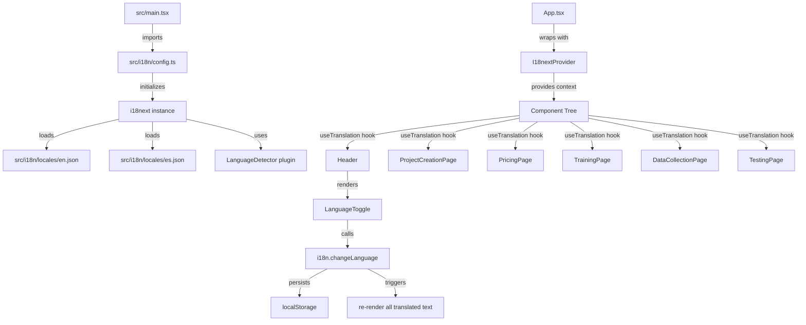

# Design Document: Spanish Localization

## Overview

This design covers Phase 1 of Spanish localization for ModelMentor: setting up the i18n infrastructure using `react-i18next` and translating the most visible pages (Project Creation, Pricing, Training, Data Collection, Testing).

The approach integrates `react-i18next` as a thin layer over the existing React component tree. Translation strings are stored in flat JSON files organized by namespace. A language detector reads `navigator.language` and localStorage to determine the active locale. A compact toggle in the header allows manual switching between English (`en`) and Spanish (`es`).

Key design decisions:
- **Single JSON file per locale** with namespace keys at the top level (vs. one file per namespace) — simpler to maintain for two languages
- **Shallow-nested key structure** — `namespace.section.key` pattern for readability without deep nesting
- **No lazy loading** — both locale files are small enough to bundle directly (Phase 1 scope is ~5 pages)
- **Intl API for formatting** — use browser-native `Intl.NumberFormat` and `Intl.DateTimeFormat` rather than adding another library

## Architecture



### Data Flow

1. **Initialization**: `src/i18n/config.ts` is imported in `src/main.tsx` before the app renders. It initializes i18next with both locale files, the language detector, and fallback configuration.
2. **Detection**: On first load, the detector checks localStorage for a saved preference. If none exists, it reads `navigator.language`. If it starts with `es`, Spanish is activated; otherwise English.
3. **Rendering**: Components call `useTranslation()` to get the `t()` function. Each `t('namespace.key')` call resolves the string from the active locale's JSON.
4. **Switching**: The `LanguageToggle` component calls `i18n.changeLanguage('es'|'en')`, which updates localStorage and triggers a re-render of all components using `useTranslation`.
5. **Formatting**: A `useLocaleFormat()` hook wraps `Intl` APIs, reading the current language from i18next to produce locale-appropriate numbers, dates, and currency.

## Components and Interfaces

### New Files

| File | Purpose |
|------|---------|
| `src/i18n/config.ts` | i18next initialization and configuration |
| `src/i18n/locales/en.json` | English translation strings |
| `src/i18n/locales/es.json` | Spanish translation strings |
| `src/components/LanguageToggle.tsx` | EN/ES toggle button in header |
| `src/hooks/useLocaleFormat.ts` | Hook for locale-aware number/date/currency formatting |

### Modified Files

| File | Change |
|------|--------|
| `src/main.tsx` | Import `src/i18n/config.ts` (side-effect import) |
| `src/components/layouts/Header.tsx` | Add `<LanguageToggle />` next to `<ThemeToggle />` |
| `src/pages/ProjectCreationPage.tsx` | Replace hardcoded strings with `t()` calls |
| `src/pages/PricingPage.tsx` | Replace hardcoded strings with `t()` calls |
| `src/pages/TrainingPage.tsx` | Replace hardcoded strings with `t()` calls |
| `src/pages/DataCollectionPage.tsx` | Replace hardcoded strings with `t()` calls |
| `src/pages/TestingPage.tsx` | Replace hardcoded strings with `t()` calls |

### Interface Definitions

```typescript
// src/i18n/config.ts
import i18n from 'i18next';
import { initReactI18next } from 'react-i18next';
import en from './locales/en.json';
import es from './locales/es.json';

const STORAGE_KEY = 'modelmentor-language';

function detectLanguage(): string {
  const stored = localStorage.getItem(STORAGE_KEY);
  if (stored === 'en' || stored === 'es') return stored;
  const browserLang = navigator.language;
  return browserLang.startsWith('es') ? 'es' : 'en';
}

i18n.use(initReactI18next).init({
  resources: {
    en: { translation: en },
    es: { translation: es },
  },
  lng: detectLanguage(),
  fallbackLng: 'en',
  interpolation: { escapeValue: false },
});

// Persist language changes
i18n.on('languageChanged', (lng: string) => {
  localStorage.setItem(STORAGE_KEY, lng);
});

export default i18n;
```

```typescript
// src/components/LanguageToggle.tsx
import { useTranslation } from 'react-i18next';
import { Button } from '@/components/ui/button';
import { Globe } from 'lucide-react';

export function LanguageToggle() {
  const { i18n } = useTranslation();
  const currentLang = i18n.language.startsWith('es') ? 'es' : 'en';

  const toggle = () => {
    const next = currentLang === 'en' ? 'es' : 'en';
    i18n.changeLanguage(next);
  };

  return (
    <Button
      variant="ghost"
      size="sm"
      onClick={toggle}
      aria-label={currentLang === 'en' ? 'Switch to Spanish' : 'Cambiar a inglés'}
      className="text-sm font-medium"
    >
      <Globe className="h-4 w-4 mr-1" />
      {currentLang.toUpperCase()}
    </Button>
  );
}
```

```typescript
// src/hooks/useLocaleFormat.ts
import { useTranslation } from 'react-i18next';
import { useMemo } from 'react';

interface LocaleFormatters {
  formatCurrency: (amount: number, currency?: string) => string;
  formatNumber: (value: number, options?: Intl.NumberFormatOptions) => string;
  formatDate: (date: Date | string, options?: Intl.DateTimeFormatOptions) => string;
}

export function useLocaleFormat(): LocaleFormatters {
  const { i18n } = useTranslation();
  const locale = i18n.language.startsWith('es') ? 'es-ES' : 'en-US';

  return useMemo(() => ({
    formatCurrency: (amount: number, currency = 'USD') =>
      new Intl.NumberFormat(locale, { style: 'currency', currency }).format(amount),

    formatNumber: (value: number, options?: Intl.NumberFormatOptions) =>
      new Intl.NumberFormat(locale, options).format(value),

    formatDate: (date: Date | string, options?: Intl.DateTimeFormatOptions) => {
      const d = typeof date === 'string' ? new Date(date) : date;
      return new Intl.DateTimeFormat(locale, options ?? { dateStyle: 'long' }).format(d);
    },
  }), [locale]);
}
```

### Translation Key Structure

```json
{
  "common": {
    "nav": {
      "projects": "Projects",
      "datasets": "Datasets",
      "pricing": "Pricing",
      "teacherResources": "Teacher Resources",
      "badges": "Badges",
      "dashboard": "Dashboard",
      "tutorial": "Tutorial",
      "help": "Help",
      "signIn": "Sign In",
      "signOut": "Sign Out",
      "settings": "Settings",
      "myAccount": "My Account",
      "bulkImport": "Bulk User Import"
    },
    "actions": {
      "save": "Save",
      "cancel": "Cancel",
      "delete": "Delete",
      "edit": "Edit",
      "create": "Create",
      "submit": "Submit",
      "back": "Back",
      "next": "Next",
      "close": "Close",
      "confirm": "Confirm",
      "retry": "Retry"
    },
    "messages": {
      "loading": "Loading...",
      "success": "Operation completed successfully",
      "error": "An error occurred",
      "noData": "No data available"
    }
  },
  "pages": {
    "projectCreation": { "...": "..." },
    "pricing": { "...": "..." },
    "training": { "...": "..." },
    "dataCollection": { "...": "..." },
    "testing": { "...": "..." }
  },
  "datasets": {
    "templates": { "...": "..." },
    "columns": { "...": "..." }
  },
  "errors": {
    "validation": { "...": "..." },
    "network": { "...": "..." },
    "auth": { "...": "..." }
  },
  "learning": {
    "moments": { "...": "..." }
  }
}
```

### Component Usage Pattern

```tsx
// Example: ProjectCreationPage usage
import { useTranslation } from 'react-i18next';
import { useLocaleFormat } from '@/hooks/useLocaleFormat';

function ProjectCreationPage() {
  const { t } = useTranslation();
  const { formatNumber } = useLocaleFormat();

  return (
    <h1>{t('pages.projectCreation.title')}</h1>
    // Dynamic interpolation:
    <p>{t('pages.projectCreation.projectCount', { count: formatNumber(projects.length) })}</p>
  );
}
```

## Data Models

### Translation File Schema

Each locale JSON file follows this schema:

```typescript
interface TranslationFile {
  common: {
    nav: Record<string, string>;
    actions: Record<string, string>;
    messages: Record<string, string>;
  };
  pages: {
    projectCreation: Record<string, string>;
    pricing: PricingTranslations;
    training: Record<string, string>;
    dataCollection: Record<string, string>;
    testing: Record<string, string>;
  };
  datasets: {
    templates: Record<string, { name: string; description: string }>;
    columns: Record<string, string>;
  };
  errors: {
    validation: Record<string, string>;
    network: Record<string, string>;
    auth: Record<string, string>;
  };
  learning: {
    moments: Record<string, string>;
  };
}

interface PricingTranslations {
  title: string;
  subtitle: string;
  billingToggle: { monthly: string; yearly: string; savePercent: string };
  plans: {
    free: PlanTranslation;
    pro: PlanTranslation;
    school: PlanTranslation;
  };
  faq: Array<{ question: string; answer: string }>;
}

interface PlanTranslation {
  name: string;
  description: string;
  cta: string;
  features: string[];
}
```

### localStorage Schema

| Key | Type | Description |
|-----|------|-------------|
| `modelmentor-language` | `'en' \| 'es'` | Persisted language preference |

### i18next Configuration Object

```typescript
interface I18nConfig {
  resources: {
    en: { translation: TranslationFile };
    es: { translation: TranslationFile };
  };
  lng: string;           // detected or stored language
  fallbackLng: 'en';
  interpolation: {
    escapeValue: false;  // React already escapes
  };
}
```


## Correctness Properties

*A property is a characteristic or behavior that should hold true across all valid executions of a system — essentially, a formal statement about what the system should do. Properties serve as the bridge between human-readable specifications and machine-verifiable correctness guarantees.*

### Property 1: Missing key fallback

*For any* translation key that exists in the English translation file but is absent from the Spanish translation file, calling `t(key)` with Spanish as the active language should return the English translation value (not an empty string or the key itself).

**Validates: Requirements 1.5**

### Property 2: Language detection from navigator.language

*For any* `navigator.language` string, the language detector should return `'es'` if the string starts with `'es'` (case-sensitive), and `'en'` otherwise.

**Validates: Requirements 2.2, 2.3**

### Property 3: localStorage overrides browser detection

*For any* valid stored language preference (`'en'` or `'es'`) in localStorage and *for any* `navigator.language` value, the language detector should return the stored preference, ignoring the browser language.

**Validates: Requirements 2.4**

### Property 4: Language change persistence

*For any* language change event (switching from one language to another), after the change completes, `localStorage.getItem('modelmentor-language')` should equal the newly selected language code.

**Validates: Requirements 2.5, 3.4**

### Property 5: Interpolation substitution

*For any* translation key containing `{{variable}}` placeholders and *for any* set of runtime values provided for those placeholders, the output of `t(key, values)` should contain each provided value as a substring and should not contain any remaining `{{...}}` placeholder syntax.

**Validates: Requirements 4.6**

### Property 6: Translation key parity

*For any* key path that exists in `en.json`, that same key path should exist in `es.json`, and vice versa. The set of all leaf key paths in both files should be identical.

**Validates: Requirements 10.2, 10.5**

### Property 7: No HTML in translation values

*For any* leaf value in either the English or Spanish translation file, the value should not contain HTML tags (no `<tag>`, `</tag>`, or `<tag />` patterns).

**Validates: Requirements 10.4**

### Property 8: Locale-aware formatting correctness

*For any* numeric value, the `useLocaleFormat` hook's `formatCurrency`, `formatNumber`, and `formatDate` functions should produce output consistent with the browser's `Intl.NumberFormat` and `Intl.DateTimeFormat` APIs for the active locale (`'en-US'` for English, `'es-ES'` for Spanish).

**Validates: Requirements 11.1, 11.2, 11.3, 6.4**

## Error Handling

### Missing Translation Keys

- **Behavior**: i18next falls back to English when a Spanish key is missing
- **Logging**: In development mode, missing keys are logged to the console via i18next's `missingKeyHandler` option
- **Production**: No visible error to the user; English text appears seamlessly

### Invalid Locale Detection

- **Behavior**: If `navigator.language` returns an unexpected value (empty, undefined, or malformed), the detector defaults to `'en'`
- **localStorage corruption**: If the stored value is neither `'en'` nor `'es'`, the detector ignores it and falls back to browser detection

### Formatting Errors

- **Invalid dates**: `formatDate` wraps the `Intl.DateTimeFormat` call; if the input is an invalid date string, it returns a fallback string (`'Invalid date'` / `'Fecha inválida'`)
- **NaN values**: `formatNumber` and `formatCurrency` check for `NaN` and return `'—'` as a safe fallback

### Translation File Loading

- **Bundle failure**: Since translation files are statically imported (not lazy-loaded), a missing file causes a build-time error, not a runtime error
- **Malformed JSON**: Caught at build time by the TypeScript compiler and Vite bundler

## Testing Strategy

### Unit Tests (Example-Based)

| Test | What it verifies |
|------|-----------------|
| `detectLanguage()` returns `'en'` when localStorage is empty and navigator is `'en-US'` | Basic detection path |
| `detectLanguage()` returns `'es'` when localStorage has `'es'` regardless of navigator | localStorage priority |
| `LanguageToggle` renders `'EN'` when English is active | UI state |
| `LanguageToggle` click switches from EN to ES | Toggle behavior |
| Header renders `LanguageToggle` component | Component presence |
| `formatCurrency(12, 'USD')` returns `'$12.00'` for `en-US` | Specific formatting example |
| `formatDate(new Date('2025-01-15'))` returns `'15 de enero de 2025'` for `es-ES` | Specific date example |
| Translation files have no HTML tags | Structural validation |
| Translation files have matching key sets | Structural validation |

### Property-Based Tests

Property-based tests use `fast-check` (the standard PBT library for TypeScript/JavaScript) with a minimum of 100 iterations per property.

| Property | Generator Strategy |
|----------|-------------------|
| Property 1: Missing key fallback | Generate random key paths from en.json, remove some from a mock es.json, verify fallback |
| Property 2: Language detection | Generate random strings, partition by `startsWith('es')`, verify detection result |
| Property 3: localStorage priority | Generate random (storedLang, navigatorLang) pairs, verify stored wins |
| Property 4: Persistence | Generate random language switches, verify localStorage after each |
| Property 5: Interpolation | Generate random strings with `{{var}}` patterns and random replacement values |
| Property 6: Key parity | Enumerate all keys from both files, verify set equality |
| Property 7: No HTML | Enumerate all leaf values, verify no HTML tag regex matches |
| Property 8: Formatting | Generate random numbers/dates, verify output matches Intl API directly |

### Integration Tests

| Test | What it verifies |
|------|-----------------|
| Render ProjectCreationPage in Spanish, verify key headings are in Spanish | Page translation wiring |
| Render PricingPage, switch language, verify plan names update | Live switching |
| Render TrainingPage with mock training state, verify metric labels are translated | Training page wiring |
| Render DataCollectionPage, trigger validation error, verify error is in active language | Error message wiring |
| Full app render → navigate between pages → verify toggle persists language | End-to-end persistence |

### Test Configuration

```bash
# Install PBT library
npm install --save-dev fast-check

# Run property tests
npx vitest --run src/**/*.property.test.ts

# Run all tests
npx vitest --run
```

Each property test file is tagged with:
```typescript
// Feature: spanish-localization, Property 1: Missing key fallback
// For any translation key that exists in English but is absent from Spanish,
// t(key) with Spanish active should return the English value
```
